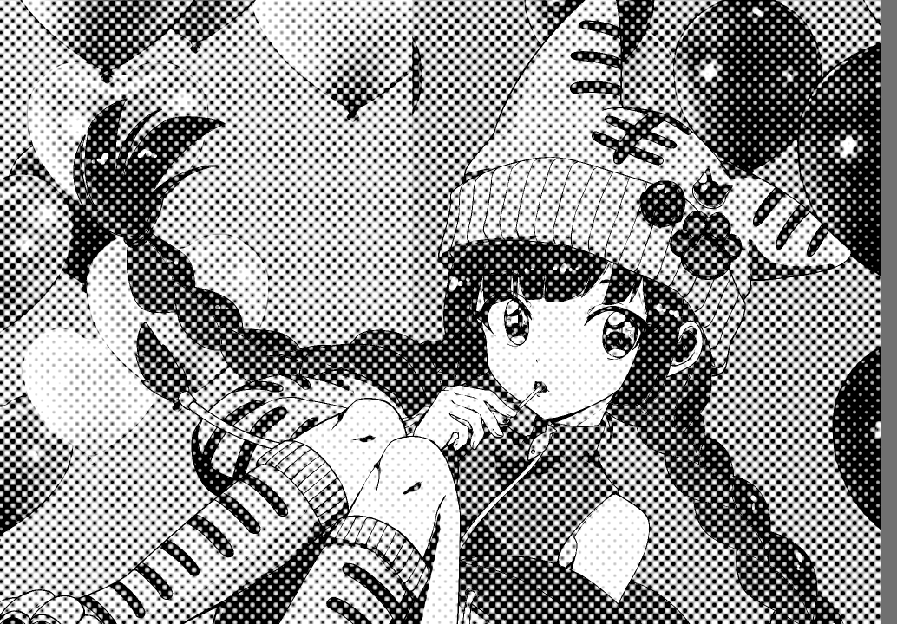

[CG](CG)

Wikipediaの日本語では[点刻 - Wikipedia](https://ja.wikipedia.org/wiki/%E7%82%B9%E5%88%BB)となっている。
[MFG](MFG)でStipplingとか出来ないかなぁ、と思って情報を集めたり、実装のメモをしたりするページ。

[MdImgr](MdImgr)用のテンプレートを貼っておく。``

## Weighted Voronoi Centroidによるstippling

たぶん一番基礎となるImage Stipplingの論文は以下の2002のSecordの論文と思う。

[Weighted Voronoi stippling - Proceedings of the 2nd international symposium on Non-photorealistic animation and rendering](https://dl.acm.org/doi/abs/10.1145/508530.508537)

母点が重心となっているようなボロノイ図を求めてその母点を使う、というアイデアに、
グレーの画像成分を重みとしてその重みも加味して重心を計算する事でグレーな所は母点同士が近くに寄り、
それ以外の所は離れる、というような結果となる。

これは繰り返し計算が必要で、また最初の開始点の分布によって収束が結構違うので、
この後に続く多くの研究でこの効率的な改善が行われた。

### 適当に散らばった点

このアイデアのポイントとしては、ボロノイ図の重心を使うと、ある程度規則的だけれど微妙にランダムっぽい点が作れる、というのがある。

これはbluenoiseと言われる性質を満たした他の分布でも良く、ポアソンディスクサンプリングなどが良く比較される。

## MFGでの実装アイデア

Weighted Voronoi Centroidのような手法はどうしても何らかのクライテリアによるイテレーションが必要になってしまい、
GPUだけでは閉じない。

けれどフィルタとして実装するならもうちょっといろいろ工夫が出来るんじゃないか、という事でフィルタで似たような事をする方法を考えてみる。

### 基本的なアイデア、グレーの重みで適当に散らばった点をサンプリング

点を動かすのでは無く、最密の点から始めて、確率的にその点を消す感じで同じ事が出来ないか。

各点はその点より少し大きい格子の中に一つとして、どこに打つかは適当にランダムにずらす。
まずはホワイトノイズでずらしてしまおう。


ランダムでずらすがこの度合いは格子を超えない程度にしておく。
こうする事で点と点が重なる事は防げる。

そしてその格子で点を打つかどうかは下のグレーの場の強さによって確率を調整した上で適当にランダムにサンプルする。
ただしランダムといっても近隣の複数の点で別々に同じ結果を計算出来る必要があるので、x, yを元にしたhashを使うのがいいだろう。
下図ではバツ印で消す点を表している。


これでだいたい下の場の強さに応じて点の数が増えたり減ったりする点が打てるんじゃないか？

このアイデアだと

1. 最密の所でも格子の距離くらいあくので、あんまり暗く出来ないかもしれない
2. ホワイトノイズがどのくらいいまいちかはやってみないと分からない

というあたりに不安もあるが、まずは実装してみて考えよう。

### グレースケール化

まずはグレースケールの場を作るためにグレースケールにしよう。
[MFG](MFG)に書いたように、以下とする。

```
@bounds(input_u8.extent(0), input_u8.extent(1))
def grayT |x, y| {
  to_xyza(input_u8(x, y)).y
}


def result_u8 |x, y| {
  let gray = grayT(x, y)
  [gray, gray, gray, 1.0] |> lbgra_to_u8color(...)}
}
```

grayTはリニアライズされた色になるので、RGBに戻す時はgamma補正する（to_u8colorでは無くlbgra_to_u8colorを使うということ）。
本当はグレーを戻すのにRGB同じ数値では適切ではないが、これは動作確認なのでいいでしょう。

試してみると以下。


結構綺麗にできているので良さそう。

### 格子の中心に点を打つ

点はとりあえず2x2ピクセルとしよう。上下左右に3pxずつあけるとすると、格子は8x8か？

```
let GRID_SIZE = 8
let inputEx = sampler<input_u8>(address=.ClampToEdge)

def result_u8 |x, y| {
  # 格子の左上
  let goxy = [x, y]/GRID_SIZE

  # 3x3の位置を左上に2x2のピクセルを打つ。
  # 3x3の位置をgcxyと呼ぶ。
  let gcxy = goxy*GRID_SIZE + [2, 2]
  ifel (all([x, y] >= gcxy) && all([x, y] < gcxy+[2, 2]),
      u8[0, 0, 0, 0xff],
       u8[0, 0, 0, 0])
}
```


なんかあってそうか。でもサイズ2はちょっと小さいな。スペース広すぎか。

まぁいい。これを少しずらす。

ハッシュは[MFG](MFG)に書いたPCGベースの奴でいいだろう（正直xorshiftとかxxHashでも十分良い気がしているが）。

```
fn hash |i: i32| {
  let state = u32(i) * 747796405u + 2891336453u
  let word = xor((state >> ((state >> 28u) + 4u)), state) * 277803737u
  i32(xor((word >> 22u), word))
}

fn hash_xy |x:i32, y:i32| {
  hash(x + hash(y))
}

fn map_to_f32 |uval: i32| {
  let inv = 1.0 / 4294967295.0
  f32(u32(uval))*inv
}
```

ずらすのは`-3`から+3まででいいのかな。

```
let GRID_SIZE = 8
let POINT_SIZE = 2
let SPACE=(GRID_SIZE-POINT_SIZE)/2

# 中略

  # -SPACEからSPACEの間にランダムにずらす。
  # goxyに対応した乱数をハッシュで得る
  let rand1 = hash_xy(*goxy)
  let rand2 = hash(rand1)
  # -0.5〜0.5の乱数
  let rf1 = map_to_f32(rand1)-0.5
  let rf2 = map_to_f32(rand2)-0.5

  let offset = i32([rf1, rf2]*f32(2*SPACE))
  let gcxy2 = gcxy+offset
```


ブルーノイズという感じはしないが、ランダム性は得られている。
あとはさらにもう一つ乱数を足して、これがグレーの値より大きければ点を打つか。

グレーの値は格子内の平均でいいかな。


```
  let rf3 = hash(rand2) |> map_to_f32(...)

  let gavg = rsum(0..<GRID_SIZE, 0..<GRID_SIZE) |rx, ry| {
    let pos = goxy*GRID_SIZE+[rx, ry]
    grayEx(*pos)
  } / f32(GRID_SIZE^2)

  let survive = rf3 < gavg  
```

これでどうだろう？


スキマがあきすぎてわからんな。

とりあえずランダムにずらすとかやめて、隙間をもっと減らしてみよう。

```
let GRID_SIZE = 4
let POINT_SIZE = 3
```


ロジックはあってそうだが、思ってたのと違うな。

### いまいちな結果の考察

Weighted Voronoi CentroidによるImage Stipplingのサンプル結果などを眺めていて違いについて思うのは、
黒いところはくっつくくらいの密度にならないとそれっぽっくならない、という事。
いつもオーバーラップしないように、というのは正しくない。

もともとポアソンディスクサンプリングの説明でくっつかないようにサンプルするというような理解から入ったのでそういうものだと思っていたが、
imge stipplingの時にはくっつくくらいそばになるケースを作らないと駄目そうだ。

どちらかというとそういうサンプリングが効いてくるのは、濃度が薄いところである程度等間隔に出るというところに思う。

また、点はある程度大きい方がそれっぽい。

### Example-basedな手法を調べる

以下の論文を読んでみる。

[Example-based stippling using a scale-dependent grayscale process - Proceedings of the 8th International Symposium on Non-Photorealistic Animation and Rendering](https://dl.acm.org/doi/abs/10.1145/1809939.1809946)

これはdot placementにはOstromoukhov 2001のerror diffusionのモデルを使っているとの事。

グレーのところをトーンとか使って解決するのを期待していたが、そうでは無かった。

ただこの論文は人間がstipplingする時との違いを分析して話をするため、
どういう事を再現したいのかは理解が深まった。

そしてやはり濃度の薄いところを等間隔に点を打つ、というのが難しさだと理解。問題の理解が誤っていた。

### 勘違いしていた事まとめ

- この問題は濃度が薄いところで等間隔にサンプルするのが難しさで、点同士の距離が近すぎないように、という問題ではない
- GPU的には間隔をあけているところと狭いところを領域が自然につながるように作るのが難しさ
   - 適当な範囲を決めればその内部の濃度をもとに格子間隔は決められるが分布に応じて連続的にそれを調整するのは難しい

という事でそもそもの自分の問題の理解が間違えていた。

ここまでの最終コードを書いておく。

```
@title "Stippling失敗"

fn hash |i: i32| {
  let state = u32(i) * 747796405u + 2891336453u
  let word = xor((state >> ((state >> 28u) + 4u)), state) * 277803737u
  i32(xor((word >> 22u), word))
}

fn hash_xy |x:i32, y:i32| {
  hash(x + hash(y))
}

fn map_to_f32 |uval: i32| {
  let inv = 1.0 / 4294967295.0
  f32(u32(uval))*inv
}

@bounds(input_u8.extent(0), input_u8.extent(1))
def grayT |x, y| {
  to_xyza(input_u8(x, y)).y
}

let GRID_SIZE = 8
let POINT_SIZE = 6
let SPACE=(GRID_SIZE-POINT_SIZE)/2

let inputEx = sampler<input_u8>(address=.ClampToEdge)
let grayEx = sampler<grayT>(address=.ClampToEdge)

def result_u8 |x, y| {
  # ifel( r > 0.5, u8[0xff, 0xff, 0xff, 0xff], u8[0, 0, 0, 0xff])

  let goxy = [x, y]/GRID_SIZE
  # 3x3の位置を左上に2x2のピクセルを打つ。
  # 3x3の位置をgcxyと呼ぶ。
  let gcxy = goxy*GRID_SIZE + SPACE
  
  # -SPACEからSPACEの間にランダムにずらす。
  # goxyに対応した乱数をハッシュで得る
  let rand1 = hash_xy(*goxy)
  let rand2 = hash(rand1)
  # -0.5〜0.5の乱数
  let rf1 = map_to_f32(rand1)-0.5
  let rf2 = map_to_f32(rand2)-0.5
  let rf3 = hash(rand2) |> map_to_f32(...)

  let gavg = rsum(0..<GRID_SIZE, 0..<GRID_SIZE) |rx, ry| {
    let pos = goxy*GRID_SIZE+[rx, ry]
    grayEx(*pos)
  } / f32(GRID_SIZE^2)

  let survive = rf3 < gavg
  # let survive = 1

  let offset = i32([rf1, rf2]*f32(2*SPACE))
  let gcxy2 = gcxy+offset
  # let gcxy2 = gcxy
  
  ifel (all([x, y] >= gcxy2) && all([x, y] < gcxy2+POINT_SIZE) && survive,
      u8[0, 0, 0, 0xff],
      u8(vec4(0xff)))
}
```

### 新しいアイデア

画面真っ黒に敷き詰めた状態から始めて、これをひっぱって伸ばすようなアプローチではどうだろう？
左上から始めて移動距離のようなものを累積和で表していけば、結果の点の座標から元の座標のどこにマップされるかを各点が判断出来て、
それである程度連続に間隔が変化する点を打てるのではないか。

ただこの考えはここまで書いたコードと全然違うので一旦中断。

### 単にグレーの濃度を白黒の頻度で表すフィルタを作ってみる

Stipplingとは違うが、単に2値トーン化として雑にランダムにサンプルするコードを作ってみるとどうだろう？
ようするに単なるハーフトーンの雑な実装だが。

```
def result_u8 |x, y| {
   let gray = grayT(x, y)
   ifel(rand() < gray, u8[0xff, 0xff, 0xff, 0xff], u8[0, 0, 0, 0xff])
}
```


けっこういいけど、これ、なんかガンマ補正してない時の暗くなるのと同じ結果に見えるな。
アルファをガンマ補正するのはどうなんだ問題と同じでしないのが正しい気もするけれど、
あえてやってみるとどうなるだろう？

```
def result_u8 |x, y| {
   let lgray = grayT(x, y)
   let gray = linear2gamma(lgray)
   ifel(rand() < gray, u8[0xff, 0xff, 0xff, 0xff], u8[0, 0, 0, 0xff])
}
```


やはりこっちの方が正しい気はするな。

拡大するとランダムさがトーンとして汚いので、やはりbluenoiseの方が良さそうではある。


ちょっとハーフトーンは面白そうだな。論文を調べてみてあとでページを分けよう。

### shadertoyの実装を移植してみる

shadertoyでハーフトーンで眺めていて見つけた以下を移植してみる。

[Halftone](https://www.shadertoy.com/view/XslGRM)

結果は以下。（少し処理系のバグを見つけたのでコードは訂正してから）



おお、結構いい感じだな。