[お絵かき](%E3%81%8A%E7%B5%B5%E3%81%8B%E3%81%8D)

- [たてなか流クイックスケッチ - YouTube](https://www.youtube.com/playlist?list=PLKl89tG4IBEvpGLIgVHAhgyhc9win4uAS)

書籍もあるのだけれど、とりあえずyoutubeをやってみる。

## あらすじ

[【書籍】魔法の人物ドローイング](%E3%80%90%E6%9B%B8%E7%B1%8D%E3%80%91%E9%AD%94%E6%B3%95%E3%81%AE%E4%BA%BA%E7%89%A9%E3%83%89%E3%83%AD%E3%83%BC%E3%82%A4%E3%83%B3%E3%82%B0)が終盤がいまいちで、そこまでのドローイングと関係ない話が増えてきた。
しかも自分がやりたいのとはちょっと違う。

という事でもうちょっと短時間で描く系のを数こなしたいなぁ、と思っていたところ、この本を見つけるが、
Kindle Unlimitedではないので買うほどかどうかは悩んでいたところ、
youtubeに途中までの内容みたいなのがある、と知る。
しかも結構長い。

とりあえずこれを最後までやってみて、良さそうなら本を買おうかな、という気分になる。

## 1日目、ばらしてみよう 2025-09-07 (日)

とりあえず動画を見ながら真似てみた。

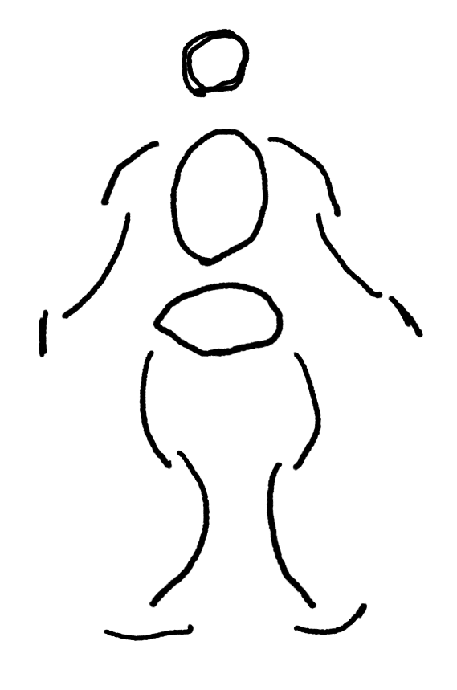

頭が小さいな。まぁいい。

最初の課題。

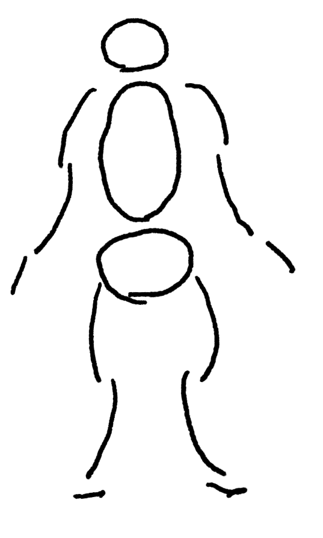

２つ目、ちょっと難しいな。

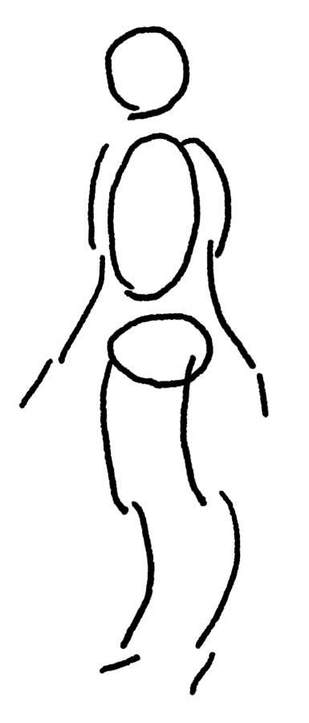

腕上げてる奴。

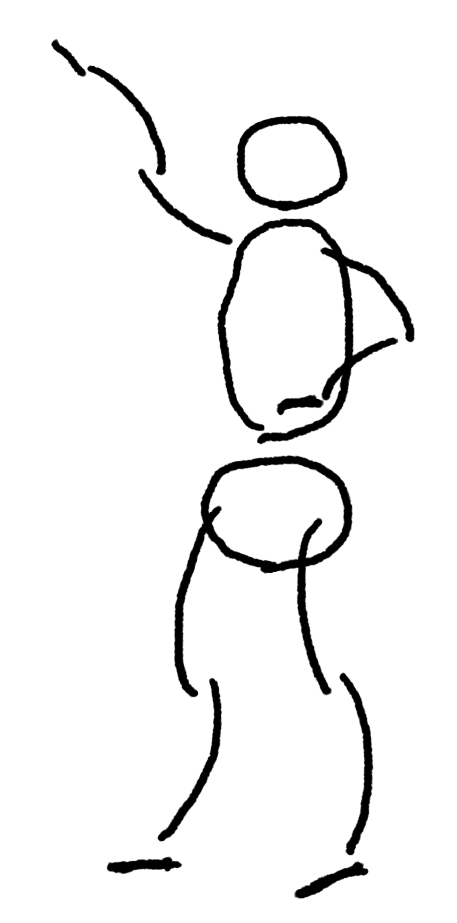

これは胸はってる感じが出てないのと、腕が何故か手本の人と逆だな。これどっち向きの孤にするかは何を基準に決めるのだろう？

とりあえず真似してみよう。

もっと胸は大げさにはっても良さそうだが、まぁいい感じには鳴っている気がする。右手は少しいまいちだが、まぁいいだろう。

### 1分チャレンジ

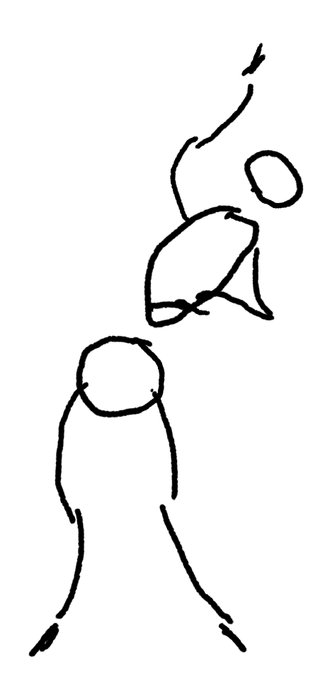

うお、一分思ったより短いな！あまり迷っている時間はないので次からはもう少し急ぐ。

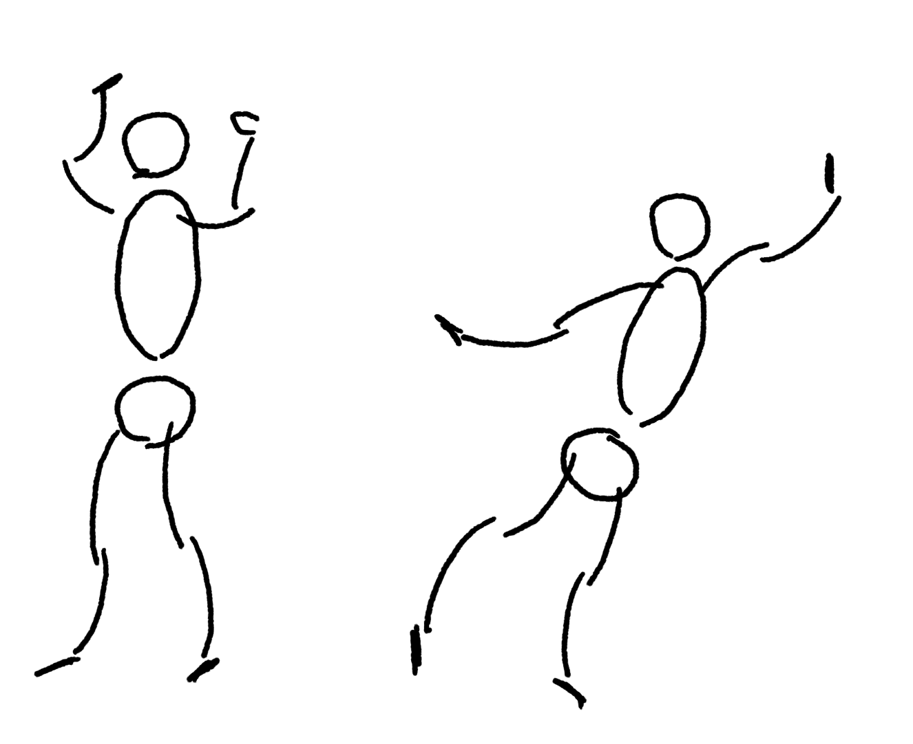

同じレイヤーでいいか、と気付き同じレイヤーに復数描く。時間は間に合うようになってきた。

長さのバランスはまだ全然とれないなぁ。

手本を見て真似したくなった奴を書き直す。

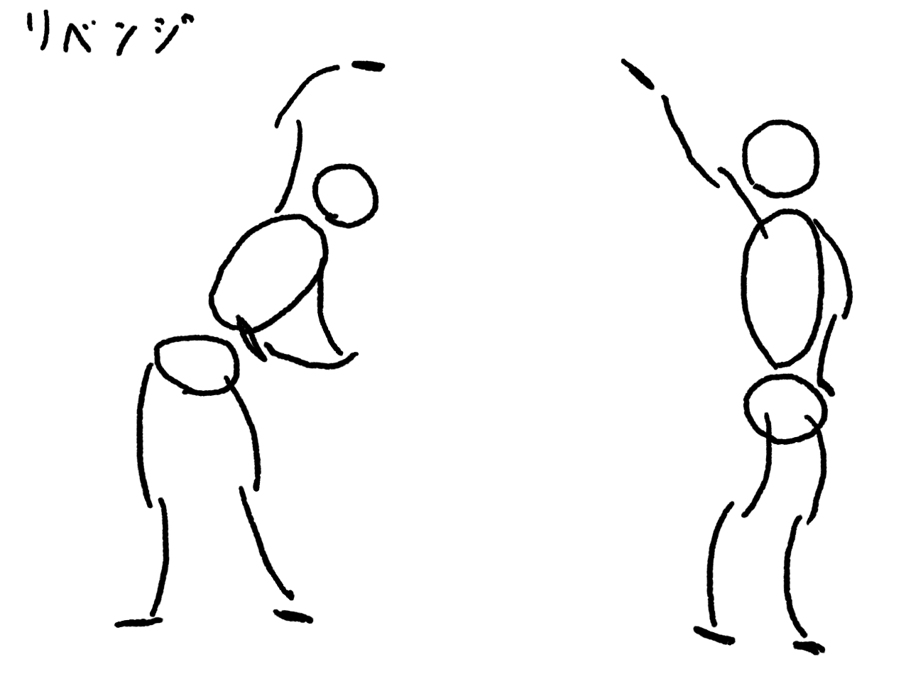

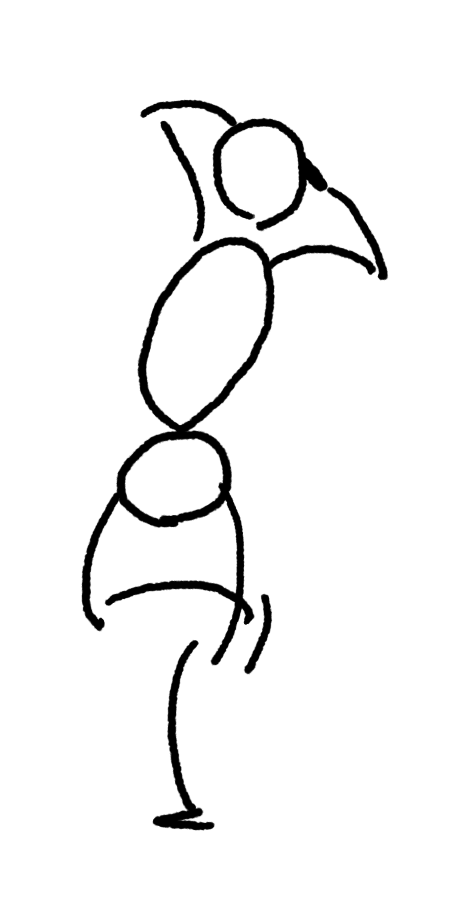

これは前の方が良かったかも。

### 1日目を終えての感想

これは自分でもやっていけそうな難度だな、と思う。
しかも一回の長さが手頃で、短すぎない。
まぁまぁ全部描けばそれなりの時間が掛かる。
でもやるのが億劫になるほどの長さでもない。

という事でこれをやっていこうかな、と思う。

## 2日目 動きを意識しよう 2025-09-08 (月)

なんかソリ具合が足りないな。

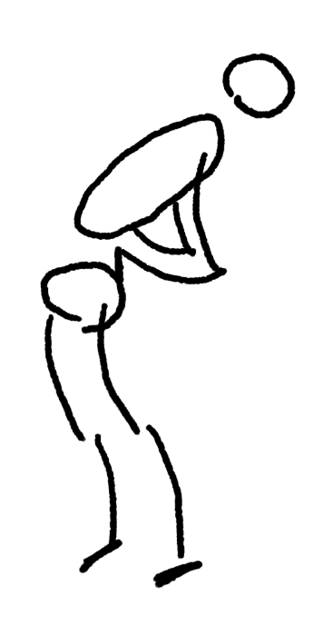

もっとそってみた。足のつけねの位置がおかしいな。まぁいい。

見えないところも薄く描く、という事をやっていたので、ブラシをスケッチブック鉛筆にしてみた。

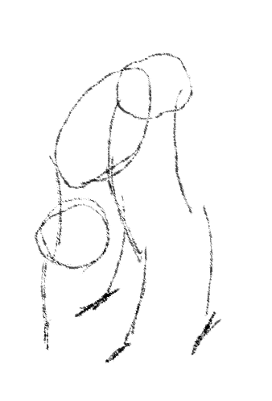

でも結局いい感じに薄くは出来なかったのであまり意味は無いな。
たてなか流は薄い線を重ねて円とか描くので、少しこのブラシでやってみるかなぁ。

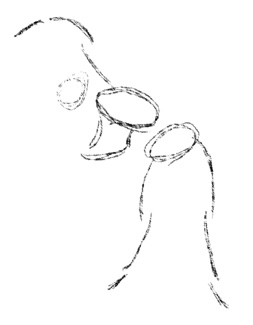

やっぱいまいちだな。自分はドローイングペンに戻すか。

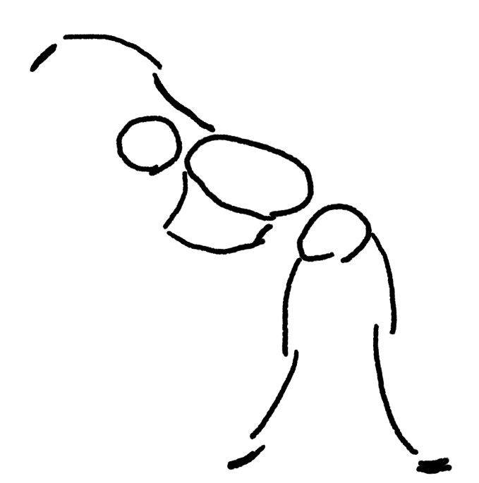

なんか上の手のソリ具合がいまいちだな。

[【書籍】魔法の人物ドローイング](%E3%80%90%E6%9B%B8%E7%B1%8D%E3%80%91%E9%AD%94%E6%B3%95%E3%81%AE%E4%BA%BA%E7%89%A9%E3%83%89%E3%83%AD%E3%83%BC%E3%82%A4%E3%83%B3%E3%82%B0)の時のアクションラインだっけ、あれを描いてから描いてみよう。

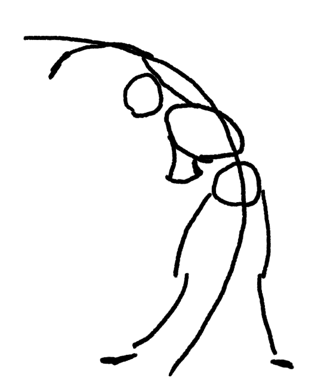

おぉ、こっちの方がずっといいな。アクションラインを描かなくてもこれを意識してみようか。

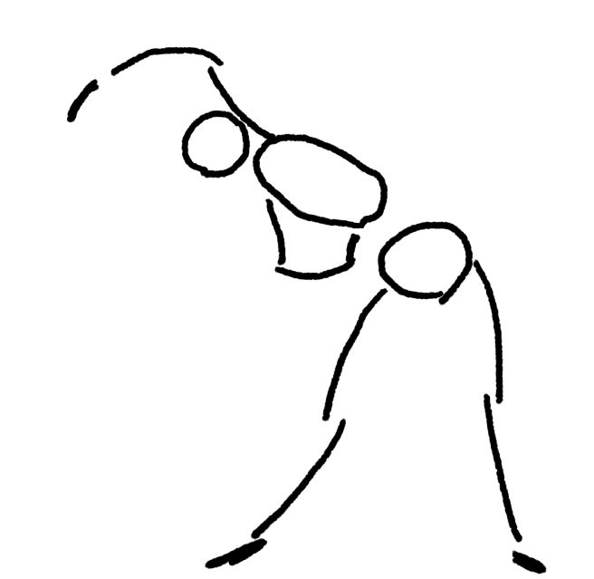

ちょっと良くなったか。

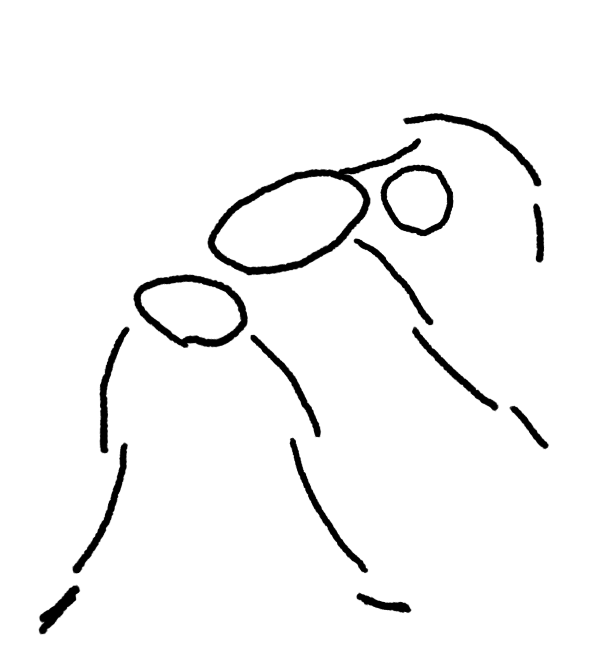

上の手の上腕が短いが、まぁこんなもんかな。

### 1分スケッチ

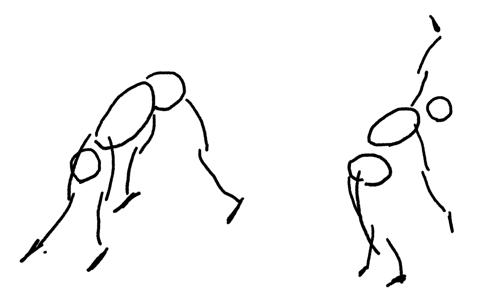

左はなんか腕が長くて変だな。右はまずまずか。

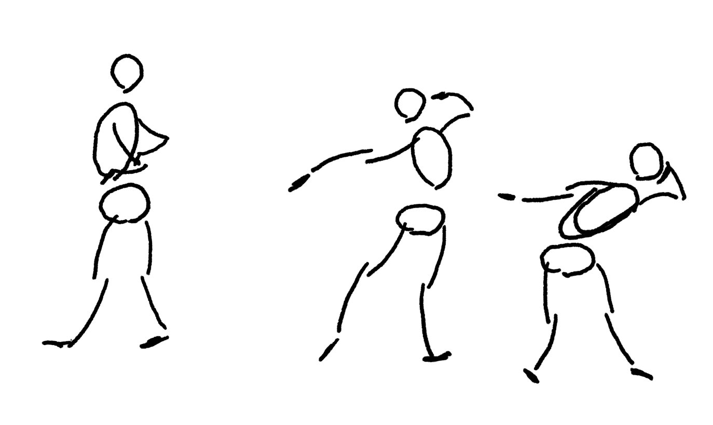

左はこの二日目の課題である動きが全然表現出来てないなぁ。
他はまぁまぁか？

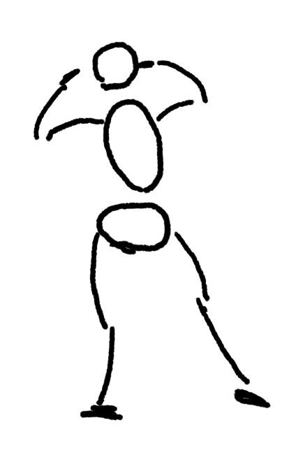

なんか足の緊張感がうまく描けてないなぁ。直線のぐって感じの足をこの描き方で描く方法が良く分かってないんだよな。

作例を見て書き直したい奴だけ描き直し。

左は良くなった気がするな。右も反りの緊張が強くなって良くなった気はする。

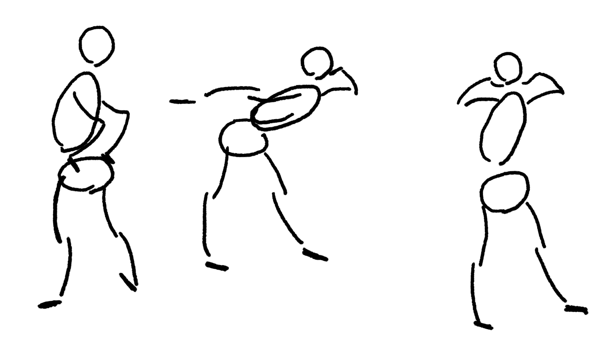

左は割と動きが出て良くなった気がする。真ん中は、足の緊張はふくらはぎの曲線で出す意識で描けば良さそうと思って試したもの。
良くなった気はする。

一番右は難しいな。実際、作例もそんなにうまくとらえられてない気がする。

### 二日目を終えての感想

動きを意識する、というのが、この解説でどうやるのかは良く分からない気もした。
ただ[【書籍】魔法の人物ドローイング](%E3%80%90%E6%9B%B8%E7%B1%8D%E3%80%91%E9%AD%94%E6%B3%95%E3%81%AE%E4%BA%BA%E7%89%A9%E3%83%89%E3%83%AD%E3%83%BC%E3%82%A4%E3%83%B3%E3%82%B0)の経験が生きたおかげで、
アクションラインを意識しながら描く事で割と動きはとらえられている気もする。

1分は1分だと短いな、という気もするけれど、作例見る前のもそれなりには表現は出来ていて良さもある気はする。
全体的にはまぁまぁ出来ているんじゃないか。

1分スケッチで6枚やる、というのはいい気がする。集中しやすいし、数も描くので経験値もためやすい。
1分は思ったより短いので、その分迷ってないで思い切り良く描く練習になる気もする。

このまま続けていきたい。