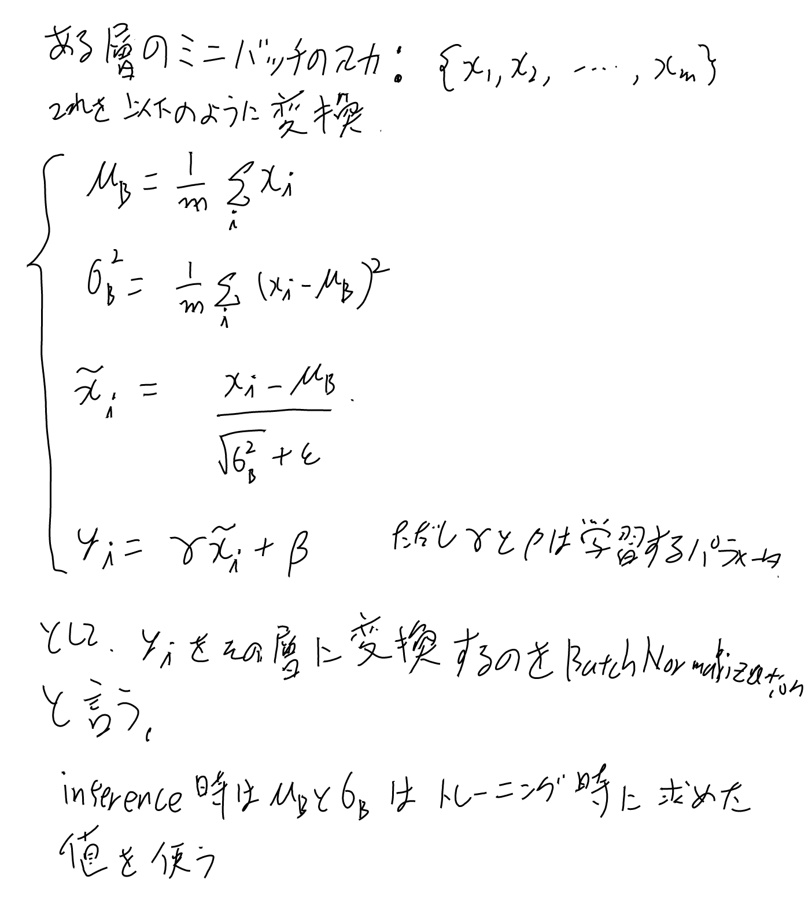

バッチ正規化とも言う。[[原論文から解き明かす生成AI]]のLayer Normalizationの項ででてきたのでメモしておく。

書籍、深層学習（Deep Learning）のp136 （4.3.4）をベースに書く。

多層のニューラルネットにおいて、途中の層は前の層の変化に追従する事ばかりに学習の労力が割かれてなかなか学習が進まない問題（内部共変量シフト）が起こる事が知られていて、それに対する対策。

ミニバッチごとに平均と分散を割り引いた入力を入れるように変更する手法。

