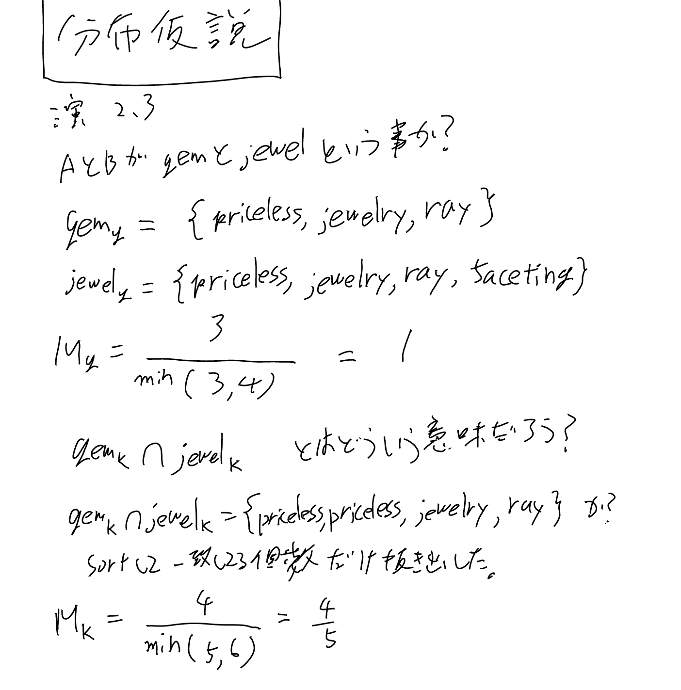
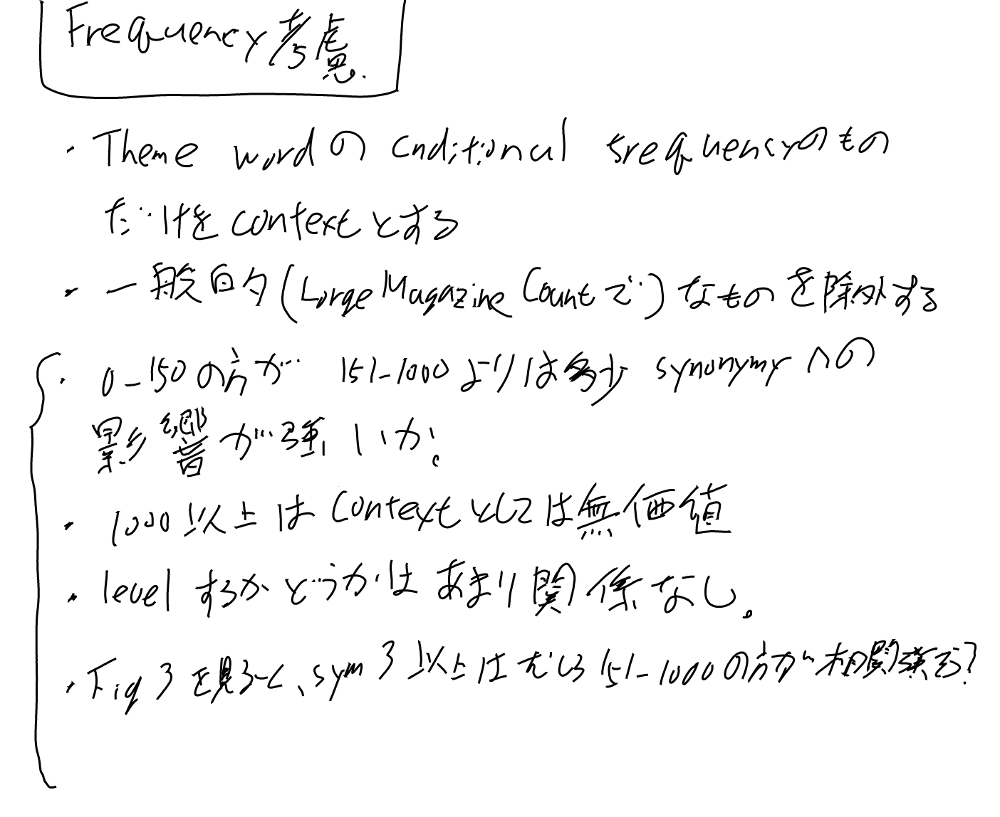
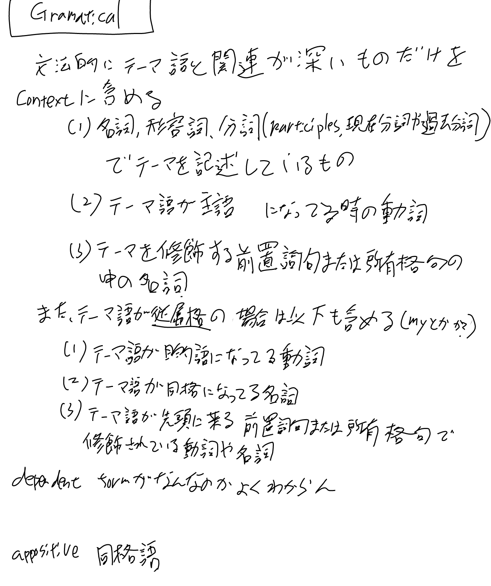
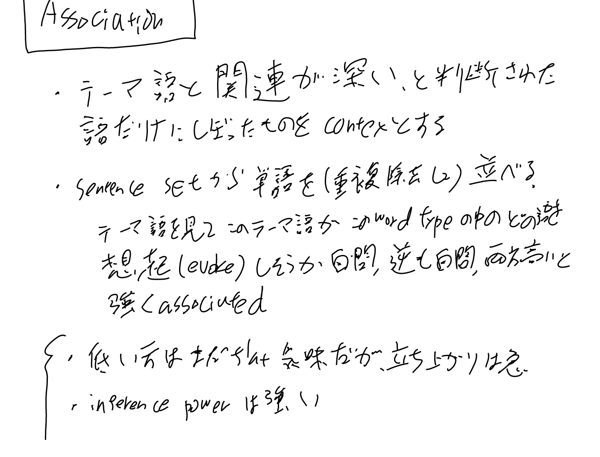

[[論文]], [[原論文から解き明かす生成AI]]

[Contextual correlates of synonymy - Communications of the ACM](https://dl.acm.org/doi/abs/10.1145/365628.365657?download=true)

[[分布仮説]]の論文。

## 提唱する仮説: 単語Aの文脈と単語Bの文脈で共通の単語の割合いは、単語AとBの意味の類似度の関数である

同じ所が本の方でも抜き出されているな。synonymyは意味の類似度の事のよう。
synonymは類義語とか同義語みたいな意味だったかな？

この論文ではfirst-orderのassocicationで意味の類似度が示される(indicated)と仮定して進める。

morphemses: 形態素

## 4つのコンテキスト

4つのcontextというのが挙げられているが、これは後で実際に実験の詳細で説明される。

1. sentenceの中の単語(content wordsだけじゃなくfunction wordsも含む）
2. sentenceの中でLorge Magazine Countによる特定の範囲の頻度の全てのcontent word
3. 各sentenceで文法的な枠組みでもっともtheme wordと近い全てのcontent word
4. そのthemeと関連がもっとも深いと判断された全ての単語

Lorge Magazine Countは雑誌を対象にした常用語の出現頻度調査らしい。

基本的にはコンテキストに関係無さそうな単語を排除していく事でどんどん相関は増していく。

## 実験手順

実験手順もなんか複雑だな。

最初は以下のように書いてあるが、

- 65ペアを作る(どうやって？)
- 全スリップを渡してそれを類似度順にならべて、その後0.0から4.0までのスコアをつけてもらう

その後に二つのグループの話が出てきて上との関係が良くわからない。

Group I

- 15被験者
- 2週間の間をあけて2つのセッションに参加
- 最初のセッションは48ペアについて類似度を判定してもらう、この48のうち36ペアは65ペアに含まれる
- 次のセッションでは65ペアについて類似度を判定してもらう

product moment correlationは積率相関係数でピアオンの相関係数の事っぽい。

この36ペアについて、最初と次のセッションの間のproduct moment correlationを求める事で、
intra subject reliabilityが計算出来る、といっている。

このsubjectは被験者の意味か。時間をあけて、他のに混ぜてもどのくらいこの類似度は同じ値(一貫している)か？という事だな。

Group IIは二番目のセッションだけやってもらった。
Group Iとはとても一致していたので2セッションに分けた弊害はあまりなさそう、という事か。

Generation of the Corpusのパラグラフでは65のtheme pairsには48の名詞があると言っている。
ペアには重複する単語があるので48個という事かな。

AとBはテーマペアがそれぞれになるように適当に選んだのかな。
AとBで別の被験者を使って例文を作ってもらう。
AとBで分けたのは同じ人であるがゆえの疑似相関を避けたかったとか。

## levelingの影響

walksをwalkに統一したり、という操作をしても、単にカーブが並行移動しただけで形状は変わらない、と結論づけている。

## Inference Power

似てないかどうかを判定している（synonymyがless than 3.0かどうか）。

帰無仮説としては「似てない」で、
これを誤ってrejectしてしまう（似ていると判定してしまう）ものをType I Errorとしている。

Type I Error: false positive

## 演習2.3 (原論文から解き明かす生成AI)

## 実験の設定: Freq考慮

## 実験の設定: Gramatical

## 実験の設定: Association

