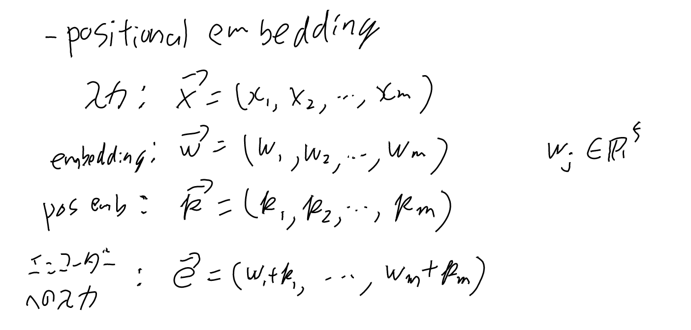
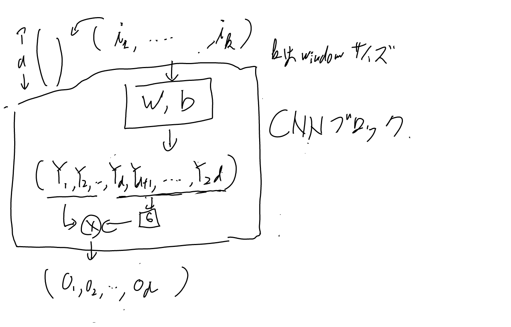
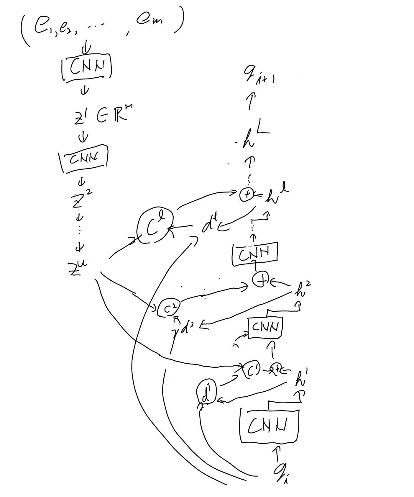
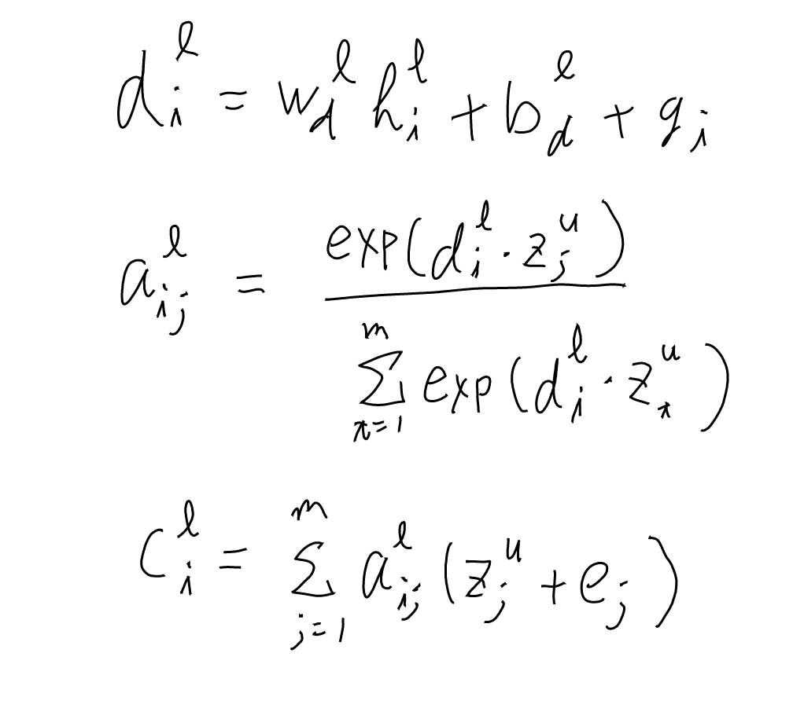

[[機械翻訳]]にRNNでは無くCNNを使う事を提唱した[[論文]]。別名: [[ConvolutionalSequenceToSequenceLearning]]

- [arxiv:1705.03122 Convolutional Sequence to Sequence Learning](https://arxiv.org/abs/1705.03122)
- [fairseq/fairseq/models/fconv.py at 3d262bb25690e4eb2e7d3c1309b1e9c406ca4b99 · facebookresearch/fairseq](https://github.com/facebookresearch/fairseq/blob/3d262bb25690e4eb2e7d3c1309b1e9c406ca4b99/fairseq/models/fconv.py#L33) 実装はこれか。

## Transformerを踏まえた特徴

[[Transformer]]へとつながる数々のアイデアがある。

- Positional embedding
- Multi step attention

初期化は結構大変そう。

## ノーテーション

入力はmトークン、一つあたりV次元だが、embedによりこれがf次元となる（ただしfやVは以後あまり出てこない）。

## CNNブロック

$i_k$ というのはk個の入力、という意味。一つあたりd次元。ちなみに5.1での実験のkは3とか。

入力はkより大きいもので、これをkずつconvolutionしていく。
これをconvolutionしていく。

## Encoder-Decoderの概略

cがAttention。Decoderの各レイヤにある。

### アテンション

dはhと$g_i$の線形和（decoder state summaryと呼んでいる）。このdecoderの状態要約とzの関係で求めるアテンションとなる。
オリジナルの[[アテンション]]と比べると、単純にhとのalignでは無くgiも含めた現時点のデコーダーのコンテキスト的なものを使うのと、元入力である$e_j$が入っていたりするのが違う。

## Positional Embedding

論文では詳細は述べていないが、以下の実装を見ると

- [fairseq/fairseq/modules/learned_positional_embedding.py at main · facebookresearch/fairseq](https://github.com/facebookresearch/fairseq/blob/main/fairseq/modules/learned_positional_embedding.py#L15)

単なるintのindexにWを掛けて、そのWを学習する感じになっている。通常のembeddingと同じ計算だな。
上の実装には[[Transformer]]で提唱されたsinの奴も入っているが。

なお、positional embedding無しでもそこそこスコアはでているので、これ無しでもそこそこは位置を扱えていそう。テーブル4に以下のスコアがある。

| 項目 | BLUE |
| ---- | ---- |
| 両方にpositional embedding | 21.7 |
| targetだけpositional embedding | 21.3 |
| sourceだけpositional embedding | 21.5 |
| 両方無し | 21.2 |

sourceの方が影響はでかそう。