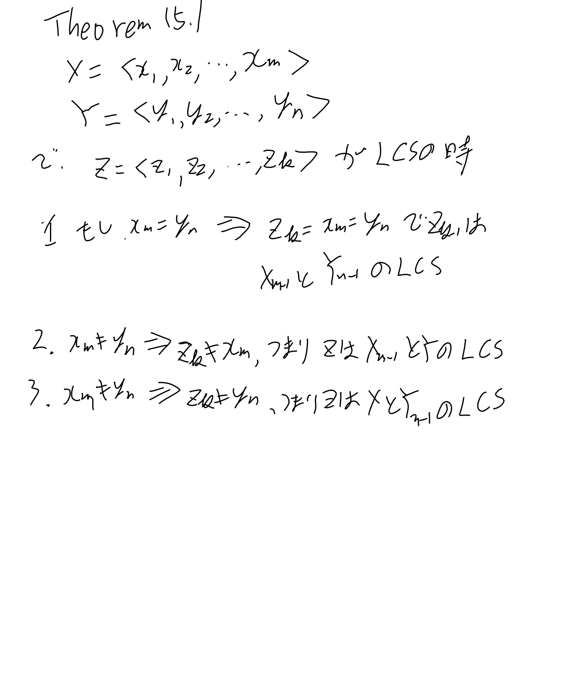
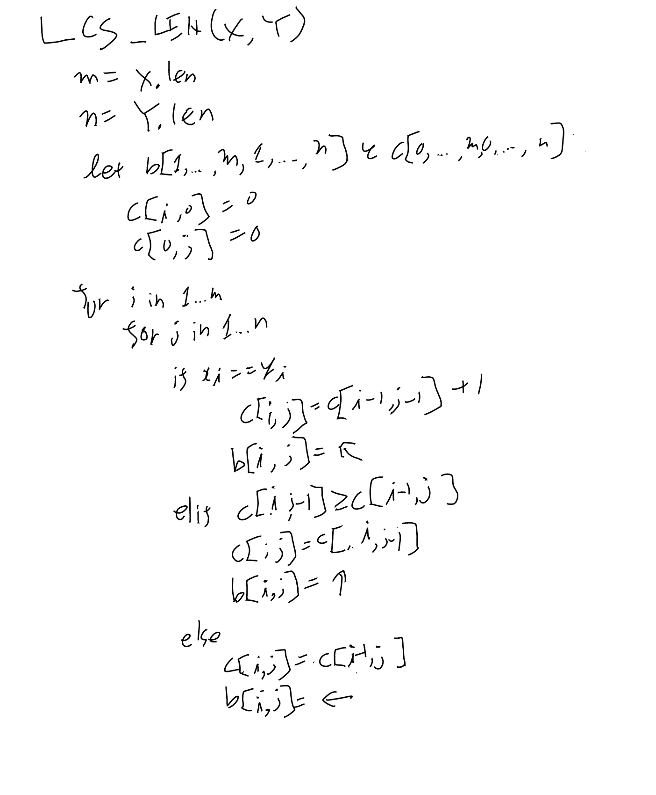
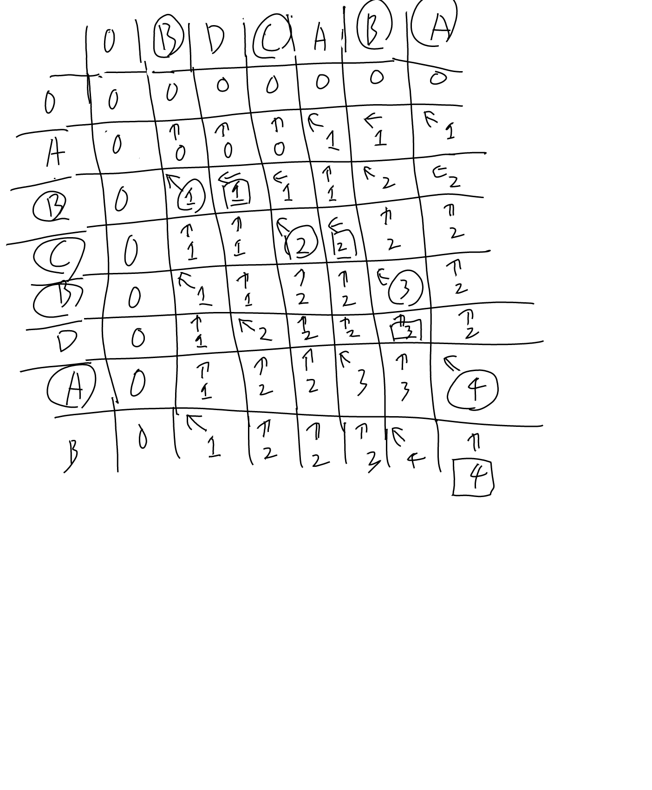
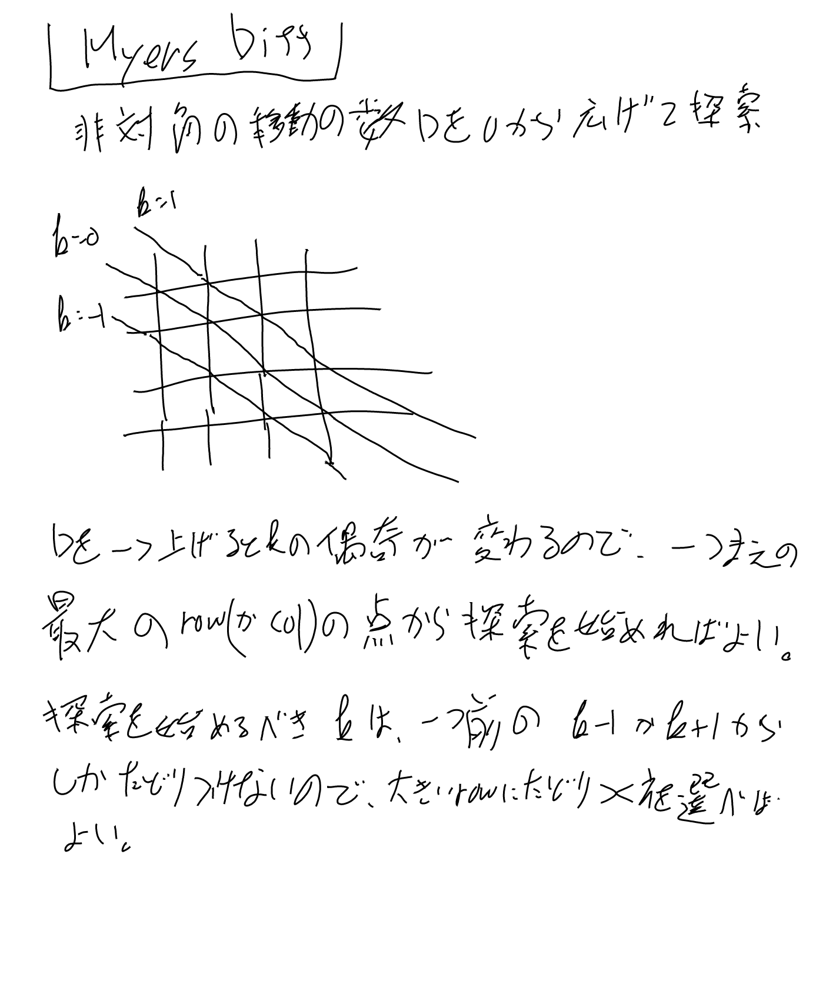
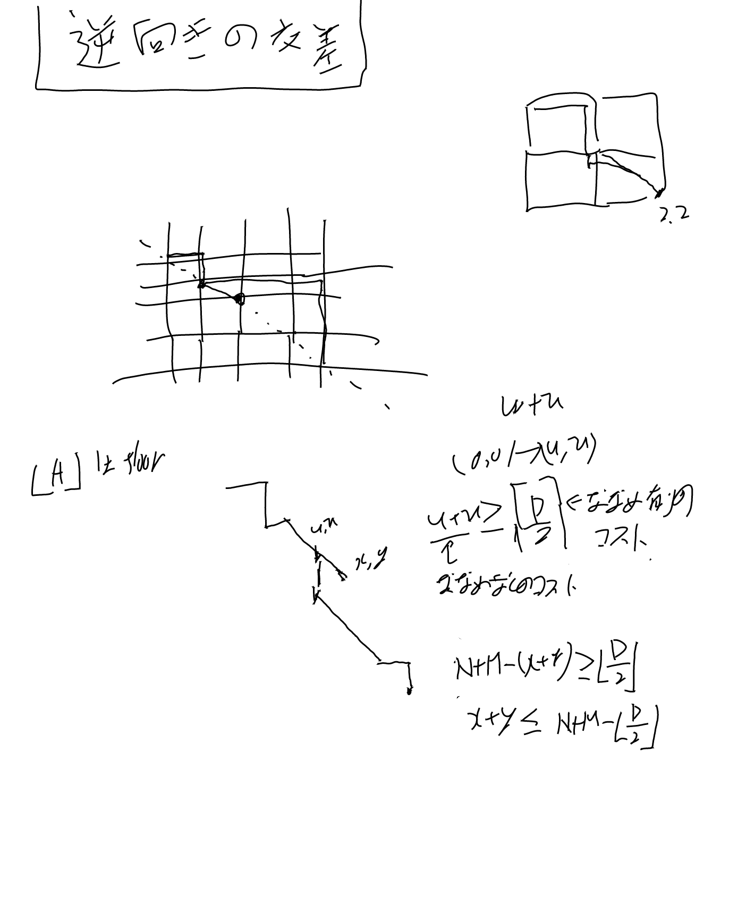

[[アルゴリズム]], [[文字列マッチ]]

ここではアルゴリズムのdiffの話をする。
Longest Common Subsequence、略してLCSと呼ばれたりもする問題。

[[【書籍】IntroductionToAlgorithms]]の15.4に基本的な話がある（Dynamic Programmingのサブセクション）。

## サブシークエンス

歯抜けで取っていたものをサブシークエンスという。XとYの共通のサブシークエンスを探すのがLCS問題。間はあいて良い。

## Theorem 15.1, Optimal Substructure of an LCS

DPを可能にする性質。

## XとYのLCSの長さとbテーブル

## bテーブルからLCSの構築

## Myers Diff

[[アルゴリズム本]]とは異なるが、Myers Diffが現在良く使われるアルゴリズムになっている。

論文としては [An O(ND) difference algorithm and its variations - Algorithmica - Springer Nature Link](https://link.springer.com/article/10.1007/bf01840446)。

Edit Graphを探す問題として最適な解を調べる。

### 逆向きの交差

