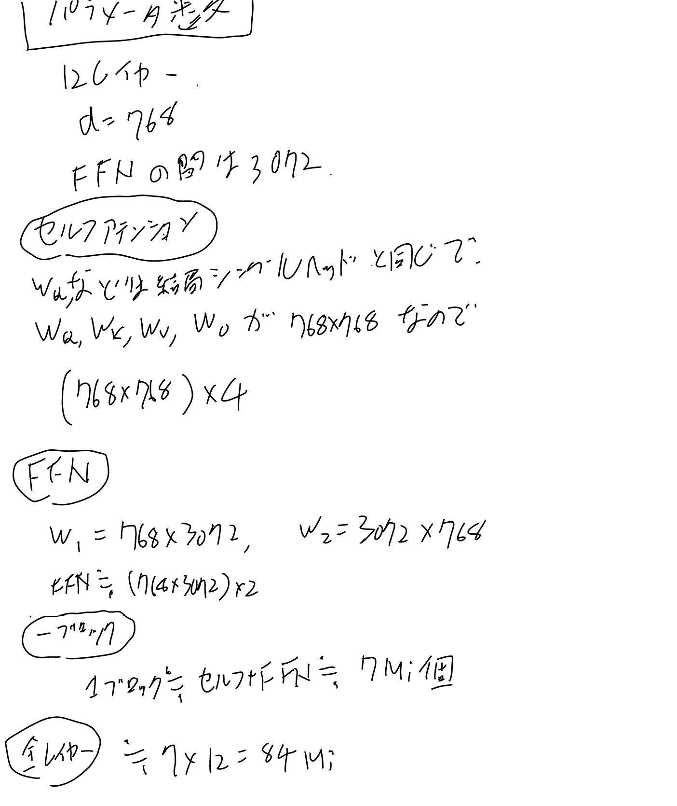
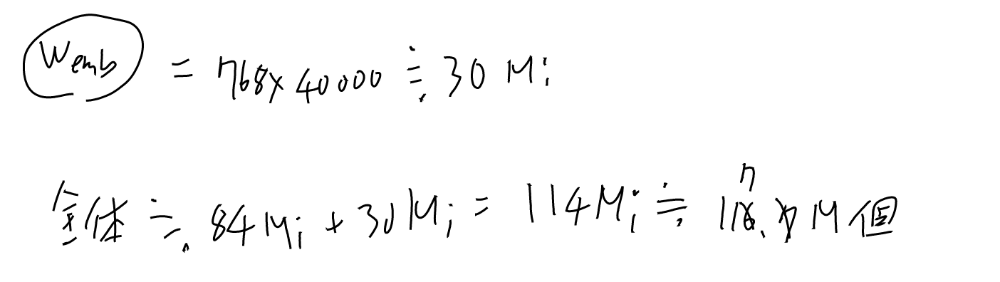

GPT1の[[論文]]、Improving Language Understanding
by Generative Pre-Trainingの事。

- [Improving Language Understanding
by Generative Pre-Training](https://cdn.openai.com/research-covers/language-unsupervised/language_understanding_paper.pdf) pdf
- [Improving language understanding with unsupervised learning - OpenAI](https://openai.com/index/language-unsupervised/) ブログ記事

## 概要

[[Transformer]]のデコーダーのみでlanguage modelを学習しまくって、それをtransfer learningするといろんなタスクで良いよ、という論文。
ラベル無しの文章で学習してスコアをあげるという試み。

タスクごとにモデルを作るのでは無く、全てのタスクをk個のトークンを元に次のトークンを予測する、という枠組みに変形する事で同じモデルを使うというのがアイデアではある。

ただし問題に合わせたfine tuneはする。4択とかはそれぞれの単語の確率のsoftmaxにしたりとか結構問題ごとに手は入れる。
最後のレイヤーだけでどうにかする、という感じ。

## モデルとパラメータ数

[[Transformerブロック]]が一つで2Mi個くらいなのに、GPT1は[[原論文から解き明かす生成AI]]の表4.1によると117M個らしい。
レイヤー数と合わない気がするのでもう少し詳しく見ていく。

モデルは12レイヤーのデコーダーオンリーモデルで、dは768次元、ヘッドは12個、FFNは間を3072にしている、との事。

計算してみる。

結構違うのだが。embedの行列か？

embedの行列も計算して足してみる。
vocabは40000。

という事で117M個くらいになりそうで無事一致。っていうかembedって大きいんだなぁ。
