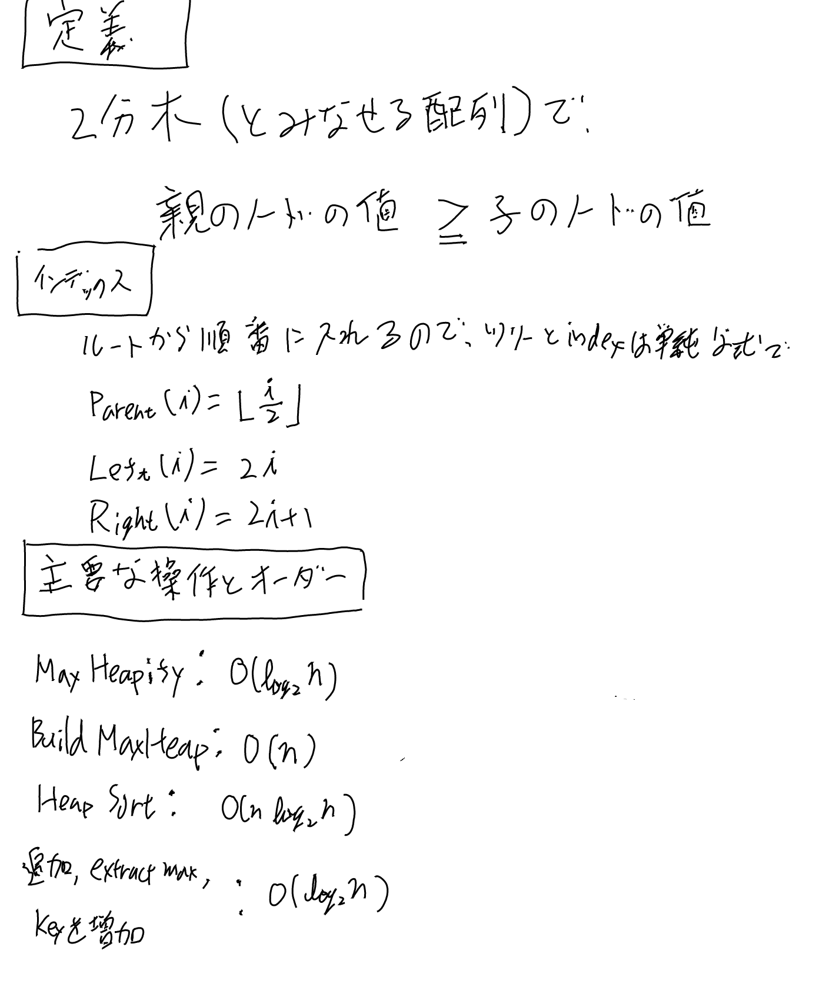
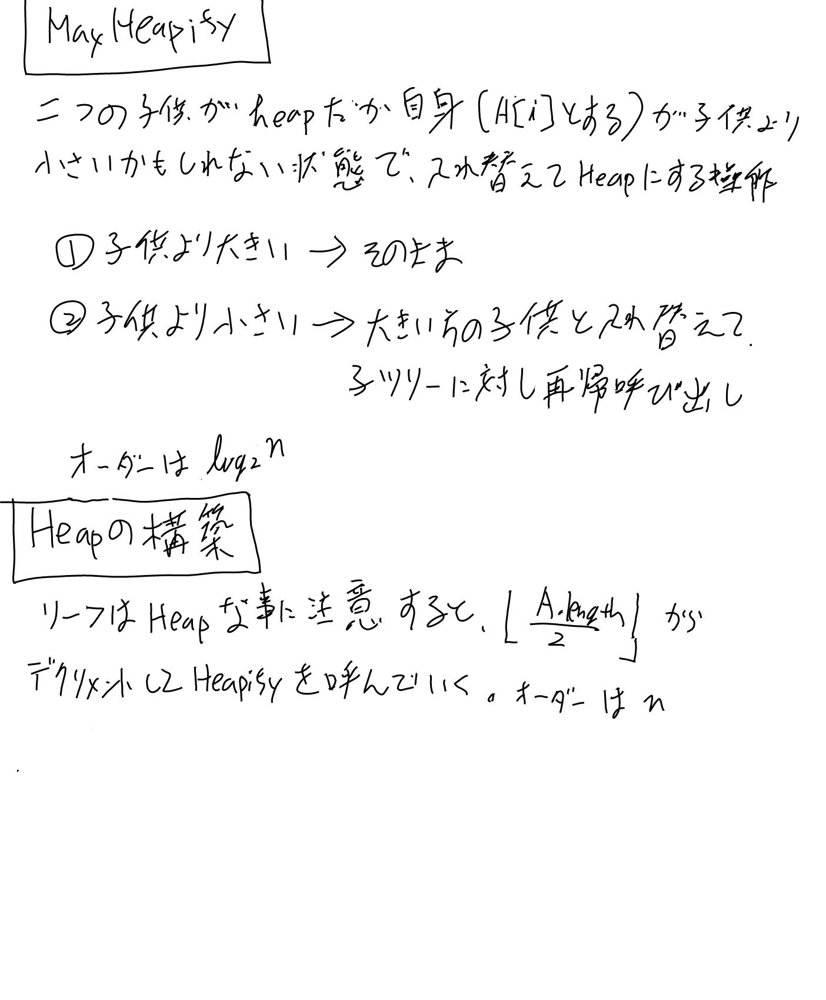
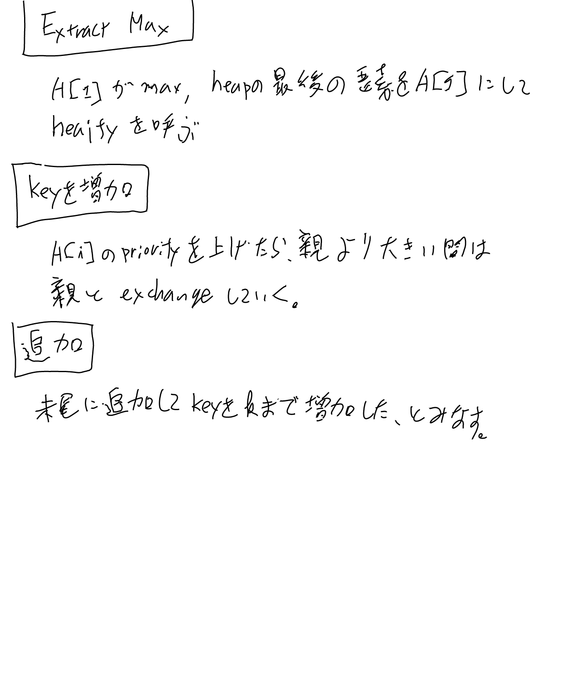

[[アルゴリズム]], [[【書籍】IntroductionToAlgorithms]]

Binary Heapに関するページ。Heapソートなどで使う。

[[【書籍】IntroductionToAlgorithms]]の6, Heapsortの内容を中心に書いていく。

## 定義と性質

## HeapifyとHeapの構築

## Priority Queueとして使う時の操作

