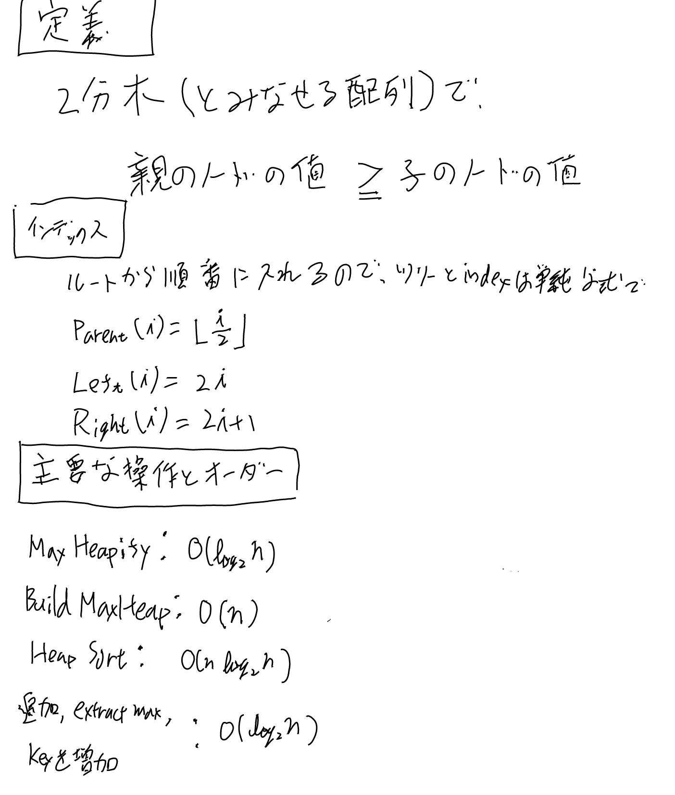
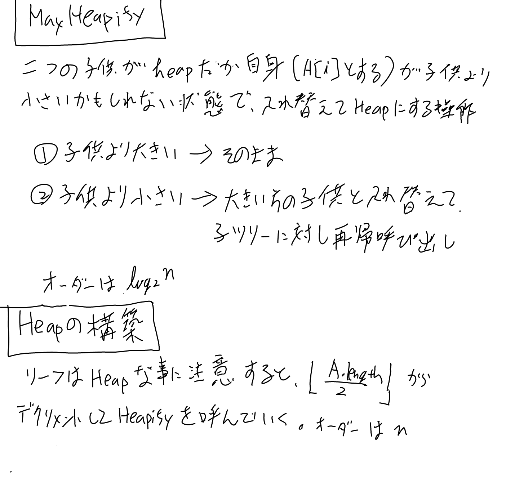
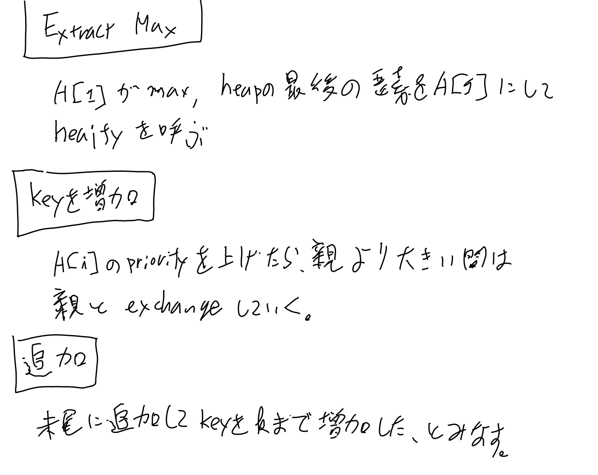

[[アルゴリズム]], [[【書籍】IntroductionToAlgorithms]]

Binary Heapに関するページ。Heapソートなどで使う。

[[【書籍】IntroductionToAlgorithms]]の6, Heapsortの内容を中心に書いていく。

## 定義と性質

log2 nはツリーを子どもに辿っていく操作。

Build Max Heapは雑に考えるとO(N log N)になってしまいそうだが、asymptotically tightに真面目に考えるとO(N)になる（6.3 Building a heap参照）

## HeapifyとHeapの構築

## Priority Queueとして使う時の操作

