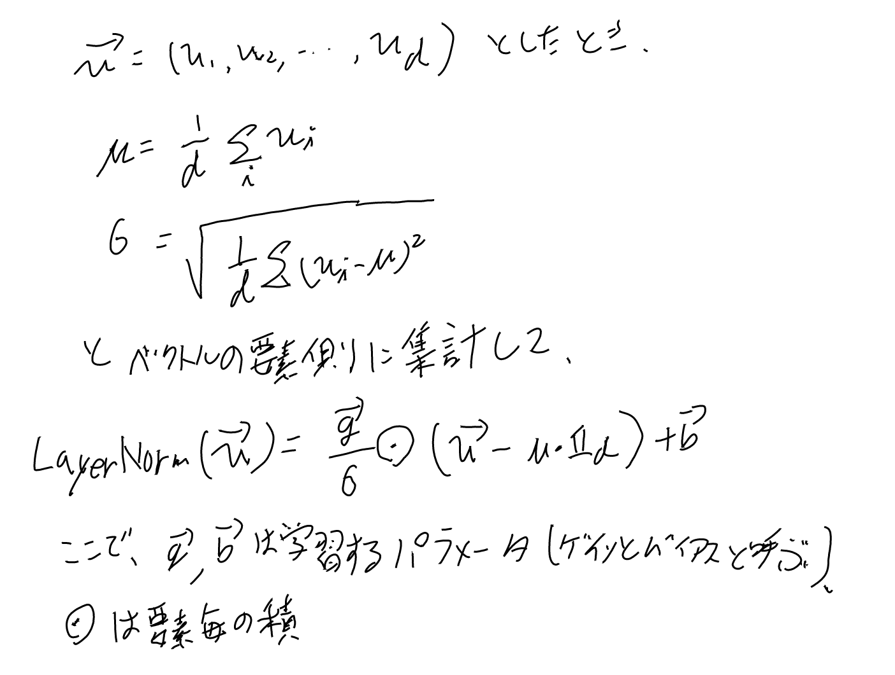

[[BatchNormalization]]からヒントを得て、同様の平均と分散の割引を単一のベクトルの次元側でやる手法。[[Transformer]]で使われる。

バイアスとゲインは学習パラメータ。

- [arxiv:1607.06450 Layer Normalization](https://arxiv.org/abs/1607.06450) 元論文。2016年。 このページではこの[[論文]]の話をメインに他のソースの話も混ぜる。トロント大学。

[[原論文から解き明かす生成AI]]の3.4 (式3.17）にも解説がある。

基本的には[[BatchNormalization]]の $\mu$ と $\sigma$ を、各iの $d_{model}$ 側に足して求めたもので代用する。

ここで[[BatchNormalization]]では $\sigma$ も $\mu$ もベクトルだったが、LayerNormalizationは要素方向にとるのでスカラーになる事に注意。

### 和の取る方向

もともとはRNNで[[BatchNormlization]]が使えないのでどうにかしたい、という問題設定で生まれたものなので、レイヤー内での平均を取る形に見えたが、
昨今は[[Transformerブロック]]で使われる用途が主流になり、これはレイヤー内での和では無いのでちょっと注意が必要。

Transformerブロックではトークン単位というかd方向に和を取り、n方向には和をとらない。

これはRNNでの和の取り方と一致しているけれど、Transformerは1レイヤーに複数トークンがある事を思うと結構違う取り方には見える。
なお、gainとbiasパラメータはTransformerではn方向では全部同じものを使うっぽい。

## Batch Normalizationとどっちを使うべきか？

Layer NormalizationはもともとRNNのようにバッチという概念が中間層に使えないものに使う技法として開発されたが、
[[Transformer]]とかにも使われている。

どうもTransformerではそのままBNに置き換えるとパフォーマンスが悪い事は知られているよう。

[arxiv:2003.07845 PowerNorm: Rethinking Batch Normalization in Transformers](https://arxiv.org/abs/2003.07845)

サンプルごとの値の違いが大きすぎて統計がバッチごとにばらつきが大きいから上手くいかないらしい。

一方Vision Transformerなどでは工夫したBNの方がいいという話もあるとか。

LayerNormの元論文の6.7にCNNでの比較があり、通常のCNNではbatch normalizationの方が良いとか。

それは境界のそばのフィーチャーは0に近いなど、同じレイヤーでも場所によって統計が大きく違うという、
Layer Normalizeに不向きな偏りがあるからではないか、とか書いてある。

この辺はいろいろ研究の余地もあるようで、[arxiv:2201.03545 A ConvNet for the 2020s](https://arxiv.org/abs/2201.03545)などではLayer Normalizationの方が良くなるような構造もあるとか。

### 推論時の計算コスト

Vision TransformerにBatch Normalizationを使う系の論文の以下を見ていたら、
[SLAB: Efficient Transformers with Simplified Linear Attention and Progressive Re-parameterized Batch Normalization](https://arxiv.org/html/2405.11582v2)、
Inference時の計算コストのためにLayer NormalizationをBatch Normalizationに変えようと模索している論文だった。

inference時の計算コストの違いというのは考えてなかったのでここで考えてみたい。

[[BatchNormalization]]では平均と分散の計算はトレーニング時のみで、inference時は不要となる。
一方LayerNormlizationは毎回計算する必要がある。

1ベクトルあたり平均と分散はそれぞれO(d)程度か。それがnトークンあるのだから、コストはO(nd)かな。

## 論文のリーマンmetricとフィッシャー統計量での学習のregularizationの話（はあまり理解出来てない）

この論文のセクション5には、LayerNormalizationがregularizationとして振る舞っている、という理論的な分析があって、結構数学的にはゴツい。
一応フィッシャー統計量とかリーマンmetricはそれなりに勉強した事はあるので知らない話では無いはずだが、
全部復習して追うガッツは沸かず。

内容的にはパラメータのノルムが2倍になると、パラメータ方向のフィッシャー統計量の曲率が半分となり、
つまり学習の勾配が小さくなる、みたいな話をしていると理解した。

ただなんでGLMがうんぬん、という話がでているのかは良く分からない。RNNはGLMの足し合わせで表せるのかしら？GLMあんま知らないからなぁ（本は買ったが読んでない）

## 論文の実験結果

実験は幾つかのタスクでやっている。

- image-sentence ranking
- question answering（穴埋め）
- contextual language modeling（skip-thoughts vector、文を読ませて前後の文を予想させる、というタスクか）
- generative modelling（MNISTから画像を作る
- handwriting sequence generation
- MNIST classification (permutation invariant MNIST、これだけFFNにつけての比較）

学習の収束が60%くらいに高速化されて、しかもgeneralizationもより良くされるよう。Image-Sentence的なまぁまぁマルチモーダルな実験をやっているのが、
この頃こんな事流行ってたなぁ、という気持ちになる。

BNとの比較ではquestion-answeringで、穴埋め問題をやっているよう。LSTMのモデルとかにどうBNを適用しているかは良く分からない。スコアとしてはLayerNormの方がいいのだが、BatchNormも結構優秀なんだよなぁ。

結構たくさんの実験をやっているので、なかなか大変そうだ。良くこれだけ調べたなぁ。一ヶ月くらいトレーニングに使っている実験もある。

permutation invariant MNISTというのがどういうテストかあまりしらないが、FNNでもLayerNormalizationは改善していそうだ。

6.7には特に実験の内容は記さずに、CNNでも試したらBatchNormに負けてた、みたいな事が書いてある。考察としてはhidden unitの役割が場所によって違うので統計の振る舞いが違うからじゃないか、とか書いてある。

### 論文の雑感、めっちゃ頑張って研究してあるなぁ

理論的な事もしっかりやっているし、実験もたくさんのモデルでたくさんのタスクを頑張って評価している。これはめっちゃ大変だっただろうなぁ。
昨今の機械学習系の論文ではめったに見ないレベルのしっかりした研究だ。（昨今では無いから、というのはあるが。学習量が現代とは違う）

トロント大学、なかなか優秀ね。