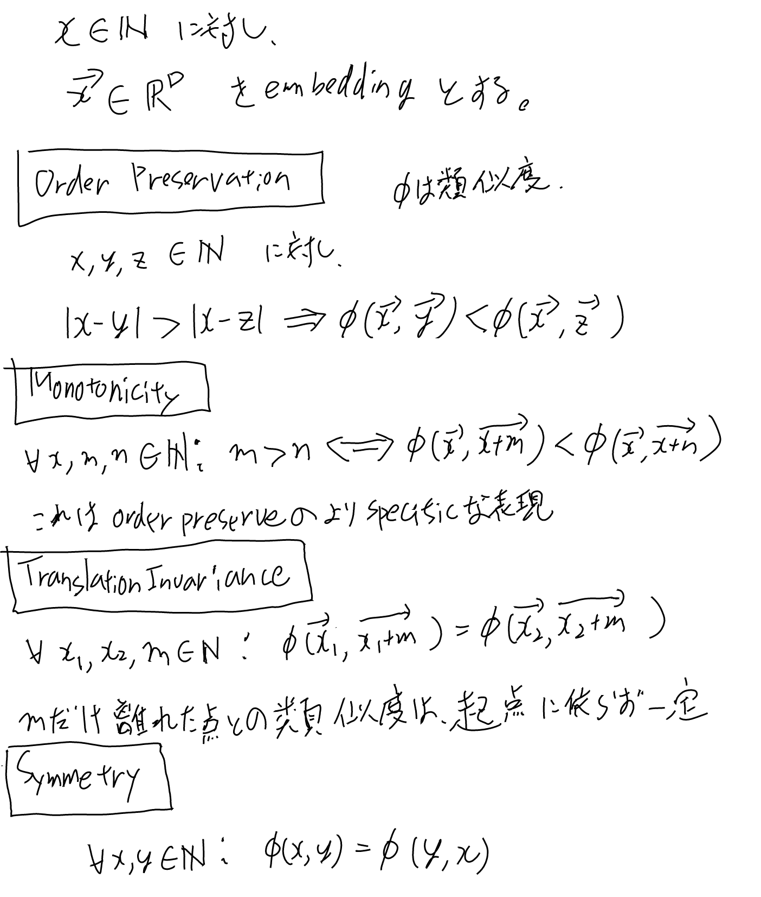
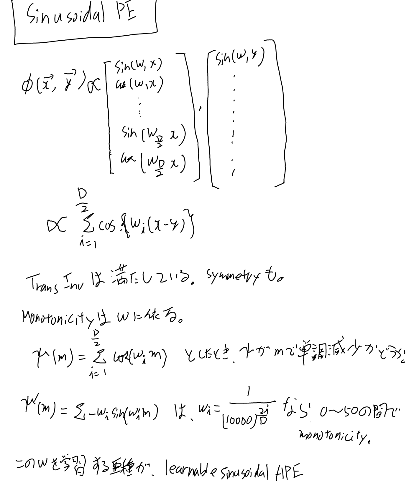

[[BERT]]にいろんな[[PositionEmbeddings]]を試してみて結果を見る[[論文]]。

- [On Position Embeddings in BERT - OpenReview](https://openreview.net/forum?id=onxoVA9FxMw)

[[WhatDoPositionEmbeddingsLearn]]が微妙だったので他のも見てみようと思って見かけた論文。

## Span prediction

[[SQuAD]]に詳細があるように、パッセージの一部が回答になるようなQ and A。

## 検討する性質

- Monotonicity
- Translation Invariance
- Symmetry

について、いろいろなembeddingsがどうなっているかを見ていく。

## Sinusoidal PE

Trans InvとSymmetryは解析的に示せる。

Monotonicityは一般には近い所でしか成り立っていない。