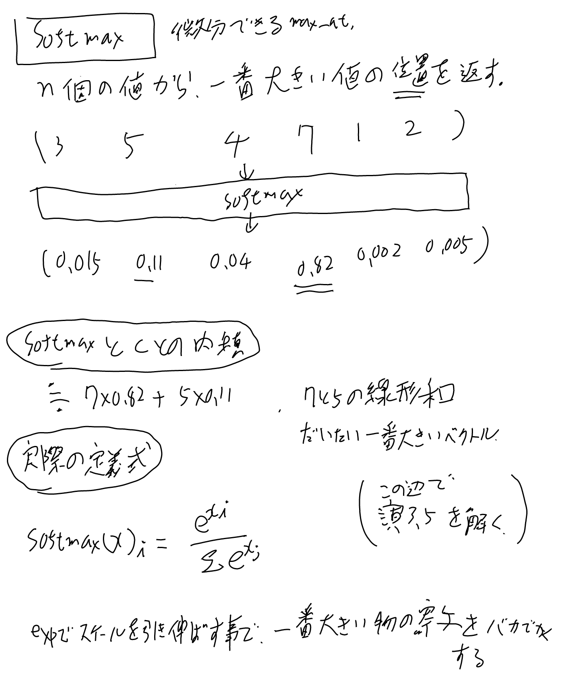

一般的には大文字ではなくsoftmaxと書くが、WikiName的に違和感があったのでWikiNameはSoftMaxとした。

## 何をするものか

n個の要素から、一番大きな要素の位置を1、それ以外を0で埋めたようなベクトルを返す。softなので完全な1と0じゃなくて一番大きいのが0.9,それ以外は0.1を分けるとかそんな感じになる。

なお、softmaxしたものと元のn個の要素の内積を取ると、一番大きい要素を取り出す演算となる。

微分が出来るのでback propagate出来て嬉しい。

伝統的にはカテゴリカルなモデルなどで、最後のフィーチャーをsoftmaxとって結果の確率とみなして学習する、みたいな使い方だったが、
昨今は[[Transformer]]の流行の結果、[[アテンション]]の文脈で良く登場するようになって、モデルの最後だけでなく途中のレイヤーでも頻繁に使われるようになった。

## 具体例と定義

## 演習3.5 softmaxが値の大きい所で誤差伝搬の勾配が小さくなるのを確認せよ（スケールの理由）

[[原論文から解き明かす生成AI]]の演習3.5。softmaxは入力の値の大きい領域では勾配が小さくなるという事を示したい。

こんな考察のもとに、[[セルフアテンション]]では、attentionに渡す値のスケールをdの影響分割り引く事にしているらしい。

[support-genAI-book/exercises/chapter3.md at main · yoheikikuta/support-genAI-book](https://github.com/yoheikikuta/support-genAI-book/blob/main/exercises/chapter3.md#%E6%BC%94%E7%BF%92%E5%95%8F%E9%A1%8C35) 菊田さんの解答。