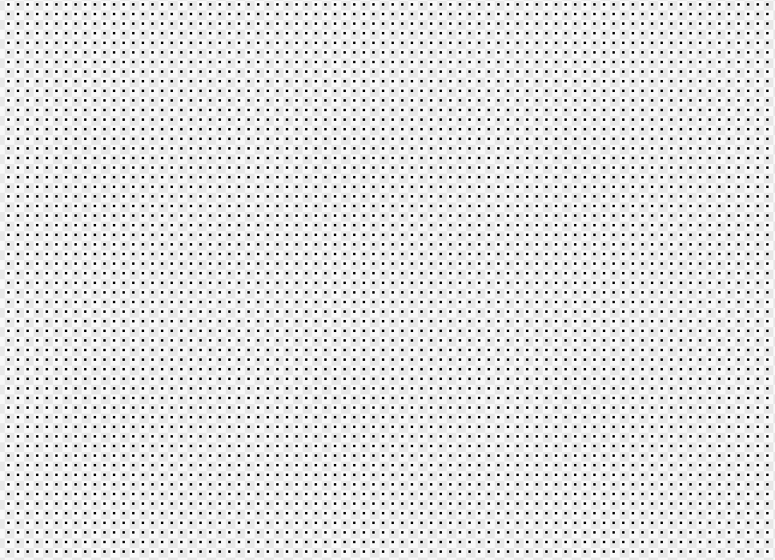

[[CG]]

Wikipediaの日本語では[点刻 - Wikipedia](https://ja.wikipedia.org/wiki/%E7%82%B9%E5%88%BB)となっている。
[[MFG]]でStipplingとか出来ないかなぁ、と思って情報を集めたり、実装のメモをしたりするページ。

[[MdImgr]]用のテンプレートを貼っておく。``

## Weighted Voronoi Centroidによるstippling

たぶん一番基礎となるImage Stipplingの論文は以下の2002のSecordの論文と思う。

[Weighted Voronoi stippling - Proceedings of the 2nd international symposium on Non-photorealistic animation and rendering](https://dl.acm.org/doi/abs/10.1145/508530.508537)

母点が重心となっているようなボロノイ図を求めてその母点を使う、というアイデアに、
グレーの画像成分を重みとしてその重みも加味して重心を計算する事でグレーな所は母点同士が近くに寄り、
それ以外の所は離れる、というような結果となる。

これは繰り返し計算が必要で、また最初の開始点の分布によって収束が結構違うので、
この後に続く多くの研究でこの効率的な改善が行われた。

### 適当に散らばった点

このアイデアのポイントとしては、ボロノイ図の重心を使うと、ある程度規則的だけれど微妙にランダムっぽい点が作れる、というのがある。

これはbluenoiseと言われる性質を満たした他の分布でも良く、ポアソンディスクサンプリングなどが良く比較される。

## MFGでの実装アイデア

Weighted Voronoi Centroidのような手法はどうしても何らかのクライテリアによるイテレーションが必要になってしまい、
GPUだけでは閉じない。

けれどフィルタとして実装するならもうちょっといろいろ工夫が出来るんじゃないか、という事でフィルタで似たような事をする方法を考えてみる。

### 基本的なアイデア、グレーの重みで適当に散らばった点をサンプリング

点を動かすのでは無く、最密の点から始めて、確率的にその点を消す感じで同じ事が出来ないか。

各点はその点より少し大きい格子の中に一つとして、どこに打つかは適当にランダムにずらす。
まずはホワイトノイズでずらしてしまおう。


ランダムでずらすがこの度合いは格子を超えない程度にしておく。
こうする事で点と点が重なる事は防げる。

そしてその格子で点を打つかどうかは下のグレーの場の強さによって確率を調整した上で適当にランダムにサンプルする。
ただしランダムといっても近隣の複数の点で別々に同じ結果を計算出来る必要があるので、x, yを元にしたhashを使うのがいいだろう。
下図ではバツ印で消す点を表している。


これでだいたい下の場の強さに応じて点の数が増えたり減ったりする点が打てるんじゃないか？

このアイデアだと

1. 最密の所でも格子の距離くらいあくので、あんまり暗く出来ないかもしれない
2. ホワイトノイズがどのくらいいまいちかはやってみないと分からない

というあたりに不安もあるが、まずは実装してみて考えよう。

### グレースケール化

まずはグレースケールの場を作るためにグレースケールにしよう。
[[MFG]]に書いたように、以下とする。

```
@bounds(input_u8.extent(0), input_u8.extent(1))
def grayT |x, y| {
  to_xyza(input_u8(x, y)).y
}


def result_u8 |x, y| {
  let gray = grayT(x, y)
  [gray, gray, gray, 1.0] |> lbgra_to_u8color(...)}
}
```

grayTはリニアライズされた色になるので、RGBに戻す時はgamma補正する（to_u8colorでは無くlbgra_to_u8colorを使うということ）。
本当はグレーを戻すのにRGB同じ数値では適切ではないが、これは動作確認なのでいいでしょう。

試してみると以下。


結構綺麗にできているので良さそう。

### 格子の中心に点を打つ

点はとりあえず2x2ピクセルとしよう。上下左右に3pxずつあけるとすると、格子は8x8か？

```
let GRID_SIZE = 8
let inputEx = sampler<input_u8>(address=.ClampToEdge)

def result_u8 |x, y| {
  # 格子の左上
  let goxy = [x, y]/GRID_SIZE

  # 3x3の位置を左上に2x2のピクセルを打つ。
  # 3x3の位置をgcxyと呼ぶ。
  let gcxy = goxy*GRID_SIZE + [2, 2]
  ifel (all([x, y] >= gcxy) && all([x, y] < gcxy+[2, 2]),
      u8[0, 0, 0, 0xff],
       u8[0, 0, 0, 0])
}
```



なんかあってそうか。でもサイズ2はちょっと小さいな。スペース広すぎか。

まぁいい。これを少しずらす。

ハッシュは[[MFG]]に書いたPCGベースの奴でいいだろう（正直xorshiftとかxxHashでも十分良い気がしているが）。

```
fn hash |i: i32| {
  let state = u32(i) * 747796405u + 2891336453u
  let word = xor((state >> ((state >> 28u) + 4u)), state) * 277803737u
  i32(xor((word >> 22u), word))
}

fn hash_xy |x:i32, y:i32| {
  hash(x + hash(y))
}

fn map_to_f32 |uval: i32| {
  let inv = 1.0 / 4294967295.0
  f32(u32(uval))*inv
}
```

ずらすのは`-3`から+3まででいいのかな。

```
let GRID_SIZE = 8
let POINT_SIZE = 2
let SPACE=(GRID_SIZE-POINT_SIZE)/2

# 中略

  # -SPACEからSPACEの間にランダムにずらす。
  # goxyに対応した乱数をハッシュで得る
  let rand1 = hash_xy(*goxy)
  let rand2 = hash(rand1)
  # -0.5〜0.5の乱数
  let rf1 = map_to_f32(rand1)-0.5
  let rf2 = map_to_f32(rand2)-0.5

  let offset = i32([rf1, rf2]*f32(2*SPACE))
  let gcxy2 = gcxy+offset
```


ブルーノイズという感じはしないが、ランダム性は得られている。
あとはさらにもう一つ乱数を足して、これがグレーの値より大きければ点を打つか。