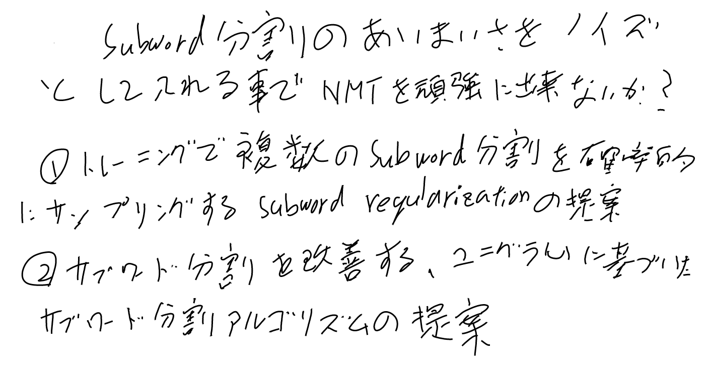
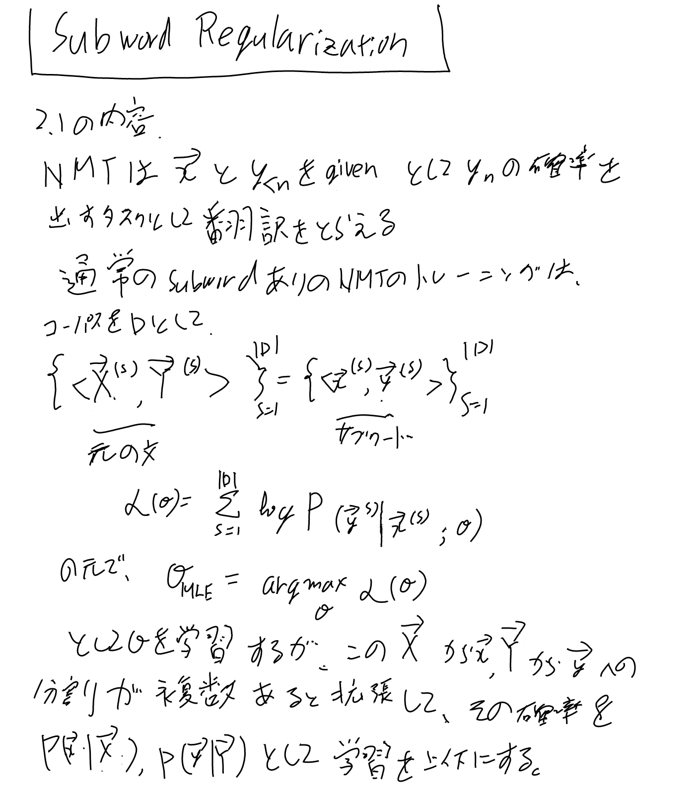
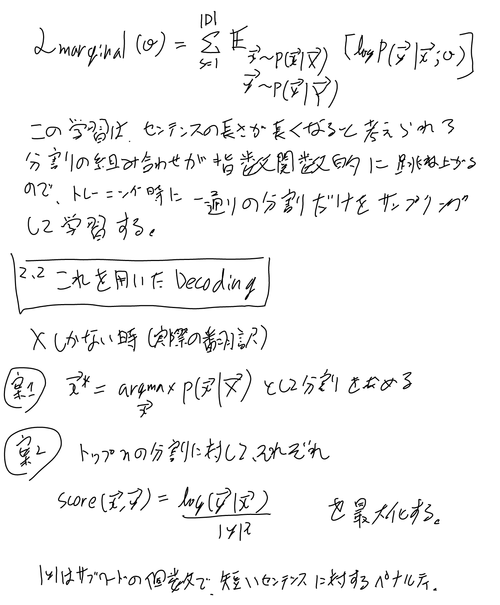
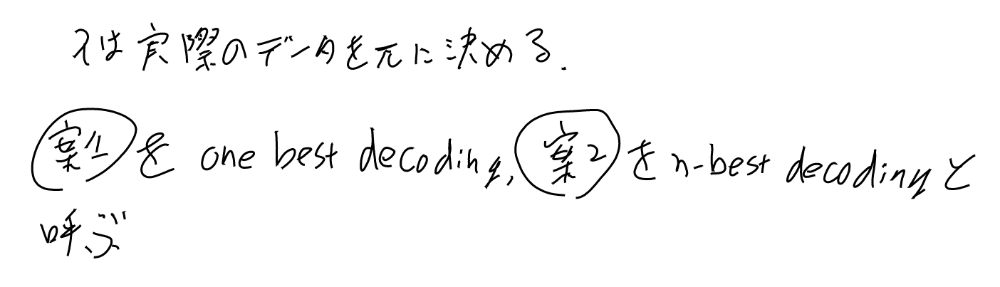

[[論文]], [[原論文から解き明かす生成AI]]の2章で扱っている。

[arxiv: 1804.10959 Subword Regularization: Improving Neural Network Translation Models with Multiple Subword Candidates](https://arxiv.org/abs/1804.10959)

[[NeuralMachineTranslationOfRareWordsWithSubwordUnits]]のサブワード分割がBPEによるgreedyなものだったが、
分割の曖昧性さが捨てられてしまう。[[SentencePiece]]には両方の実装が入っている。

分割の曖昧性さはregularizationの一種として解釈出来て、トレーニングに組み込むとよりよいモデルになるのでは？
というアイデアと、その例として[[ユニグラム言語モデル]]によるサブワード分割の提唱をしている。

## 概要

## Subword Regularization

