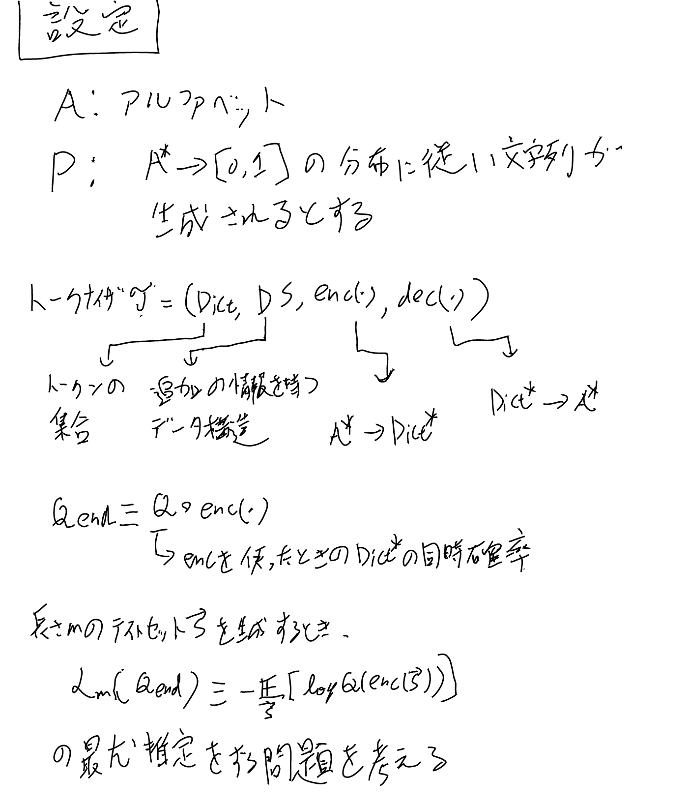
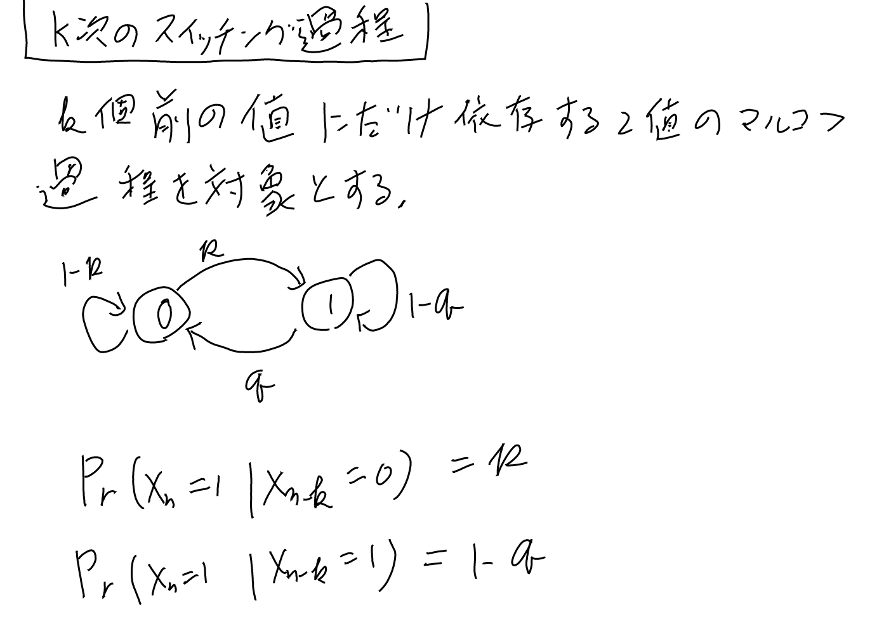
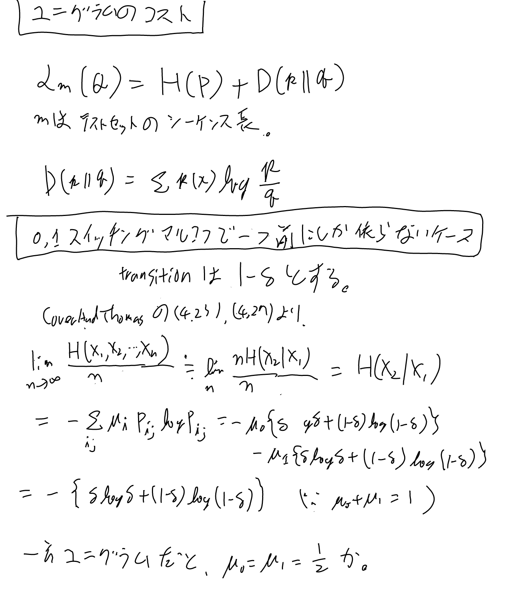
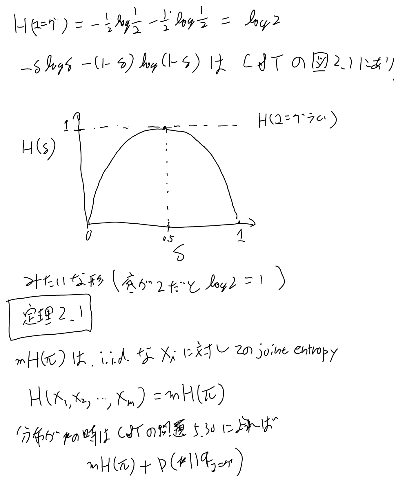
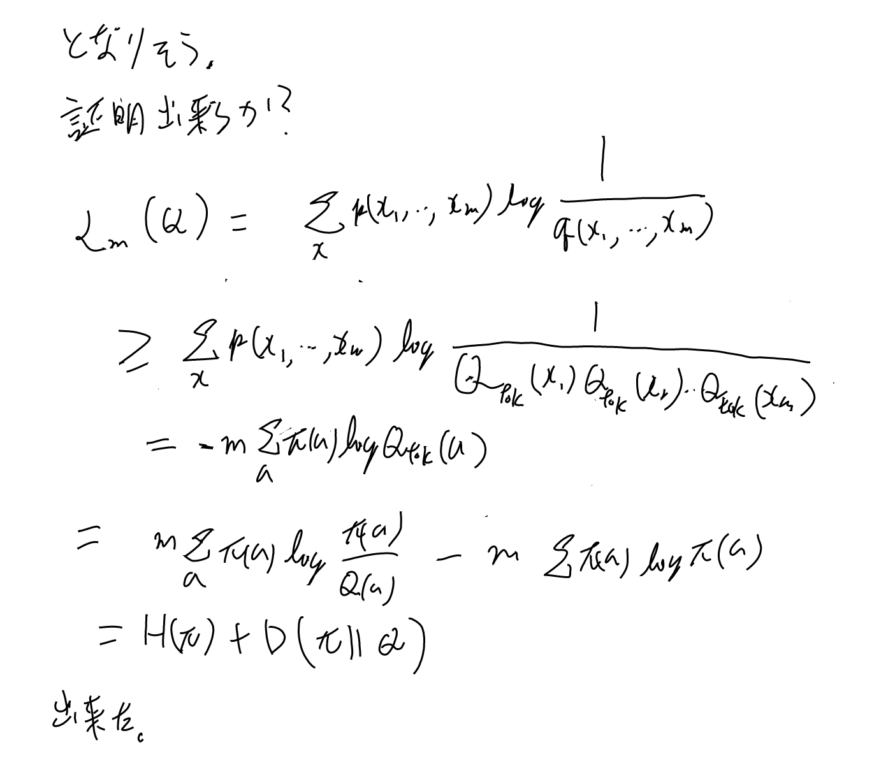
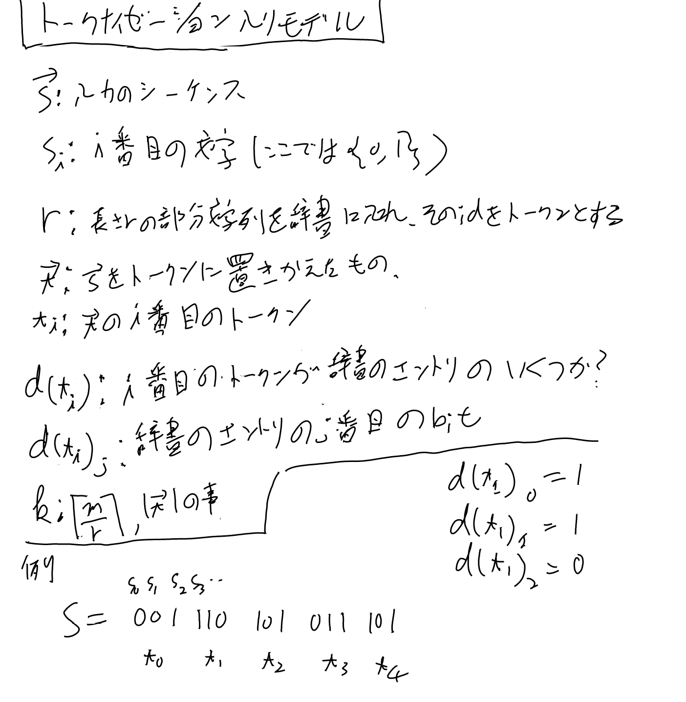
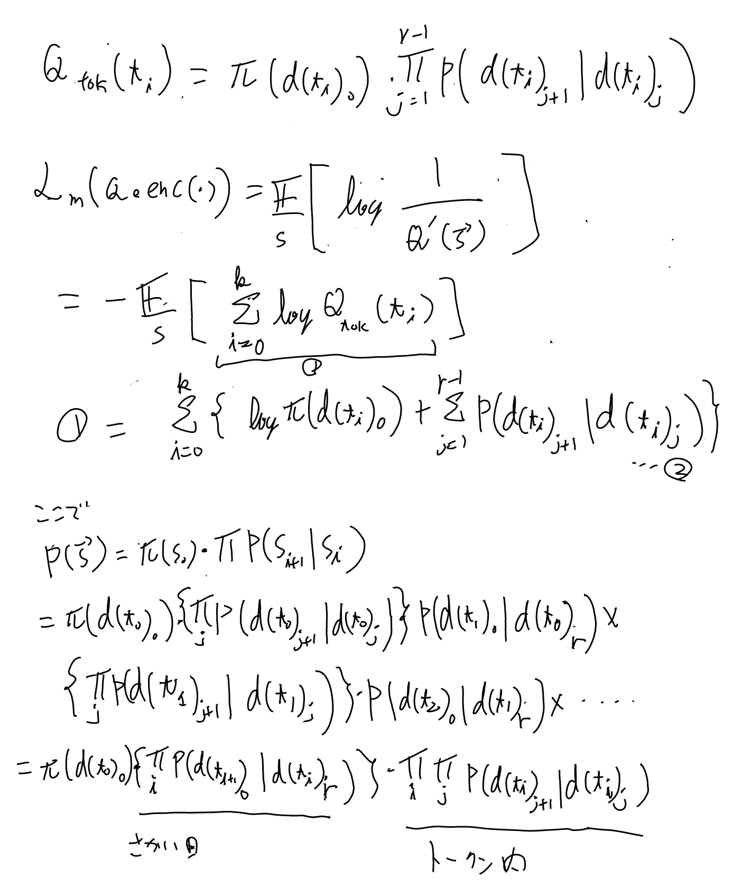
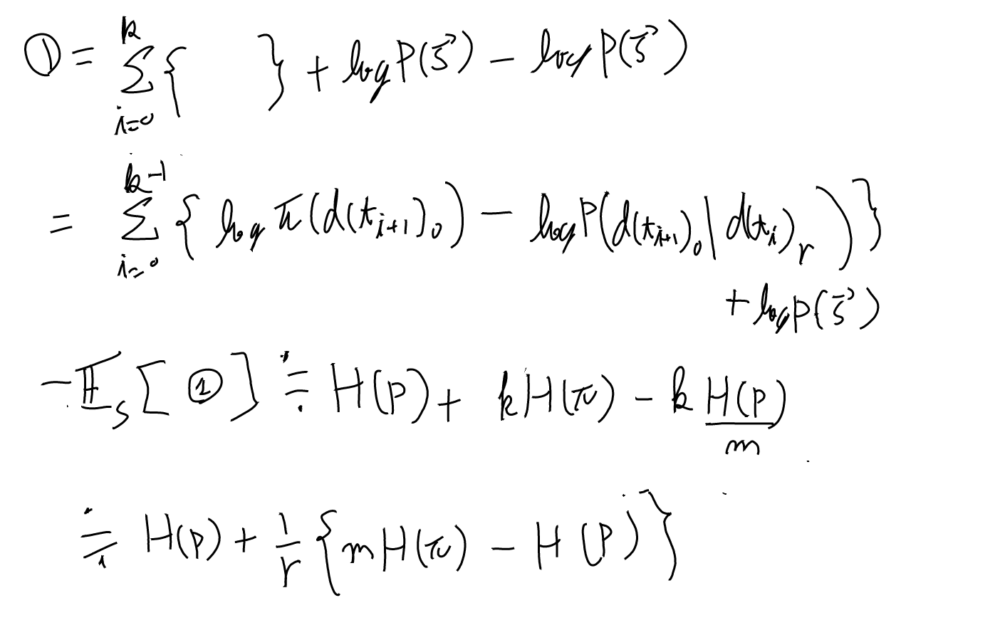

[[論文]], [[原論文から解き明かす生成AI]]

[arxiv:2404.08335 Toward a Theory of Tokenization in LLMs](https://arxiv.org/abs/2404.08335)

## 基本的な設定

## k次のスイッチングマルコフ

## ユニグラムのコスト

まずはマルコフ性を無視したユニグラムの言語モデルでは、どの程度の無駄があるかを、対数尤度のlower boundから考える。

真の分布をPとして、ユニグラムによる言語モデルの値をQとする。Pでの期待値である事に留意すると以下。（スイッチングのケースは[[マルコフ連鎖]]も参照、Dは[[KLダイバージェンス]]）

不等号は$Q_\#(m)$の分。最後はmを忘れている気がする。

ユニグラムのコストはスイッチングのケースでデルタを極端な値に持っていけばいくらでも大きく出来るので、
ユニグラムのコストは大きくなりうる。

## トークナイゼーション入りモデル

ユニグラムでは十分な最適化が行えないケースがありうるという事が示せたので、次はトークナイズを入れるとどうなるかを見ていく。

遷移核からエントロピーレートになる所（終わりから三行目から二行目になるところ）は[[マルコフ連鎖]]を参照のこと。

この最後の式は、rを大きくする（語彙サイズのdを大きくする）と、これはユニグラム制約無しの最適な値に近づいていく事を表す。