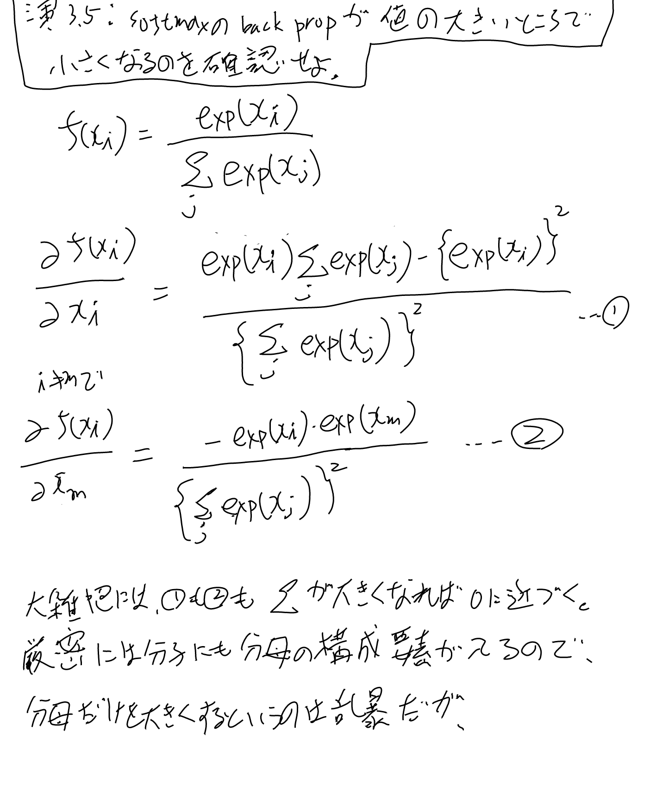
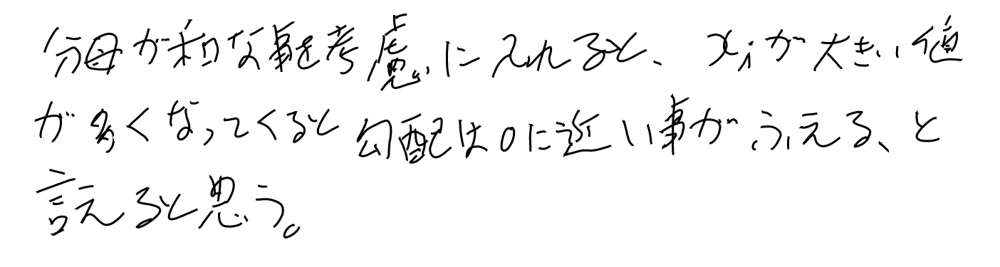
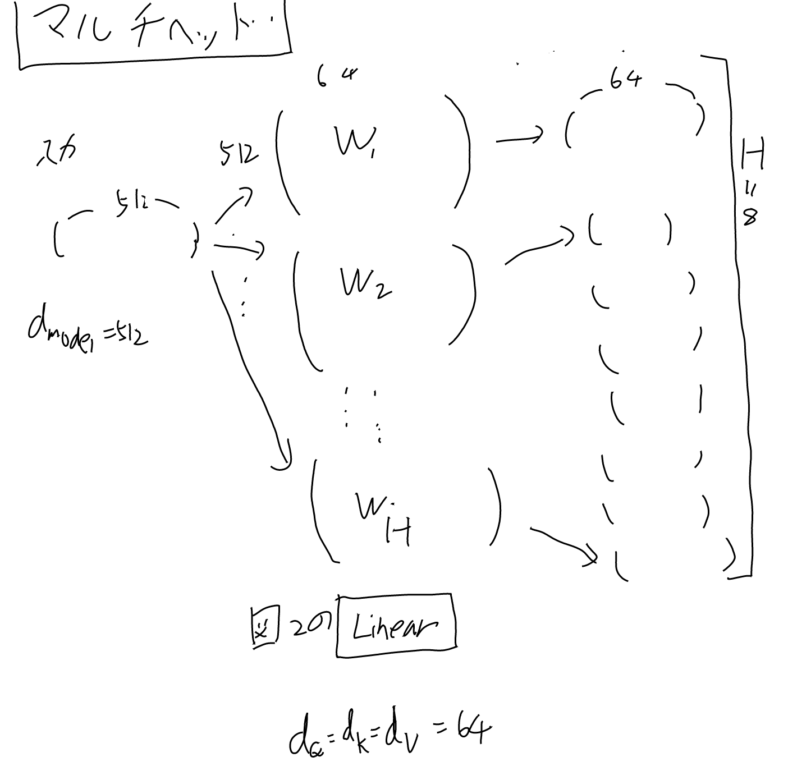
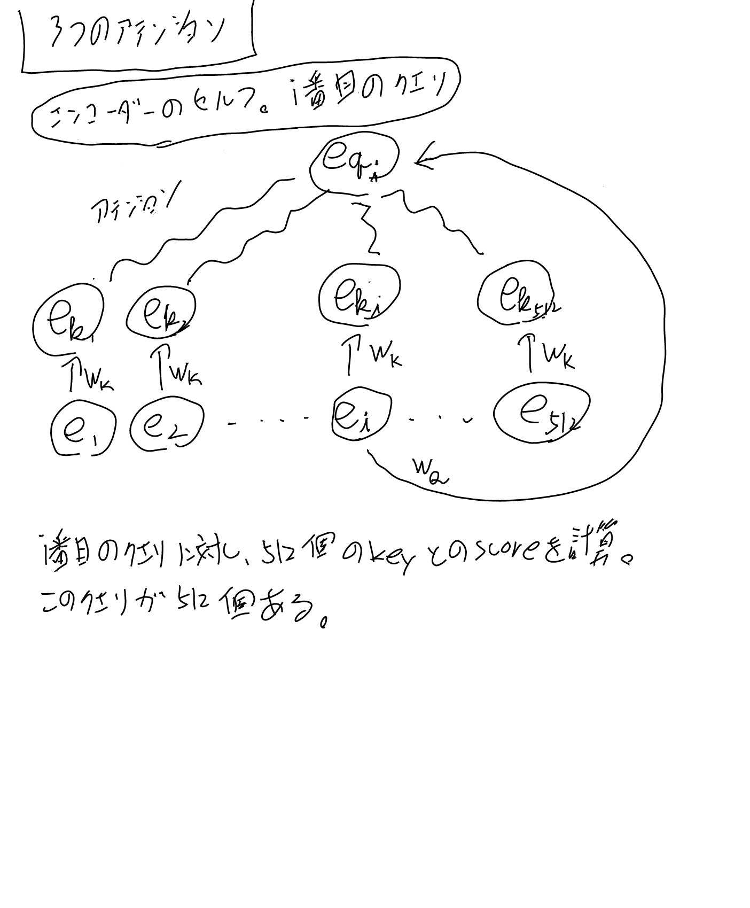
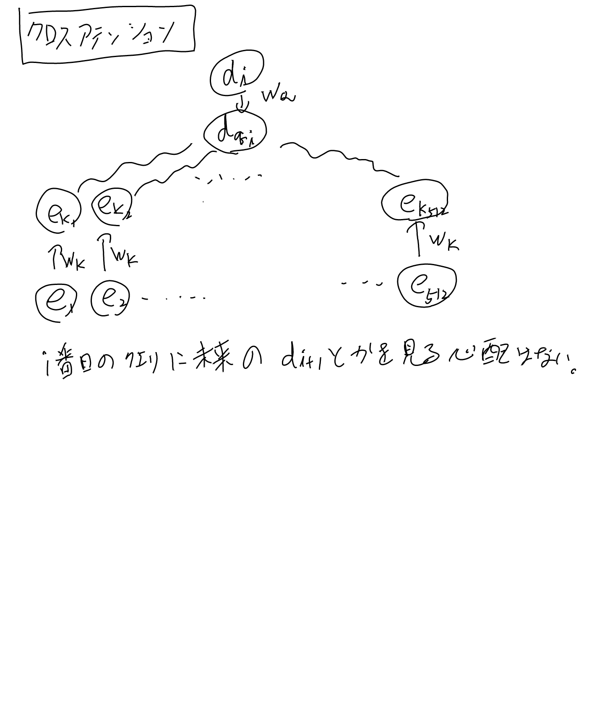
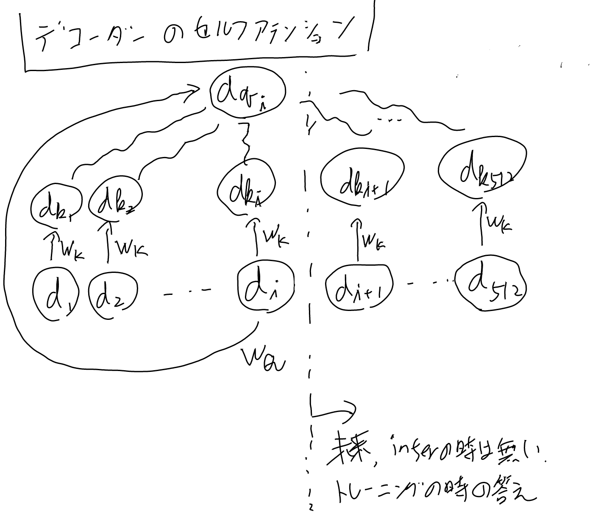

[[機械翻訳]]の決定版。[[機械学習]]。別名: [[AttentionIsAllYouNeed]]

- [arxiv:1706.03762 Attention Is All You Need](https://arxiv.org/abs/1706.03762)という[[論文]]で提唱された。
- [The Annotated Transformer](https://nlp.seas.harvard.edu/annotated-transformer/)
- [[原論文から解き明かす生成AI]]の3章にも詳しい
- [Attention is All You Needのメモ - なーんだ、ただの水たまりじゃないか](https://karino2.github.io/2018/06/01/217.html) 大した事書いてないが。

[[ConvS2S]]の進化版と考えられる。Convの代わりに[[セルフアテンション]]を使うという発明。

## PositionEmbeddings

[[PositionEmbeddings]]へ。

## アテンション

[[アテンション]]

### 演習3.5 softmaxが値の大きい所で誤差伝搬の勾配が小さくなるのを確認せよ（スケールの理由）

[[原論文から解き明かす生成AI]]の演習3.5。

こんな考察のもとに、attentionに渡す値のスケールをdの影響分割り引く事にしているらしい。

## Transformerのブロック構成

マルチヘッドアテンションとLayerNormとFFNの組み合わせになっている。

### マルチヘッドアテンション

マルチヘッドの所についてのメモ。
Q, K, Vを8個（H=8）に分離する訳だが、
次元とかがややこしいので。

入力の次元 $d_{model}=512$ で、Wのアウトプットの方はQ, K, V共通で全て 64。

ようするに512次元の入力を、64次元の出力にするWを8つ用意して、掛ける。図のLinearがこれ。

全ての位置の入力に対して同じWを掛ける。Q, K, Vそれぞれに別々のWを掛ける（論文の3.2.2に説明がある)。

### FFのコネクション

以下のdense_relu_denseが呼ばれそう。

[tensor2tensor/tensor2tensor/layers/common_layers.py at master · tensorflow/tensor2tensor](https://github.com/tensorflow/tensor2tensor/blob/master/tensor2tensor/layers/common_layers.py?utm_source=chatgpt.com)

denseは以下っぽい。

[tf.keras.layers.Dense  -  TensorFlow v2.16.1](https://www.tensorflow.org/api_docs/python/tf/keras/layers/Dense?utm_source=chatgpt.com)

Noteの所に、rankが2以上だとlast axisだけをdotすると書いてあるのでd_modelに対してだけdotするという事で良さそうかな。
入力は(バッチ, token列, d_model)というテンソルだろう。

計算量は[[セルフアテンション]]の方で計算した。

### アテンションの取り込み方

マルチヘッドのアテンションをconcatしてWを掛けたものをそのまま次の入力へと渡している。

## セルフアテンションとマルチヘッドアテンション

他からもリンクしたい事があるのでページを分ける。

[[セルフアテンション]]

## マスクと3つのアテンション

アテンションの使われ方が3つあり、decoderのセルフアテンションだけmaskが必要、みたいな話が論文と本に書いてあるので、
この３つのアテンションの使われ方を見ておく。

### エンコーダーのセルフアテンション

### クロスアテンション

これは通常の[[アテンション]]になる。[[ConvS2S]]などと同じもの。
dを使うが、クエリに使うdは一つだけ（図ではiとしているが、実際はt-1期のもの）なのに注意。

### デコーダーのセルフアテンション

これだけ未来のdが登場しうるのでマスクが必要。

## Layer Normalization

[[LayerNormalization]]

## 入力の所はnormalizeされないのでは？という疑問

論文の図によると最初はLayer Normしてないように見えるが、これだと内積では絶対値に引きずられてcos距離にならず、アテンションとしては微妙なのでは？と思った疑問。

２つ目以降はLayerNormが入るので1にノーマライズされている入力になるから内積でcos距離のようなものになる。

ChaatGPTに聞いたら、先にLayerNormを置くPre-LN Transformerというのがあって、そっちの方が最近は主流との事。

Pre-LNの方が良いのでは、という理論的な話をしている論文は以下。

[On Layer Normalization in the Transformer Architecture](https://proceedings.mlr.press/v119/xiong20b.html?utm_source=chatgpt.com)

学習が簡単になる、という話だが、自分の直感の、ノルムに引きずられる分をembeddingとかWが学習するのが無駄に大変という話とも整合的に思う。

この論文は既にあるPre-LNの理論的な裏付けであって、最初にPre-LN Transformerを使ったのはこの論文では無い。
最初に使われたのは以下の論文のよう。

 [arxiv: 1809.10853 Adaptive Input Representations for Neural Language Modeling](https://arxiv.org/abs/1809.10853)

ただこれには「we apply layer normalization
before the self-attention and FFN blocks instead of after, as we find it leads to more effective training.」とあるだけで、何故か、みたいな話はあまり無さそう。