[[Transformer]]の構成要素の1ブロック。

マルチヘッドアテンション+LayerNorm+FFN+LayerNorm。

- [[セルフアテンション]]
- [[LayerNormalization]]

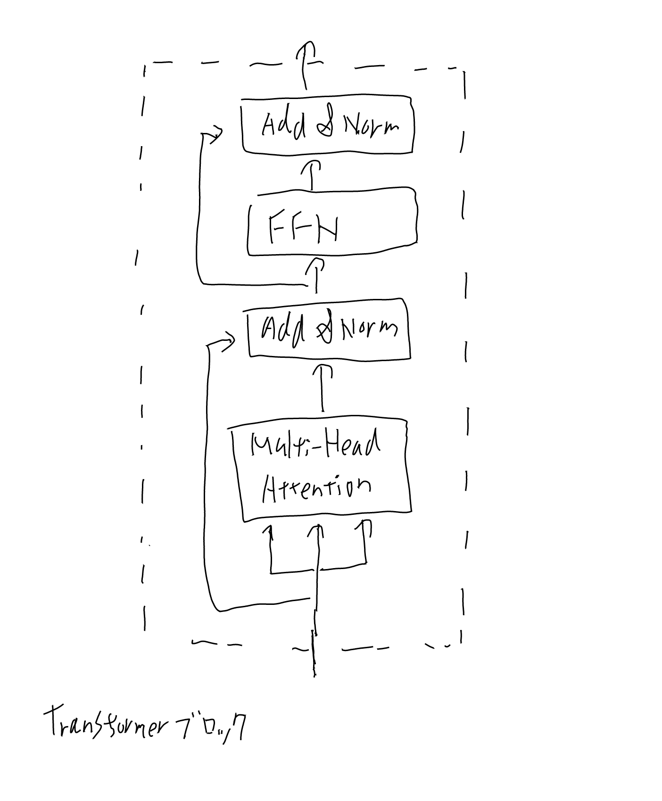

## マルチヘッドアテンション

[[セルフアテンション]]を参照のこと。

### FFのコネクション

以下のdense_relu_denseが呼ばれそう。

[tensor2tensor/tensor2tensor/layers/common_layers.py at master · tensorflow/tensor2tensor](https://github.com/tensorflow/tensor2tensor/blob/master/tensor2tensor/layers/common_layers.py?utm_source=chatgpt.com)

denseは以下っぽい。

[tf.keras.layers.Dense  -  TensorFlow v2.16.1](https://www.tensorflow.org/api_docs/python/tf/keras/layers/Dense?utm_source=chatgpt.com)

Noteの所に、rankが2以上だとlast axisだけをdotすると書いてあるのでd_modelに対してだけdotするという事で良さそうかな。
入力は(バッチ, token列, d_model)というテンソルだろう。

数式にすると以下か。（[[原論文から解き明かす生成AI]]の3.18が見やすいので真似する）
$$
FFN(\bm{x}) = W_2 \cdot max(\bm{0}, W_1 \bm{x} + \bm{b}_1) + \bm{b}_2
$$

## Layer Normalization

[[LayerNormalization]]

## 入力の所はnormalizeされないのでは？という疑問

論文の図によると最初はLayer Normしてないように見えるが、これだと内積では絶対値に引きずられてcos距離にならず、アテンションとしては微妙なのでは？と思った疑問。

２つ目以降はLayerNormが入るので1にノーマライズされている入力になるから内積でcos距離のようなものになる。

ChaatGPTに聞いたら、先にLayerNormを置くPre-LN Transformerというのがあって、そっちの方が最近は主流との事。

Pre-LNの方が良いのでは、という理論的な話をしている論文は以下。

[On Layer Normalization in the Transformer Architecture](https://proceedings.mlr.press/v119/xiong20b.html?utm_source=chatgpt.com)

学習が簡単になる、という話だが、自分の直感の、ノルムに引きずられる分をembeddingとかWが学習するのが無駄に大変という話とも整合的に思う。

この論文は既にあるPre-LNの理論的な裏付けであって、最初にPre-LN Transformerを使ったのはこの論文では無い。
最初に使われたのは以下の論文のよう。

 [arxiv: 1809.10853 Adaptive Input Representations for Neural Language Modeling](https://arxiv.org/abs/1809.10853)

ただこれには「we apply layer normalization
before the self-attention and FFN blocks instead of after, as we find it leads to more effective training.」とあるだけで、何故か、みたいな話はあまり無さそう。

## Fully-connectedなパーセプトロンとのパラメータ数の比較

セルフアテンションとConvやRNNの比較は論文や[[原論文から解き明かす生成AI]]にあるが、
この辺は当時の状況からの比較であって、今から新しくこの辺を学ぶ人にとっては不要に難しい比較に思う。

素人の視点としては、Fully-connectedなパーセプトロンとの違いを見てみるのが教育的だろう。

### Fully-connectedなパーセプトロンのパラメータ数

一つのoutputにつき、トークン数、トークンの次元を512とする。

一つのトークンあたり、512次元のアウトプットを出すには512x512となる。
一つのアウトプットにつき512トークンを足し合わせるのだから、それが512個必要になる。

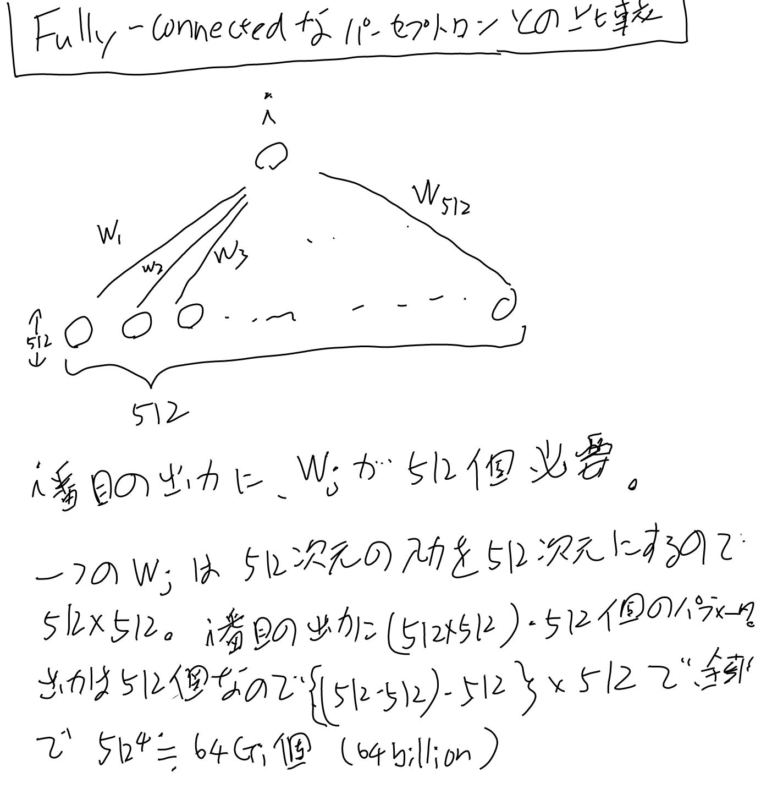

これが512個あるのだから、全体では512の4乗で、だいたい64G個（64Billion）となる。

### Transformerブロックのパラメータ数

MultiHeadと[[LayerNormalization]]とFFNで出来ている。LayerNormは大したこと無いので無視しよう。また多くの演算はW+Bの形式になるがWが512x512の時Bは512のオーダーなので、Wだけ見ていけば丼勘定としては十分。

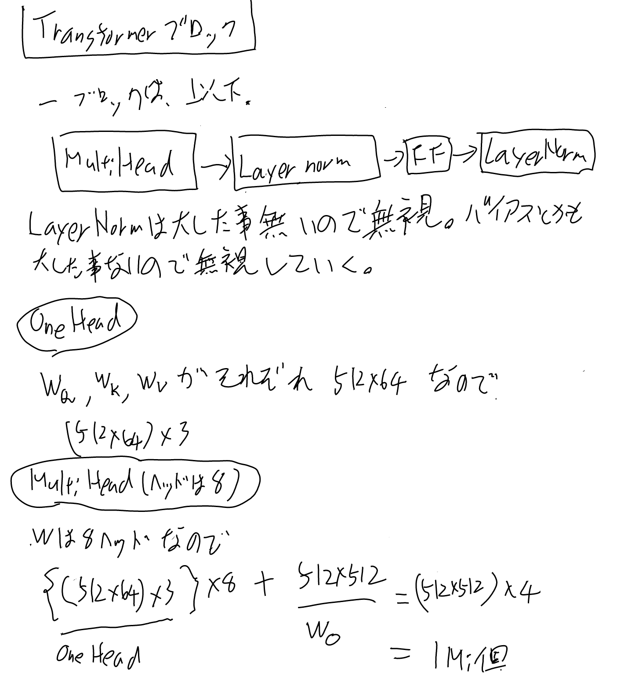
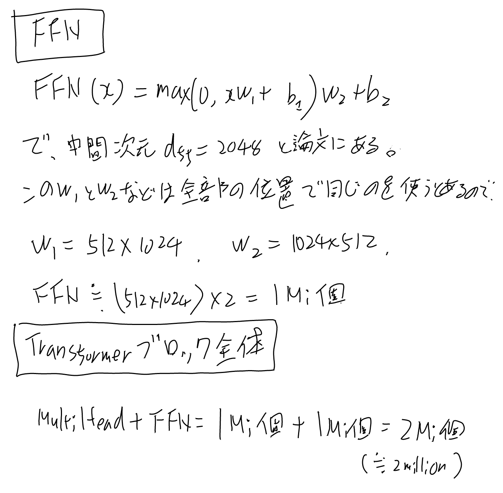

という事で、64Giと2Mi、くらいの差（32*1024倍）がある。

なお、パラメータ数を直感的に感じるには、どの行列は同じものを掛けているかに注目すると良い。

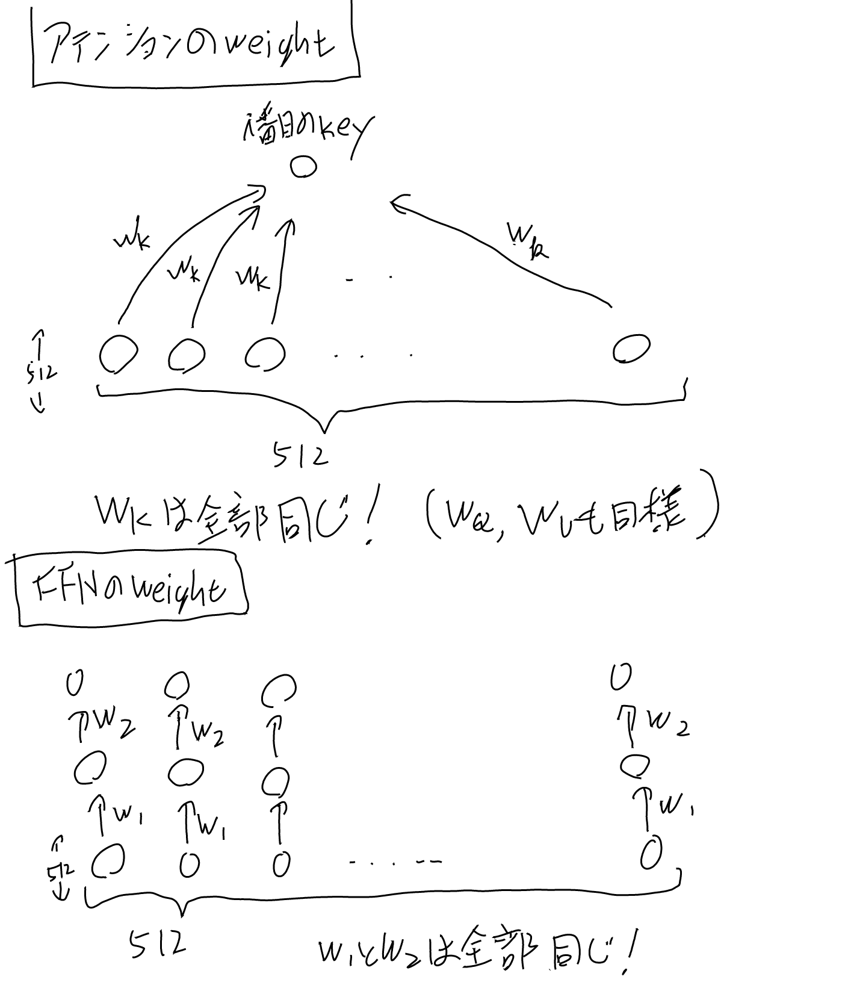

## 計算量の比較

論文のセクション4や[[原論文から解き明かす生成AI]]に話題があるが、少し自分でも計算してみる。

### 内積とWとの積

まず大前提として、

- 内積
- Wとベクトルの積

の計算量から見る。

内積はO(d)となる。
Wとの積は出力の次元によるが、入力と同じ次元を出力するのが基本とすると$O(d^2)$

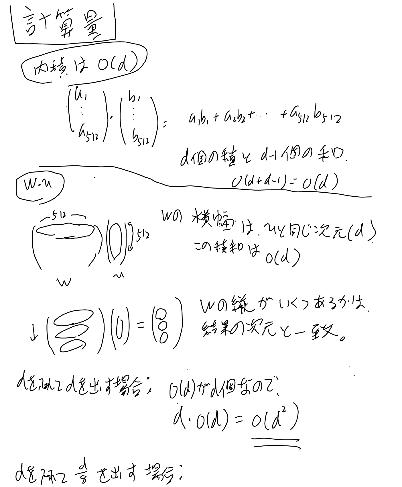
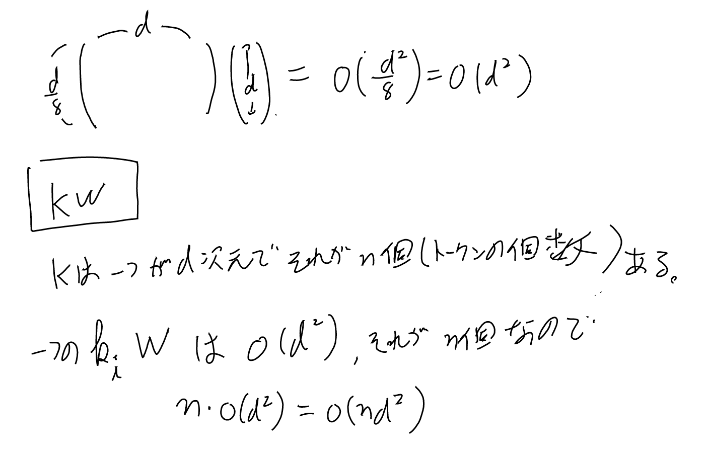

マルチヘッドではd/8を8個出すので、d/8のケースも考えておくと、計算量は1/8だが、オーダーとしては結局d/8の項はdとなる。512程度でビッグO記法はどうなんだ、という話でもある。

Q, K, VにWを掛ける計算は全て同じような演算なので、KWだけ考えておくと上記のようになる。

### マルチヘッドアテンションのQ, K, V

マルチヘッドのQ, K, VにWを掛ける計算は先にも述べた通りビッグO記法では定数倍は影響が無いが、厳密に考えても1/8したものが8個あるのでやはり通常のアテンションと同じくらいになる。

K, VとWとの積の計算量は、上の図でも書いたように、KとVは行列との積がn個あると解釈して、$O(nd^2)$となる。

QとWの積は、アテンションの種類によってQがベクトル1つかn個かの違いがある。

- クロスアテンション(Qはベクトル1つ）: $O(d^2)$
- セルフアテンション(Qはベクトルn個）: $O(nd^2)$

これらがアテンションの入力を作るのに必要な計算量で、この後にこれらの結果を使ってアテンションを計算する計算量が掛かる。

### アテンションの計算量

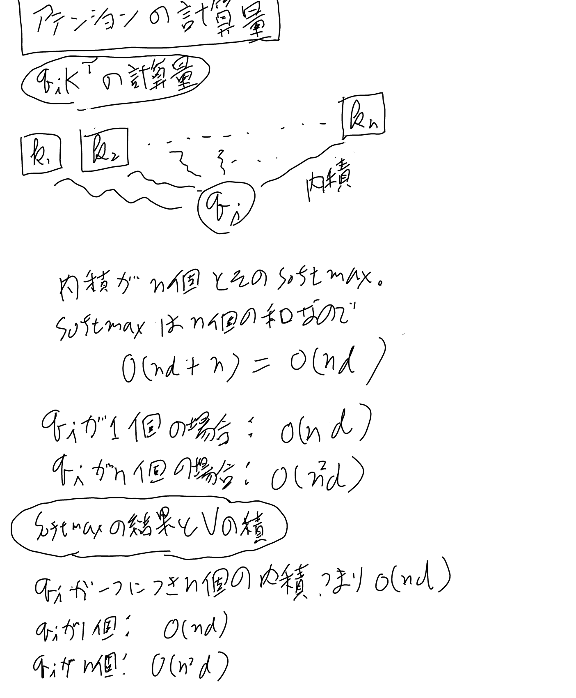

### FFNの計算量

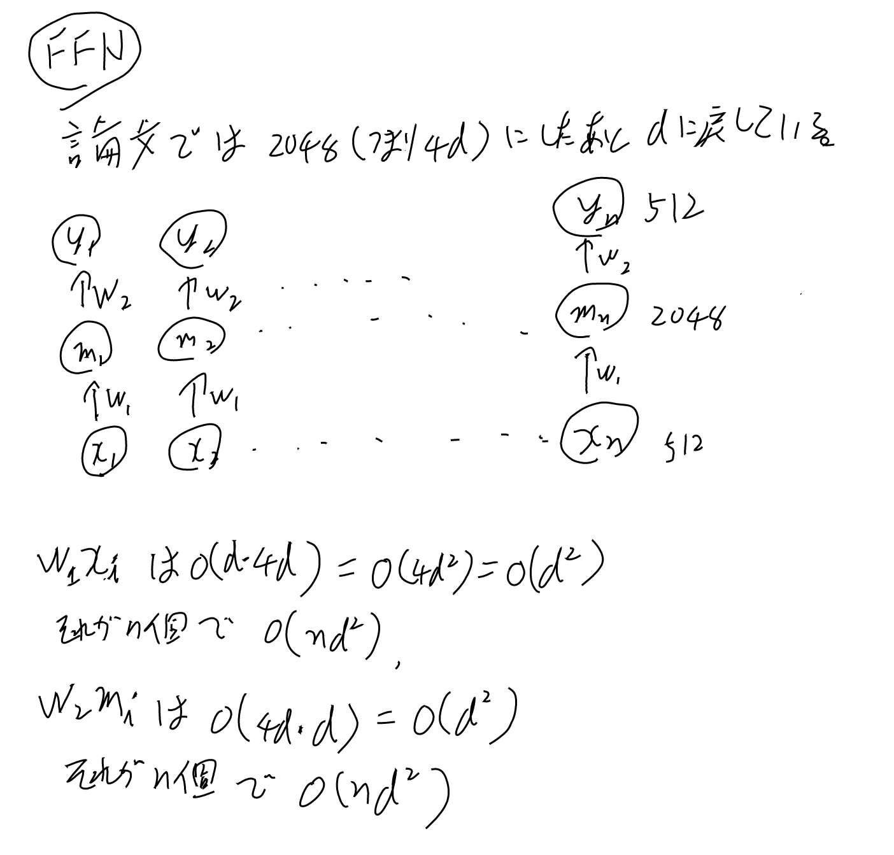

### Trasnformerブロック全体

以上をまとめると以下のようになる。

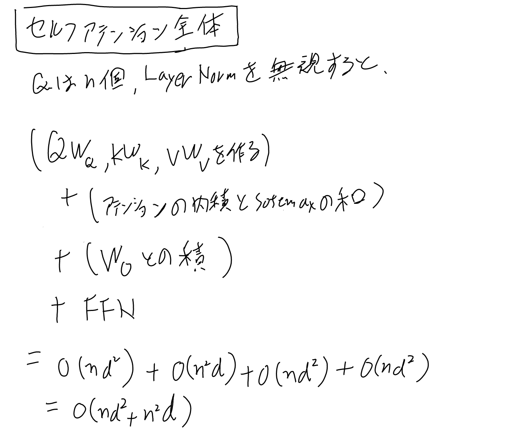

### Convの計算量

比較のため、1次元Convolutionの計算量も見ておく。カーネルサイズは便宜上5としておく（k=5）。なお、[[ConvS2S]]はk=3なのでもっと小さい。

テンソルは慣れないと分かりにくいので、dxdの行列を5個持っている、として計算すると良い。
一つのdxd行列との積の計算量が$O(d^2)$で、それがk個ある。

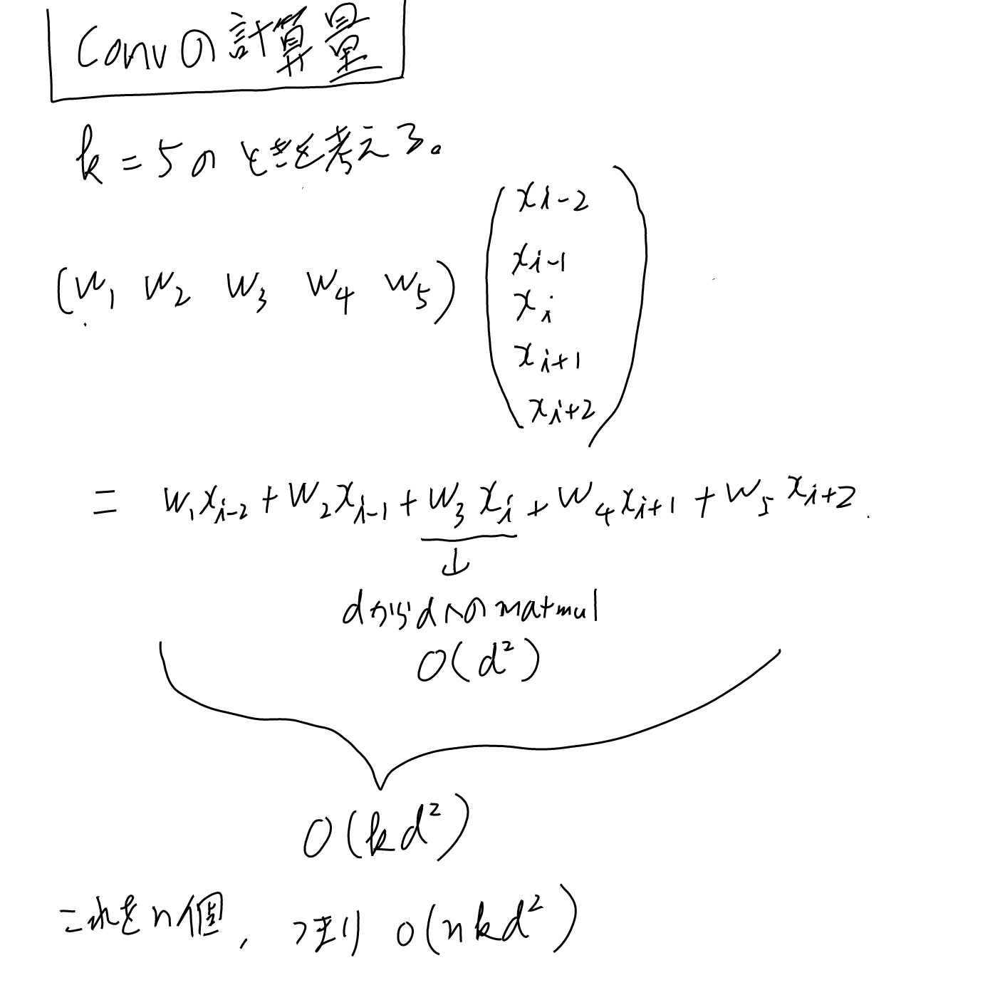

なお、convolutionはinputの個数だけこの演算を行うので、最後にn倍する事に注意。

### r個にrestrictしたケースの計算量等（演習3.6）

[[原論文から解き明かす生成AI]]の演習3.6に、アテンションを近隣のrに絞った場合の計算をせよ、というのがあるのでやってみる。

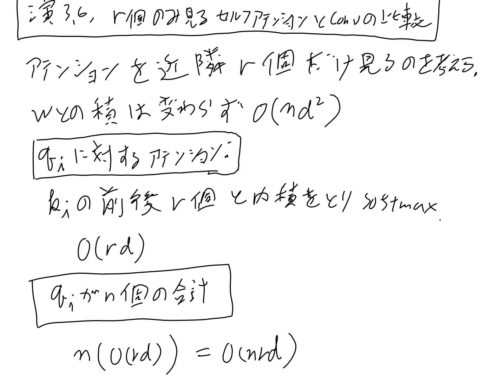

最大パス長は、nの間の相互作用を得られるまでに何層つなげるか、という事だと思う。
微妙な話ではあるが、一層でr個分の相互作用があると思うと、n/r 個のレイヤーを積み重ねれば一応つながるという話だろう。
softmaxがrの端をちゃんと考慮に入れるかどうかは自明では無いので正直n/r個のレイヤーを重ねてもn離れた相互作用を計算出来るかは微妙だが。