[[お絵描き]]

- [amazon: イラストをそれっぽく描くコツ](https://amzn.to/3ORTGxd)
- [書籍: イラストをそれっぽく描くコツの練習ライブ - YouTube](https://www.youtube.com/playlist?list=PL3J_mLcl4YCdg2O2fkkuR-whqyZfl61Mb)

## 購入、やる前の動機 2026-05-09 (土)

ちょっとお絵描きアプリのテストで長時間実際の使われ方と同じような事をする必要が出てきた。
そういう訳で普通のお絵描きをしたい。

そこで以前から気になっていた「イラストをそれっぽく描くコツ」を買ってみる事にした。
ちょうどマストドンで他の人がこの本をやっていて、意外とそれっぽい絵を描くようになっていたのも「ほーん？」って気分になっていたのもある。

## 配信テンプレ

iLMiNAで配信するようにしたので、テンプレ。

```
イラストをそれっぽく描くコツの練習ライブ、

練習を続けるために書籍「イラストをそれっぽく描くコツ」の練習を配信してみる。
```

tweet

```
イラストをそれっぽく描くコツの練習配信 by iLMiNA、今日は
```

### 初日の感想、なかなか良い気がする

1章の例を描いてみて、全然描ける気がしない。大丈夫なのか？これ。と始まったが、


そのあとやってみよう、の奴は以下みたいになった。

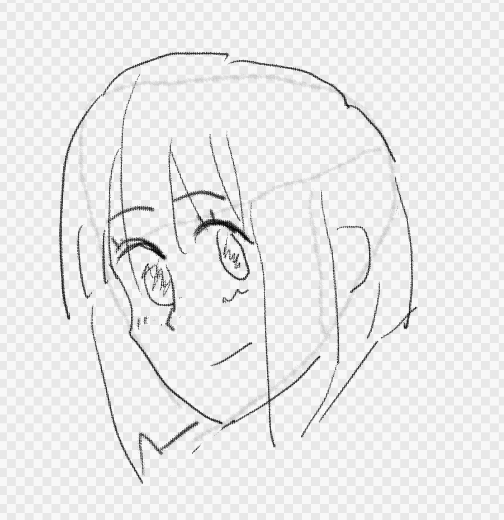

これなら割とそれっぽいか。
とりあえずやってみよう、という課題だけやっていく感じの方が良さそうかな。

と進めてみると、2章からは割と細かい話があって、書籍のタイトル通り、著者なりにたどり着いたそれっぽく描くコツをいろいろ語ってくれている。

正面の顔を描いてみるが、

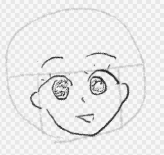

髪が無いと良くわからんな。

横顔。

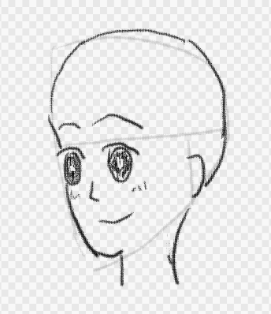

これはあまりうまく行っている気はしないな。

ただ、それっぽく描くコツの内容は良い気がする。

費用対効果が一番高く、素人でも気をつけられるくらいの数に絞ってポイントを示してくれるので、このくらいならたしかに素人でもすぐに実践出来る。
そして確かに、それらを気にした効果は得られる。

当然そんなちょっとの事だけでは「それだけで上手く描ける」というほどでは無くて、
いろいろいまいちな出来のものが出来る事もある。
だが、それは地道に頑張って練習しないのだから当然だよな。

この本がいいな、と思うのは、たまに「これはまぁそこまで悪くも無いのでは？」と思うギリギリのラインの絵が描ける事がある所。
「全然駄目だな、これ」という場合もあるのだが、
上手く行ったり行かなかったり、というランダム性があるのは、少しやってみようか、という気になる。
これは結構凄い事な気がする。

### 二日目

俯瞰。

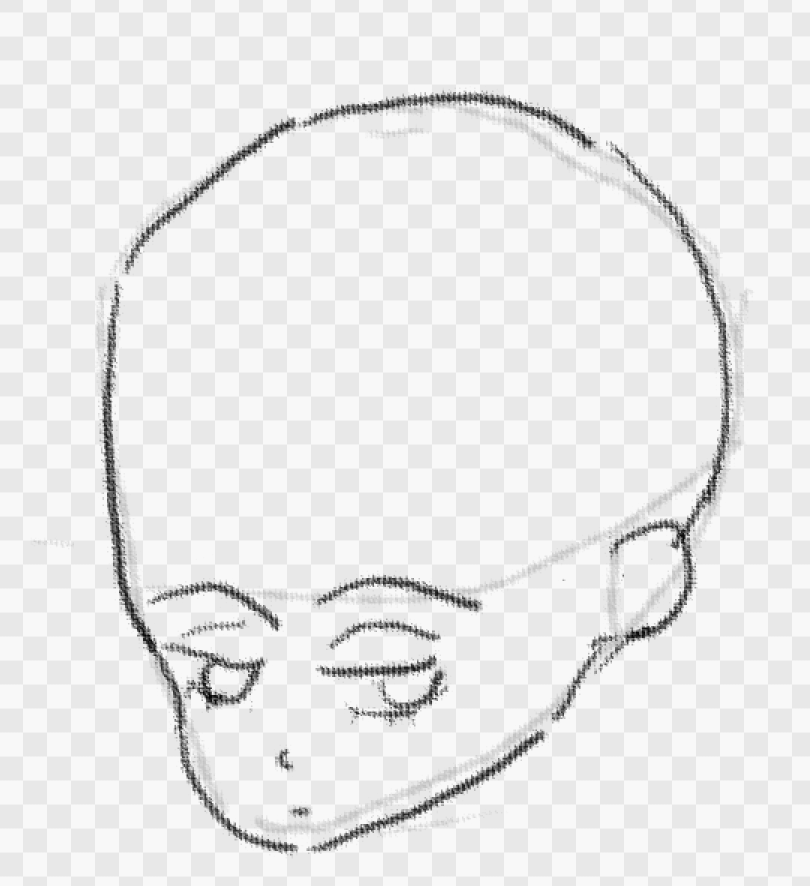

髪を描くのがあとなので、これだけだとどのくらい大丈夫なのかが良く分からないな。
頭がでかすぎるようにも見えるが。

ちょっとこれを描いている時にテスト対象の方の問題が発覚したのでお絵かきは中断（テストが目的なのでこれは良い）。


### 三日目

アオリ

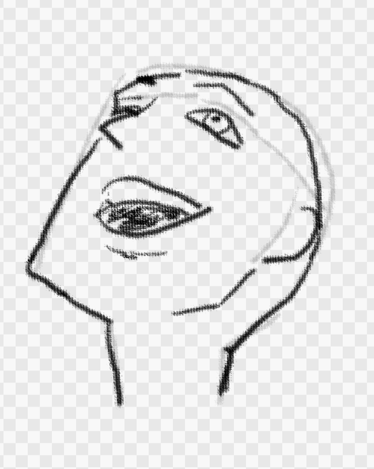

ちょっとアゴが突き出て見えるなぁ。少し直すか。

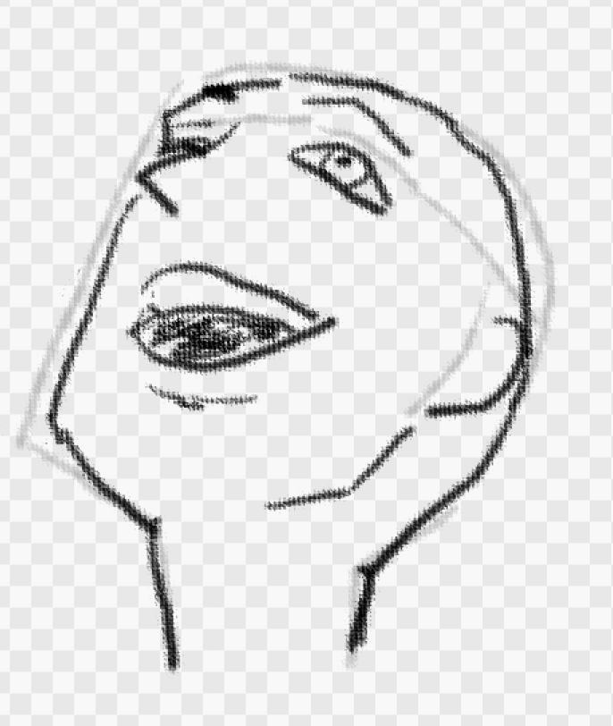

アオリには見えるな。
三つのコツに気を付けつつ真似をして描いただけだが、割とそれっぽくはなっているんじゃないか。

次は横顔

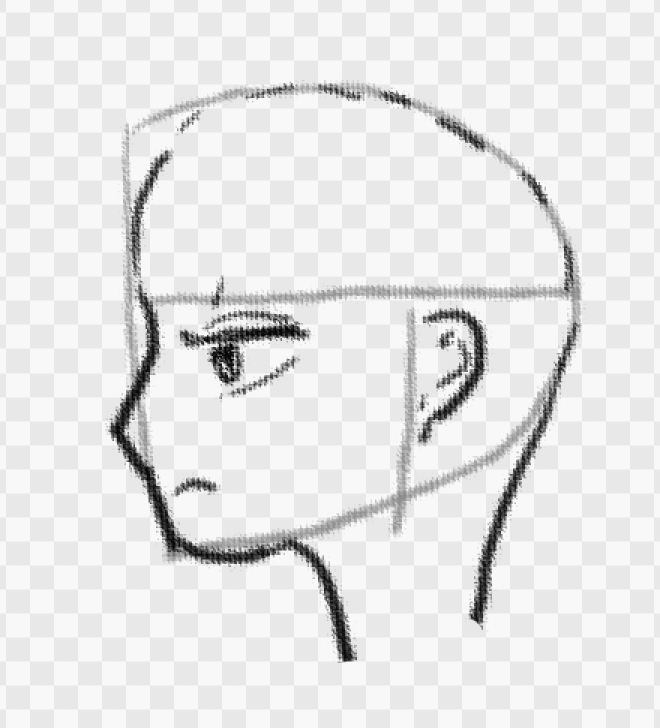

頭が小さい気はするな。三つの特徴は意識出来ている気はする。

大人の正面

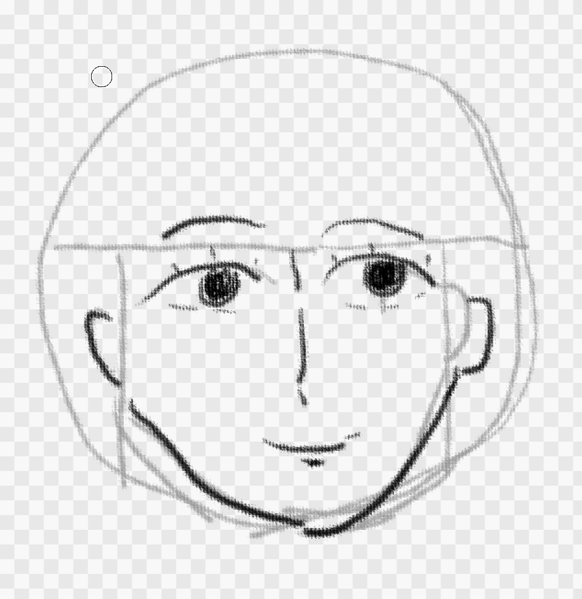

これは正面のコツと合わせると6つになるので全部意識するのはちょっと難しいな。
そして髪が後回しだとさっぱり分からん。

子供

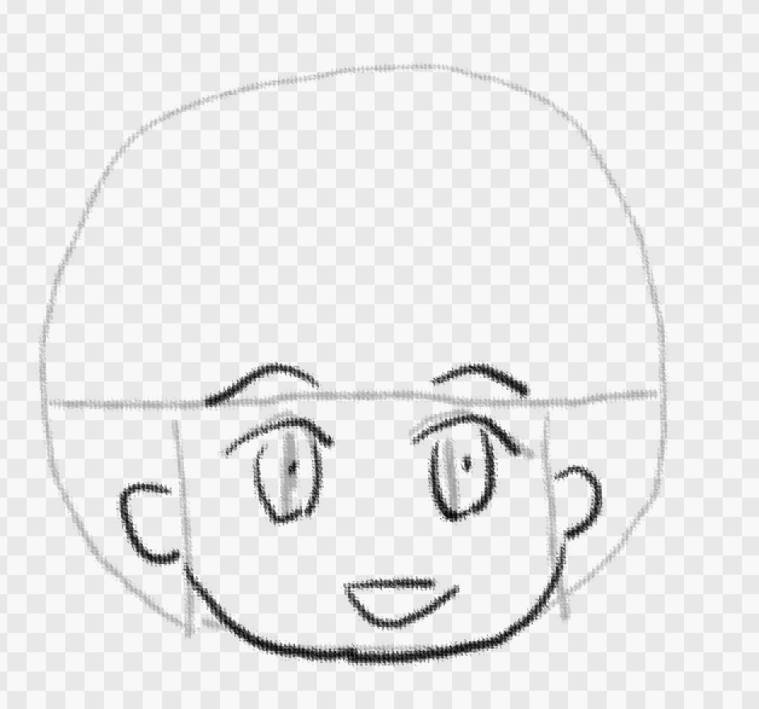

子供の方が簡単だ！

## 4日目 2026-05-19 (火)

今日は髪。

まずは正面顔のロングヘア。

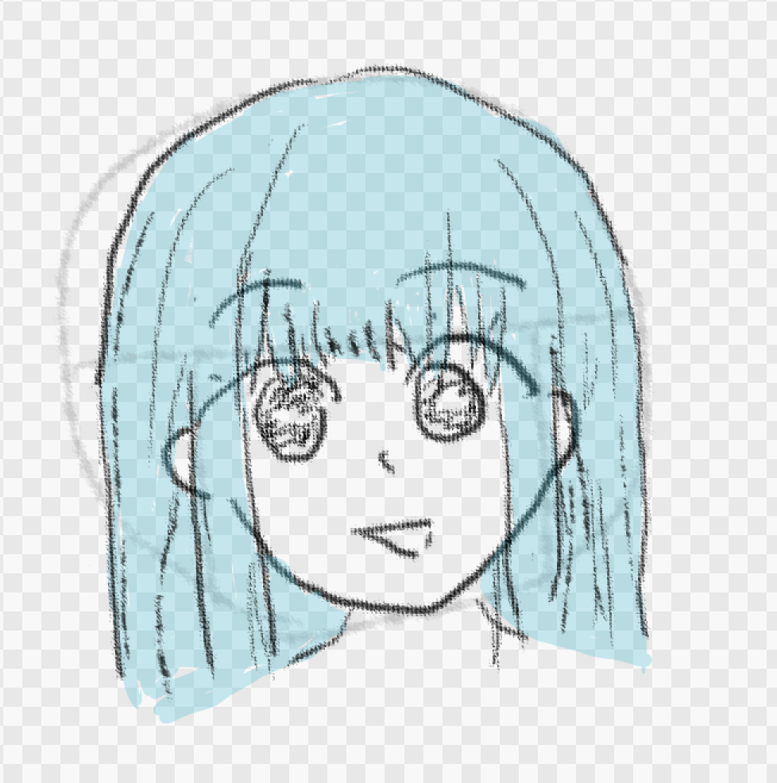

なんか髪はスケッチブック鉛筆のブラシだと汚いな。普通のペンにするか。
それっぽいかといわれると微妙だな。まぁこんなもんなような、下手なような。

と思ったが次のページに描いてみよう、がもうちょっと具体的な手順がかいてあるな。
もう一度この手順に従って描いてみよう。

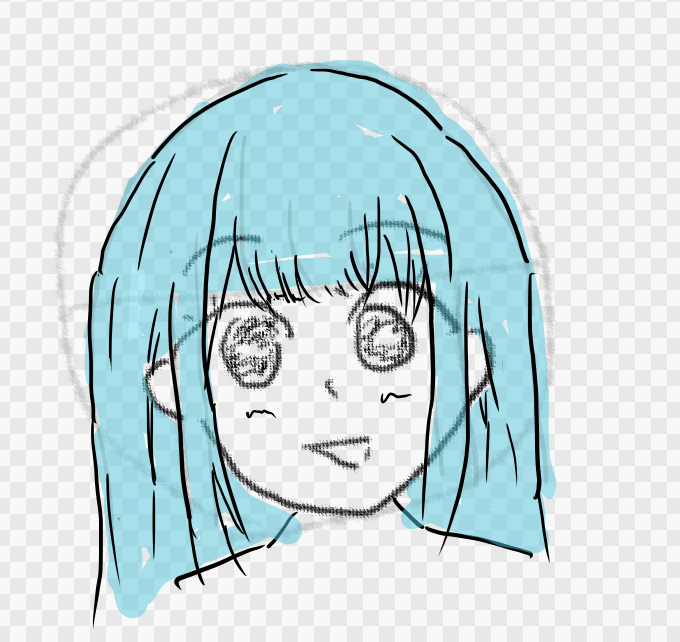

うーん、あんまりそれっぽくないな。髪難しい。

髪は難しいという事を受け入れて、あまり頑張らずにとっとと先に進む方がいい気がするな。

## 5日目 2026-05-20 (水)

あんまり真似ようとしても無駄に時間がかかる割にそんなに出来も良くないし、本の趣旨にも反する気がするので、
アタリの所を重要視してディテールは適当で終わらせよう、という気分になる。

ポニーテール

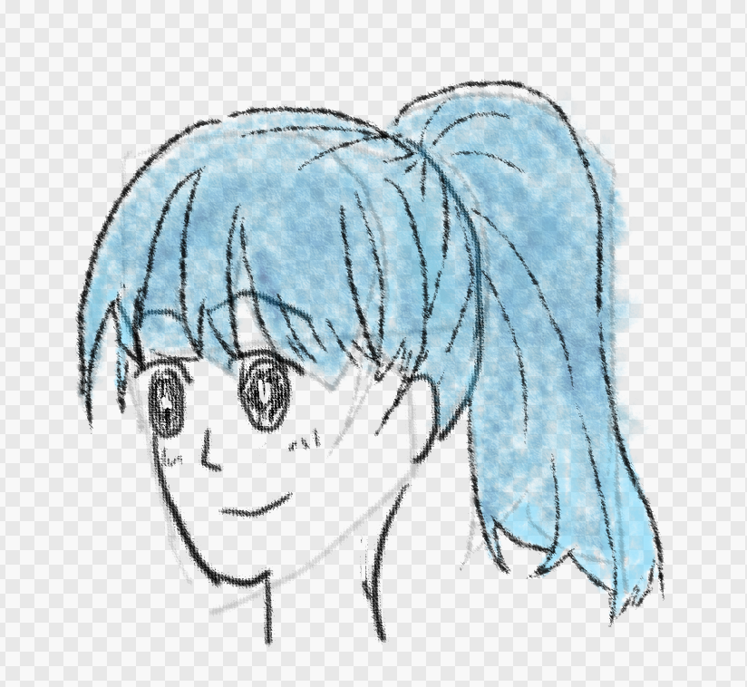

そんなにいい出来とは思えないが、髪よりは顔の方の問題な気もするし、三つのポイントは守れているし、時間は掛かっていない。
この方がよい気はするな。

この本とは関係ないがこの絵をやる本来の目的であった、テストしているフィーチャーが思った以上にバグが出なくてモチベーションが低下中。
まぁお絵描きとしては面白い本だと思うので続けようとは思うが。

先をパラパラ見ていて思うが、かなりの数があって全部髪をやっていくのはなんか違う気がするな。いかにも挫折するのがやる前から分かる。
しかもそこまで髪を描く練習をしたいわけでもない。

ちょっと進め方を考えよう。

アタリだけ一通り描いて、その先まで描くのは気が向いた奴だけにしようかな。その方がこの本の趣旨にもあっている気がする。
たぶん自分の描きたい奴だけを真似するのが本来の正しい使い方な気がするが、
別段今描きたいのが無いんだよなぁ。

### 進めやすい本だと思う

ここまでやってみての中間感想を。この本はシルエットから描いてうんたらかんたらって感じで始まるのだが、
どちらかというとトピックごとの3ポイントアドバイスの方が本体に思う。

模写しやすそうな絵とこのくらいなら自分でも出来そうだ、と思える三つのポイントが描いてあって、
それだけを意識して描いてみる、というのが良く出来ている所に思う。
3つのポイントだけでは満足できる程度の出来にならない事も多いが、
たまに満足できる程度の出来のものが出来る事もあり、
このバランスがとても良い本という気がする。

満足できるほどの絵を描くのは大変な事なので、満足できるほどのハウツーにしてしまうと難しすぎて挫折してしまう。
でもあまりにも好きに描いてみようだけだと全然満足できないひどい出来でそれもすぐに挫折してしまう。
難しくない程度ではあるが気を付ける事があって、それが出来ていればとりあえず出来たという達成感は味わえて、
しかもたまにそれっぽくなる事もあるのでモチベーションが保てる。

この簡単に出来そうな3つのポイントを選ぶのは相当頑張ったんだろうなぁ、という気はする。

あと模写というかちょっと真似して描きやすい絵がたくさんあるというのもいいポイントだと思う。
このくらいなら自分でも描けそうかも？と思えるようなくらいの大変さの絵がたくさんあるのが良い。

こういうとても続けやすく作られているのがこの本のメリットと思う。
結局自分のような素人にとっては、描けば描くだけ上手くはなるので（初心者だから）、
描いてみようと思わせる工夫、描いてみて達成感を少しは味わえる工夫がちゃんとされているのは、
経験を積む上でも良いと思った。

## 配信: オールバックっぽく描きたい 2026-06-09 (火)

iLMiNAで配信しながらやる事にした。

[書籍、イラストをそれっぽく描くコツの練習配信 - YouTube](https://www.youtube.com/live/bnKdjTftcUU)

いいんじゃない？（絵の出来はいまいちだが）

## 配信: ツンツンヘアっぽく描きたい 2026-06-10 (水)

[イラストをそれっぽく描くコツの練習配信、アオリとツンツンヘア - YouTube](https://www.youtube.com/live/hxM0tyWuScA)

## 配信: イケメン風、ツーブロック

[イラストをそれっぽく描くコツの練習ライブ、横顔とイケメン風髪 - YouTube](https://www.youtube.com/live/bECLxjLMdw0)

髪はまぁまぁそれっぽい気はする。イケメンかとかツーブロックかと言われると微妙だが。

## 配信: 巻き髪

[イラストをそれっぽく描くコツの練習ライブ、巻き髪から - YouTube](https://www.youtube.com/live/OxrbTJyhXvE)

巻き髪ちょー難しいな。

## 配信: 三つ編み

[イラストをそれっぽく描くコツの練習ライブ、三つ編みっぽく描きたい、から - YouTube](https://www.youtube.com/live/TWOI7qRfCKg)

なんかあと一歩な感じだな。

## 配信: 斜め、猫背

[イラストをそれっぽく描くコツの練習ライブ、ナナメっぽく描きたい！から - YouTube](https://www.youtube.com/live/fppjKrSNdVI)

ななめ

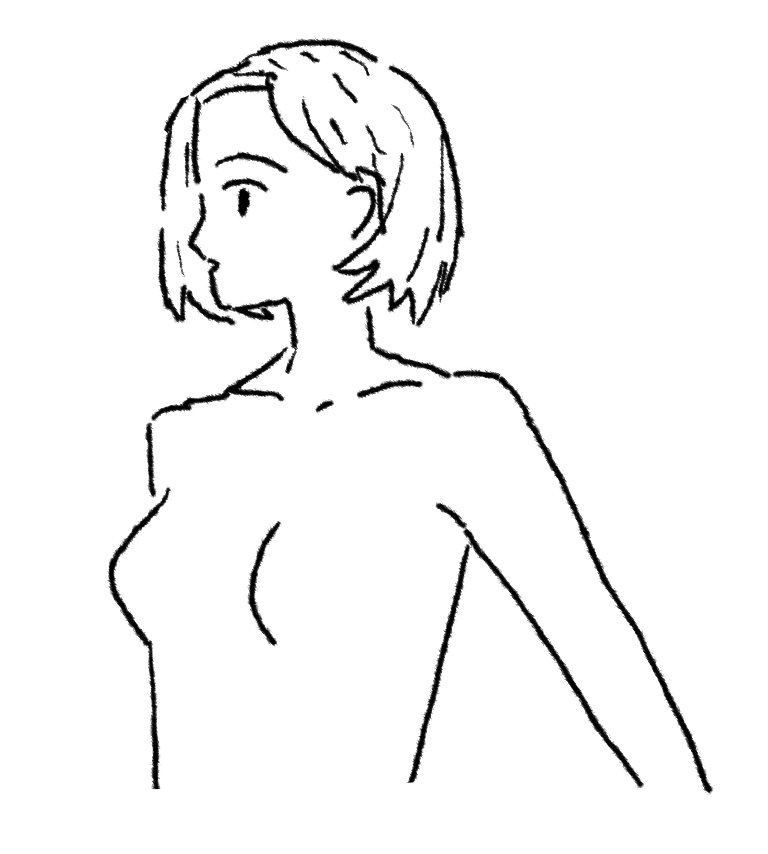

これは悪くない気がしている。

猫背。猫背はいまいち。

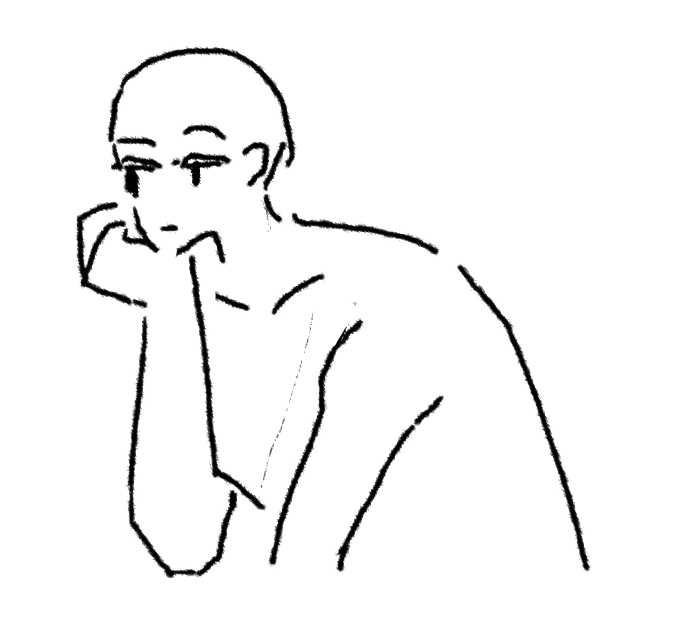

腕が細いのではないか、というフィードバックをもらった。そうかも。

## 配信: 横向き、背面

[イラストをそれっぽく描くコツの練習ライブ、横向きっぽく描きたい！から - YouTube](https://www.youtube.com/live/fh7ImmBEZbg)

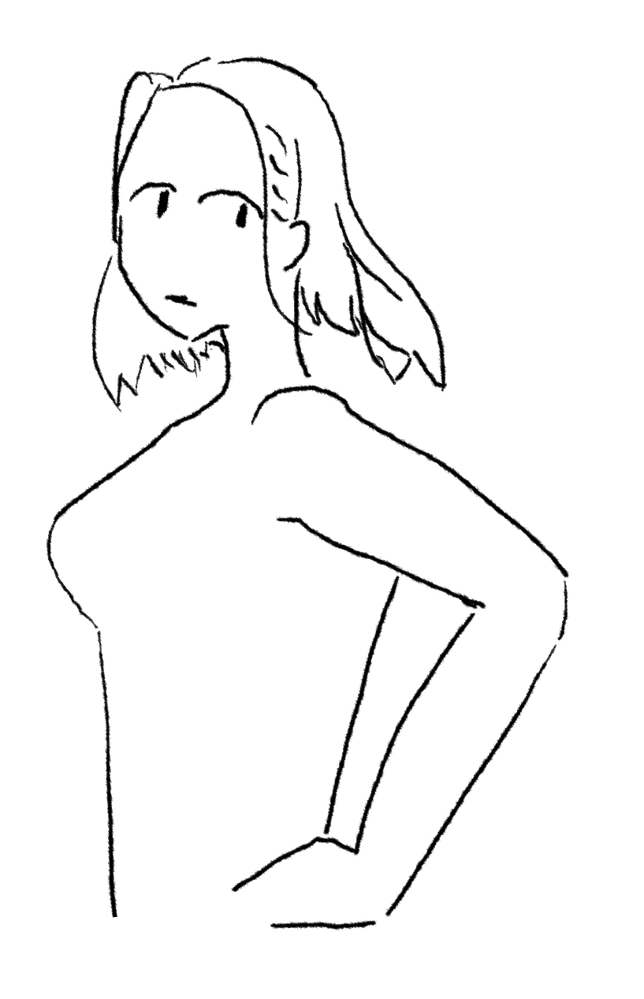

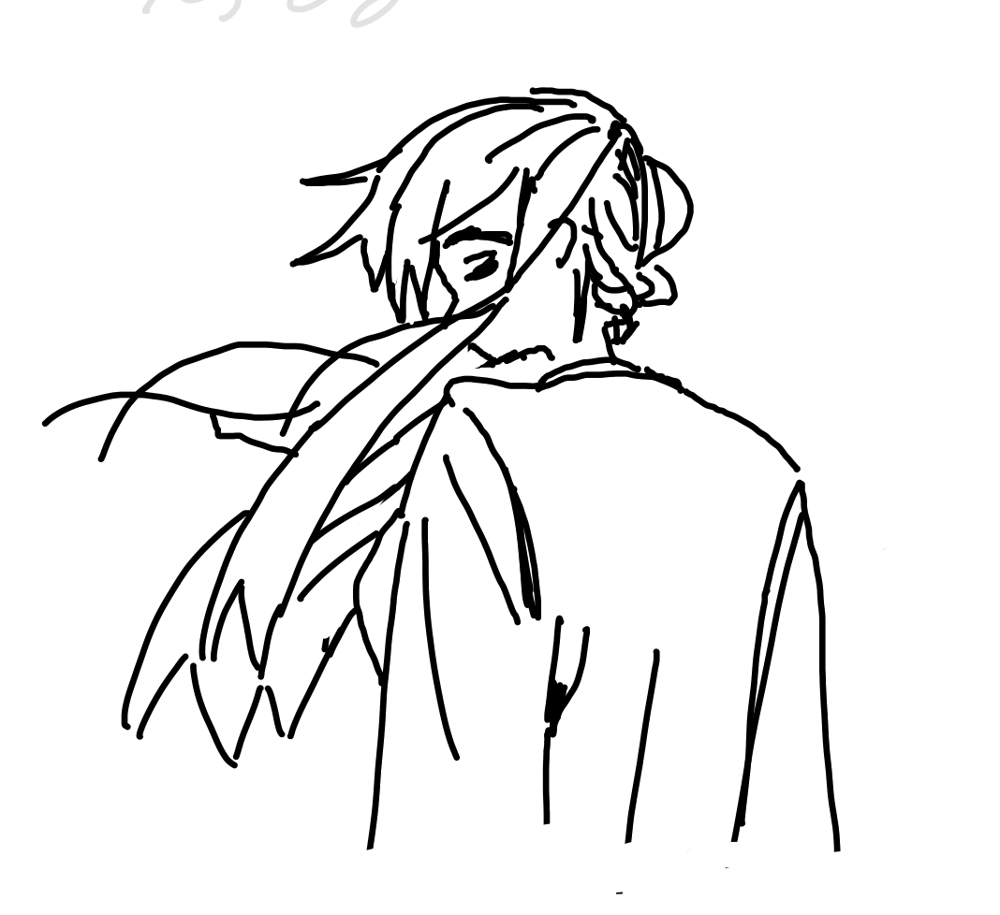

横向きっぽくはちょっと体が太くなってしまった気もするが、横には見えているかな。
背面っぽくは結構いいんじゃない？

## 配信: 女性の身体っぽく描きたい

[イラストをそれっぽく描くコツの練習ライブ、女性の身体っぽく描きたい！から - YouTube](https://www.youtube.com/live/lP8HZRFP-ME)

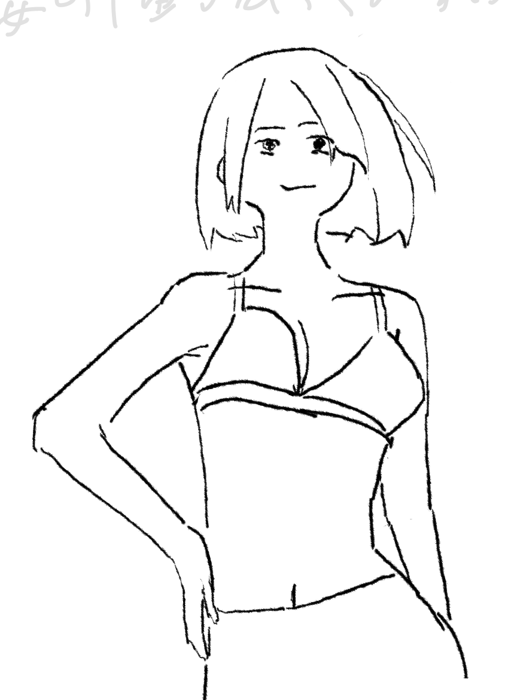

身体は女性っぽく描けてるのでは？顔がいまいちだが。