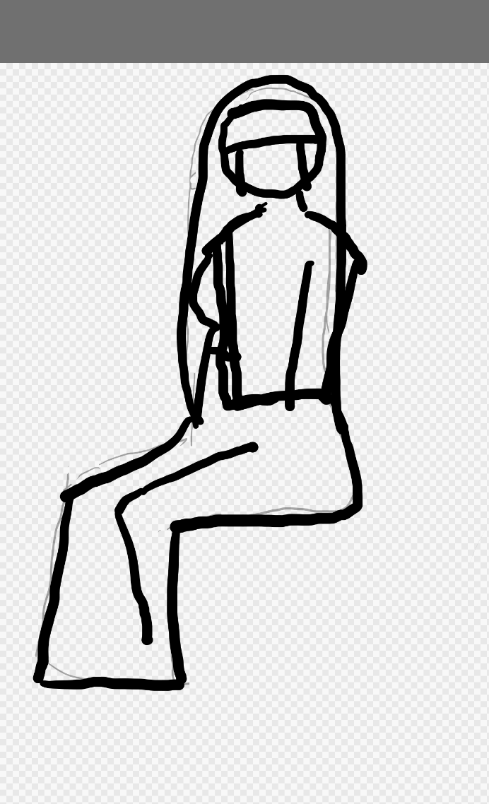

[[お絵描き]]

- [amazon: イラストをそれっぽく描くコツ](https://amzn.to/3ORTGxd)

## 購入、やる前の動機 2026-05-09 (土)

ちょっとお絵描きアプリのテストで長時間実際の使われ方と同じような事をする必要が出てきた。
そういう訳で普通のお絵描きをしたい。

そこで以前から気になっていた「イラストをそれっぽく描くコツ」を買ってみる事にした。
ちょうどマストドンで他の人がこの本をやっていて、意外とそれっぽい絵を描くようになっていたのも「ほーん？」って気分になっていたのもある。

### 初日の感想

1章の例を描いてみて、全然描ける気がしない。大丈夫なのか？これ。と始まったが、

そのあとやってみよう、の奴は以下みたいになった。

これなら割とそれっぽいか。と進めてみると、2章からは割と細かい話があって、書籍のタイトル通り、著者なりにたどり着いたそれっぽく描くコツをいろいろ語ってくれている。

