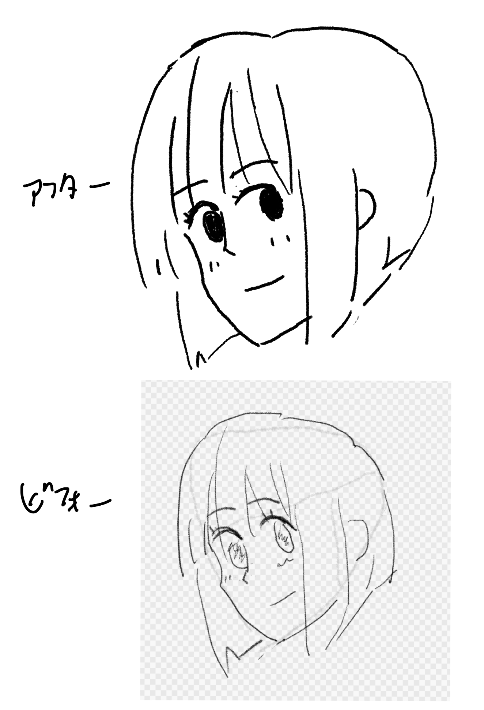
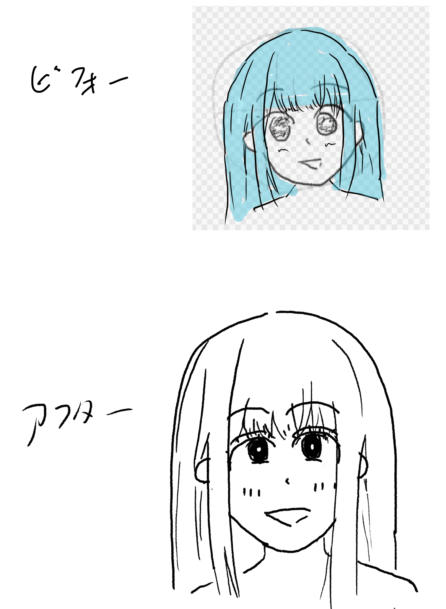

[[【書籍】イラストをそれっぽく描くコツ]]の練習、2周目。
リベンジ編とも言う。

１周目で気に食わなかった奴を再挑戦する。再挑戦はちょっと頑張る。
同じ条件で描く訳では無いので成長だけの違いでは無いが、まぁ差分は成長って事にしておこう。

## リベンジ編1: 描いてみよう、ロングヘア（2026/07/14)

[書籍：イラストをそれっぽく描くコツの練習ライブシーズン2、描いてみようの娘（最初）〜 - YouTube](https://www.youtube.com/live/3O6GaRrGbdc)

描いてみようの子。あんま変わらない気もするが、2周目の方が好きかな。
この子は１周目もそんなに嫌いでは無いが。

これは2周目でもあまりうまくいっている気はしないけれど、1周目よりは2周目の方が好きかな。
板タブとiPadの違いもあるが、線を引くのはなれてきた気はする。