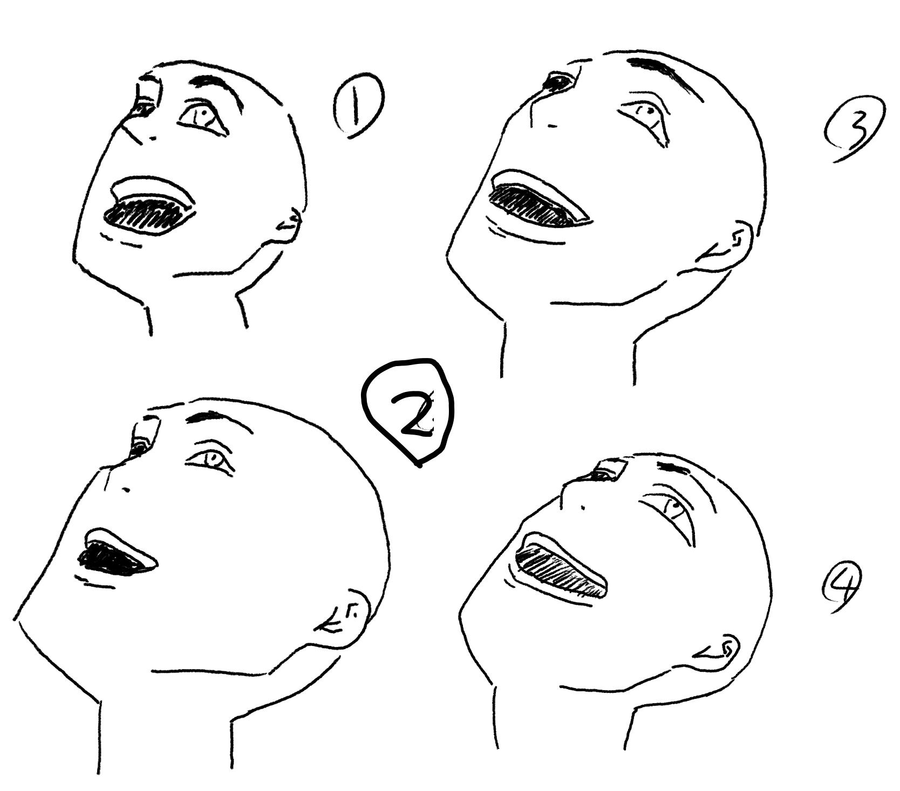
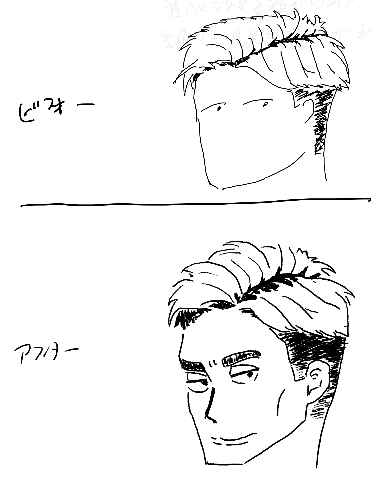

[[【書籍】イラストをそれっぽく描くコツ]]の練習、2周目。
リベンジ編とも言う。

[[それっぽく描くコツ1周目]]で気に食わなかった奴を再挑戦する。再挑戦はちょっと頑張る。
同じ条件で描く訳では無いので成長だけの違いでは無いが、まぁ差分は成長って事にしておこう。

## 配信テンプレ

iLMiNAで配信するようにしたので、テンプレ。DVRはオフに。

```
イラストをそれっぽく描くコツの練習配信リベンジ編、今日はツーブロックっぽく描きたい、から
```

```
書籍：イラストをそれっぽく描くコツの練習ライブ、リベンジ編、ツーブロックっぽく描きたい〜

練習を続けるために書籍「イラストをそれっぽく描くコツ」の練習を配信してみる。
再生リスト: https://www.youtube.com/playlist?list=PL3J_mLcl4YCdg2O2fkkuR-whqyZfl61Mb

まとめページ:
https://tinyurl.com/yam2y8nr
```

このページのtinyurlも貼っておこう。

```
https://tinyurl.com/4v7szysb
```

## リベンジ編1: 描いてみよう、ロングヘア（2026/07/14)

[書籍：イラストをそれっぽく描くコツの練習ライブシーズン2、描いてみようの娘（最初）〜 - YouTube](https://www.youtube.com/live/3O6GaRrGbdc)


描いてみようの子。あんま変わらない気もするが、2周目の方が好きかな。
この子は１周目もそんなに嫌いでは無いが。


これは2周目でもあまりうまくいっている気はしないけれど、1周目よりは2周目の方が好きかな。
板タブとiPadの違いもあるが、線を引くのはなれてきた気はする。

## リベンジ編2: ポニーテールっぽく (2026/07/15)

[書籍：イラストをそれっぽく描くコツの練習ライブ、リベンジ編、ポニーテールっぽく描きたい〜 - YouTube](https://www.youtube.com/live/Xz2ad8ybw4c)


今回は一つで終わってしまったがまぁいいか、という事で。
割と可愛く描けたヽ(´ー｀)ノ

## リベンジ編3: オールバックっぽく（2026/07/16）

[書籍：イラストをそれっぽく描くコツの練習ライブ、リベンジ編、オールバックっぽく描きたい〜 - YouTube](https://www.youtube.com/live/0nyzYJyykJU)


少しフカン度合いが弱い気はするが、こんなもんかな、という気はする。やはりこれはなかなか難しいね。

## リベンジ編4: ツンツンヘア (2026/07/17)

- [書籍：イラストをそれっぽく描くコツの練習ライブ、リベンジ編、ツンツンヘアっぽく描きたい〜 - YouTube](https://www.youtube.com/live/TeH-q8Ahozo)
- [書籍：イラストをそれっぽく描くコツの練習ライブ、リベンジ編、ツンツンヘアっぽく描きたい2〜 - YouTube](https://www.youtube.com/live/jeZQSweAZlc)

なぜか通信エラーで切れてしまったので作り直し。


いやー、これは全然うまくいかずに無駄に時間が掛かってしまった！こういう無駄に時間掛かるのは無くしたいので今回は失敗だったなぁ。

ツンツンヘアはそれっぽい気もするけれど、アオリはマスター出来ていない感じがするのでもうちょっと練習したいね。

## リベンジ編5: アオリをひたすら描く (2026/07/18)

[書籍：イラストをそれっぽく描くコツの練習ライブ、リベンジ編、アオリをひたすらく - YouTube](https://www.youtube.com/live/kvm8F02S728)

昨日のツンツンヘアがなかなか上手く描けなかったので、アオリをたくさん描いてみる事に。



3くらいから、最初にイメージした感じに描けるようになってきた。いろいろおかしい所もあるけれど、まぁこのくらいかな、という気はする。

## リベンジ編6: ツーブロックっぽく描きたい(2026/07/19）

[書籍：イラストをそれっぽく描くコツの練習ライブ、リベンジ編、ツーブロックっぽく描きたい〜 - YouTube](https://www.youtube.com/live/u901sXnBJQI)



髪型は一周目も嫌いでは無いんだが、今ならもうちょい上手く描けるかな？と思って描いてみた。ついでに顔も描いてみた。
やっぱ顔ある方がいいよな。

髪型も立体感が改善しているかな。全体的には上達している気がする。

## 2周目はバランスが大きく改善している

最初の数枚はたまたまマシな事もあるかな、としばらく結論は出さずに進めていたが、ここまで描いたのを見直すと全体的なバランスが改善している。
ぱっと見の印象はだいぶ良くなっているように思う。

1周目でシルエットとアタリの段階で最終的な失敗パターンをいろいろ経験した結果、最初の段階で少し試行錯誤出来るようになった。
シルエットからアタリの一方通行だけでなくアタリからシルエットに少しフィードバックして直したりもしている。
あまり直してばかりで進まない感じにはしたくなかったが、アタリとシルエットくらいだとそこまで時間は掛からないので、このくらいならいいかな、と思っている。

この試行錯誤で全体的にどういう感じにしたいかを固めて進められるようになり、最終的な出来がこの段階の試行錯誤で調整出来るようになったと思う。
このくらいでいいか、という感じになったら進めて、まぁこのくらいだな、という完成になる。
これはたぶん一周目の最初の段階では出来なかったと思うので、このやり方で進めた成長と思う。

このシルエットとあたりの段階で全体的な事がある程度予想出来るようになった事と、あとは各線を引いている時にその全体的な事をある程度意識出来るようになったのが大きな違いに思う。自分が今描いている線がなんなのか良く分からない、みたいな事は減ったし、バランス感覚を働かせながら線を引ける事が増えた。
これはシルエットから描く描き方の副作用と思う。最初から全体的な事を気にするので、途中も全体的な事を気にしながら進めやすい。
1周目は「このシルエット意味無くね？」という感じになる事も多かったが、2周目は最初に固めたなんとなくのイメージでバランスをとっていく感じにできているので、有効活用出来ている感じがある。

線もその全体的な事の中で引くので、この線はここまでひく、みたいなのに自信が持てている。のびのび引けるようになった気がする。

ただ描く時間は1.5倍くらいになっていると思う。1周目は一度のライブで2枚描けていたのが、2周目は1枚になっている。
ただ喋ったり準備したりといろいろやっているので、2倍にはなっていない。たぶん1枚に30分は掛からないくらいかな、と思う。
もう少し手戻りを減らして20分くらいにしたいなぁ。でも30分なら休憩挟まずに完成まで行けるので、直してばかりで全然進まないという感じには感じていない。まぁ自分の絵を描くペースは今はこのくらいかな、という気がする。
練習としては1周目の方が多くを経験出来て良いかもしれないが、
出来たものの満足度は2周目だとこのくらいは欲しいので、このくらいがバランスという気がする。