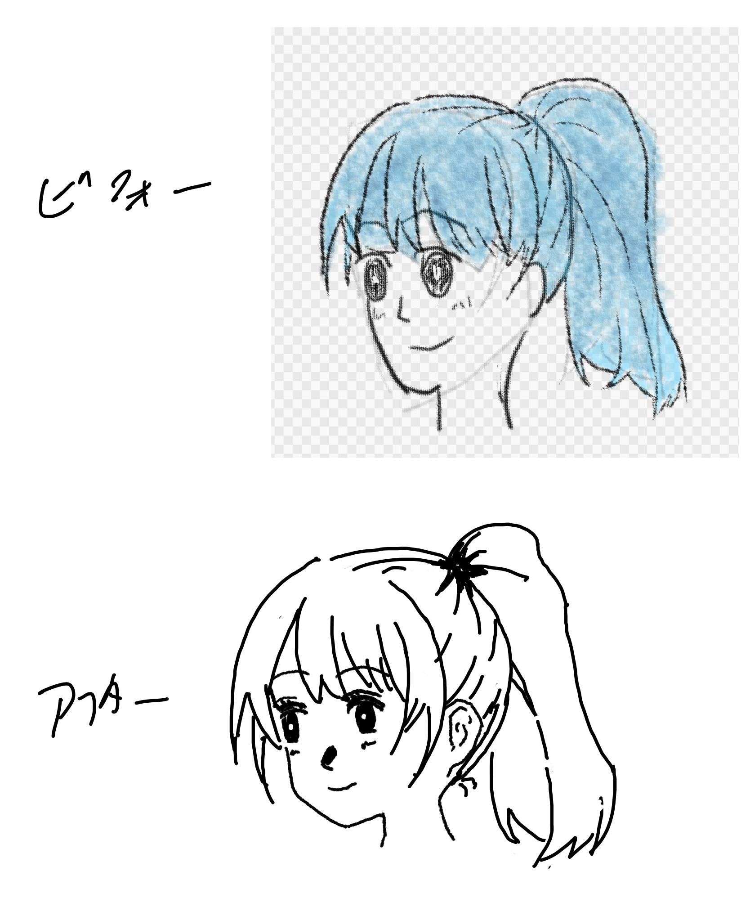
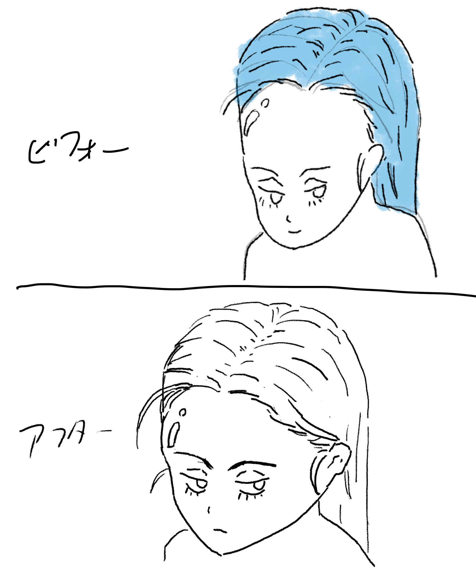
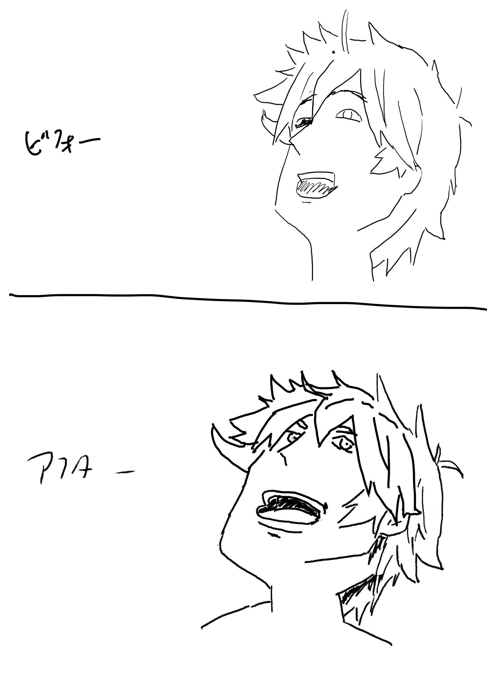

[[【書籍】イラストをそれっぽく描くコツ]]の練習、2周目。
リベンジ編とも言う。

１周目で気に食わなかった奴を再挑戦する。再挑戦はちょっと頑張る。
同じ条件で描く訳では無いので成長だけの違いでは無いが、まぁ差分は成長って事にしておこう。

## 配信テンプレ

iLMiNAで配信するようにしたので、テンプレ。DVRはオフに。

```
イラストをそれっぽく描くコツの練習配信リベンジ編、今日はツンツンヘアっぽく描きたいから。
```

```
書籍：イラストをそれっぽく描くコツの練習ライブ、リベンジ編、ツンツンヘアっぽく描きたい〜

練習を続けるために書籍「イラストをそれっぽく描くコツ」の練習を配信してみる。
再生リスト: https://www.youtube.com/playlist?list=PL3J_mLcl4YCdg2O2fkkuR-whqyZfl61Mb

まとめページ:
https://tinyurl.com/yam2y8nr
```

このページのtinyurlも貼っておこう。

```
https://tinyurl.com/4v7szysb
```

## リベンジ編1: 描いてみよう、ロングヘア（2026/07/14)

[書籍：イラストをそれっぽく描くコツの練習ライブシーズン2、描いてみようの娘（最初）〜 - YouTube](https://www.youtube.com/live/3O6GaRrGbdc)


描いてみようの子。あんま変わらない気もするが、2周目の方が好きかな。
この子は１周目もそんなに嫌いでは無いが。


これは2周目でもあまりうまくいっている気はしないけれど、1周目よりは2周目の方が好きかな。
板タブとiPadの違いもあるが、線を引くのはなれてきた気はする。

## リベンジ編2: ポニーテールっぽく (2026/07/15)

[書籍：イラストをそれっぽく描くコツの練習ライブ、リベンジ編、ポニーテールっぽく描きたい〜 - YouTube](https://www.youtube.com/live/Xz2ad8ybw4c)



今回は一つで終わってしまったがまぁいいか、という事で。
割と可愛く描けたヽ(´ー｀)ノ

## リベンジ編3: オールバックっぽく（2026/07/16）

[書籍：イラストをそれっぽく描くコツの練習ライブ、リベンジ編、オールバックっぽく描きたい〜 - YouTube](https://www.youtube.com/live/0nyzYJyykJU)



少しフカン度合いが弱い気はするが、こんなもんかな、という気はする。やはりこれはなかなか難しいね。

## リベンジ編4: ツンツンヘア (2026/07/17)

- [書籍：イラストをそれっぽく描くコツの練習ライブ、リベンジ編、ツンツンヘアっぽく描きたい〜 - YouTube](https://www.youtube.com/live/TeH-q8Ahozo)
- [書籍：イラストをそれっぽく描くコツの練習ライブ、リベンジ編、ツンツンヘアっぽく描きたい2〜 - YouTube](https://www.youtube.com/live/jeZQSweAZlc)

なぜか通信エラーで切れてしまったので作り直し。



いやー、これは全然うまくいかずに無駄に時間が掛かってしまった！こういう無駄に時間掛かるのは無くしたいので今回は失敗だったなぁ。

ツンツンヘアはそれっぽい気もするけれど、アオリはマスター出来ていない感じがするのでもうちょっと練習したいね。