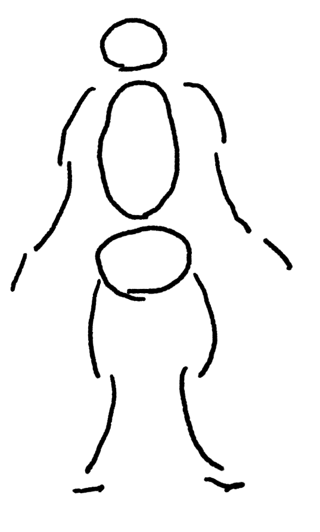

[[お絵かき]]

- [たてなか流クイックスケッチ - YouTube](https://www.youtube.com/playlist?list=PLKl89tG4IBEvpGLIgVHAhgyhc9win4uAS)

書籍もあるのだけれど、とりあえずyoutubeをやってみる。

## あらすじ

[[【書籍】魔法の人物ドローイング]]が終盤がいまいちで、そこまでのドローイングと関係ない話が増えてきた。
しかも自分がやりたいのとはちょっと違う。

という事でもうちょっと短時間で描く系のを数こなしたいなぁ、と思っていたところ、この本を見つけるが、
Kindle Unlimitedではないので買うほどかどうかは悩んでいたところ、
youtubeに途中までの内容みたいなのがある、と知る。
しかも結構長い。

とりあえずこれを最後までやってみて、良さそうなら本を買おうかな、という気分になる。

## 1日目、ばらしてみよう 2025-09-07 (日)

とりあえず動画を見ながら真似てみた。

頭が小さいな。まぁいい。

最初の課題。

２つ目、ちょっと難しいな。

