[[お絵描き]]

- [たてなか流クイックスケッチ - YouTube](https://www.youtube.com/playlist?list=PLKl89tG4IBEvpGLIgVHAhgyhc9win4uAS)

書籍もあるのだけれど、とりあえずyoutubeをやってみる。

## あらすじ

[[【書籍】魔法の人物ドローイング]]が終盤がいまいちで、そこまでのドローイングと関係ない話が増えてきた。
しかも自分がやりたいのとはちょっと違う。

という事でもうちょっと短時間で描く系のを数こなしたいなぁ、と思っていたところ、この本を見つけるが、
Kindle Unlimitedではないので買うほどかどうかは悩んでいたところ、
youtubeに途中までの内容みたいなのがある、と知る。
しかも結構長い。

とりあえずこれを最後までやってみて、良さそうなら本を買おうかな、という気分になる。

## 1日目、ばらしてみよう 2025-09-07 (日)

とりあえず動画を見ながら真似てみた。

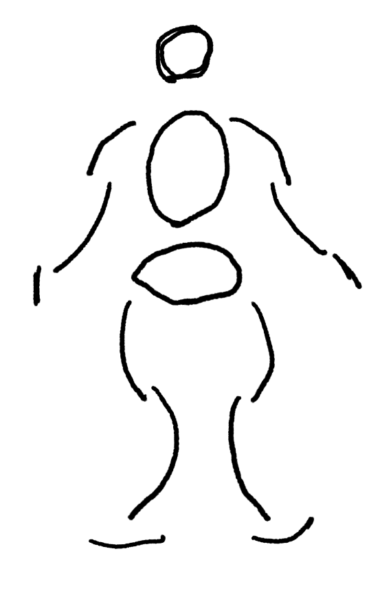

頭が小さいな。まぁいい。

最初の課題。

２つ目、ちょっと難しいな。

腕上げてる奴。

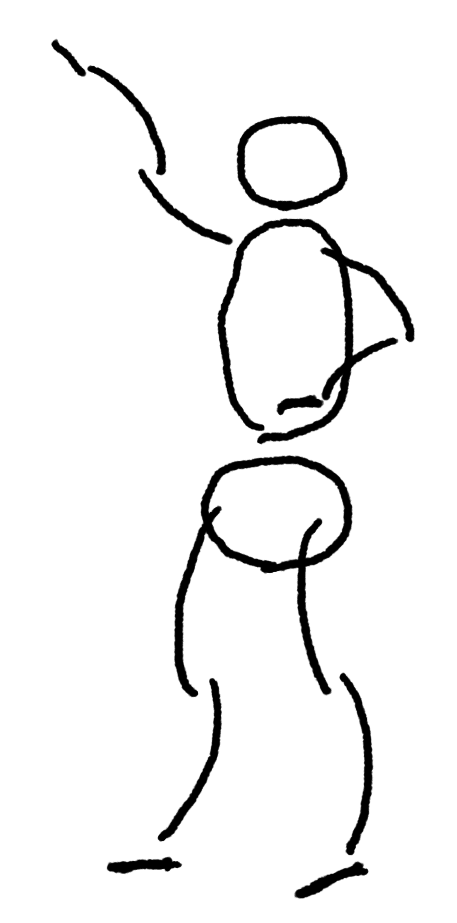

これは胸はってる感じが出てないのと、腕が何故か手本の人と逆だな。これどっち向きの孤にするかは何を基準に決めるのだろう？

とりあえず真似してみよう。

もっと胸は大げさにはっても良さそうだが、まぁいい感じには鳴っている気がする。右手は少しいまいちだが、まぁいいだろう。

### 1分チャレンジ

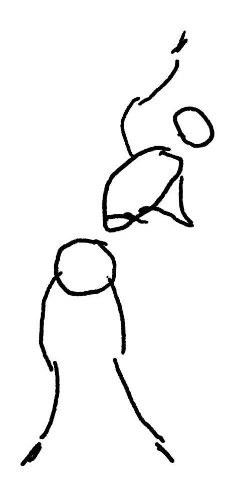

うお、一分思ったより短いな！あまり迷っている時間はないので次からはもう少し急ぐ。

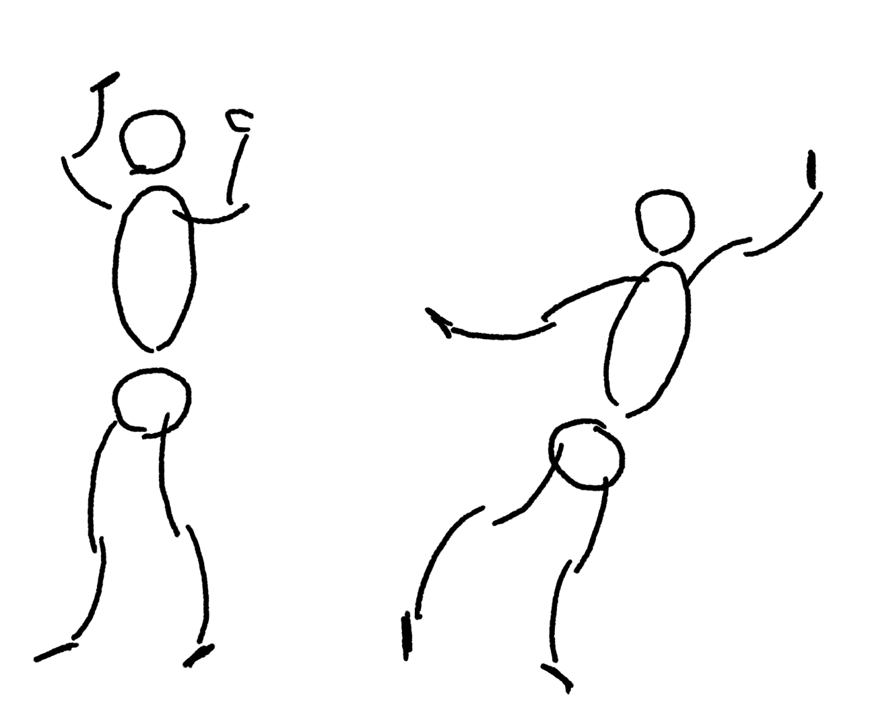

同じレイヤーでいいか、と気付き同じレイヤーに復数描く。時間は間に合うようになってきた。

長さのバランスはまだ全然とれないなぁ。

手本を見て真似したくなった奴を書き直す。

これは前の方が良かったかも。

### 1日目を終えての感想

これは自分でもやっていけそうな難度だな、と思う。
しかも一回の長さが手頃で、短すぎない。
まぁまぁ全部描けばそれなりの時間が掛かる。
でもやるのが億劫になるほどの長さでもない。

という事でこれをやっていこうかな、と思う。

## 2日目 動きを意識しよう 2025-09-08 (月)

なんかソリ具合が足りないな。

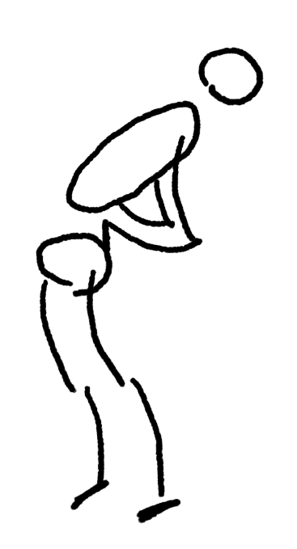

もっとそってみた。足のつけねの位置がおかしいな。まぁいい。

見えないところも薄く描く、という事をやっていたので、ブラシをスケッチブック鉛筆にしてみた。

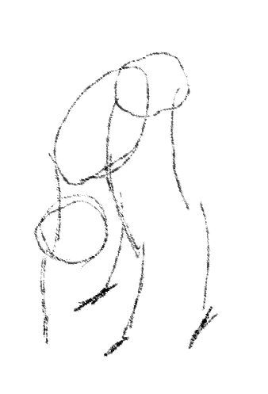

でも結局いい感じに薄くは出来なかったのであまり意味は無いな。
たてなか流は薄い線を重ねて円とか描くので、少しこのブラシでやってみるかなぁ。

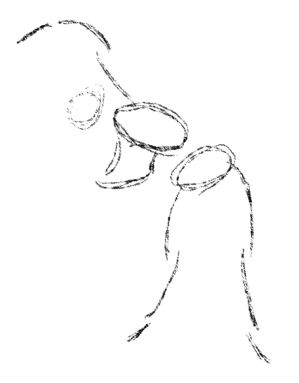

やっぱいまいちだな。自分はドローイングペンに戻すか。

なんか上の手のソリ具合がいまいちだな。

[[【書籍】魔法の人物ドローイング]]の時のアクションラインだっけ、あれを描いてから描いてみよう。

おぉ、こっちの方がずっといいな。アクションラインを描かなくてもこれを意識してみようか。

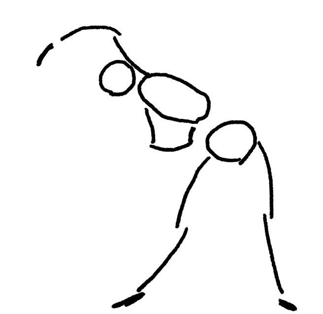

ちょっと良くなったか。

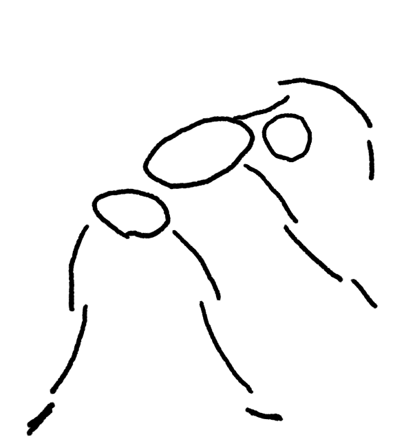

上の手の上腕が短いが、まぁこんなもんかな。

### 1分スケッチ

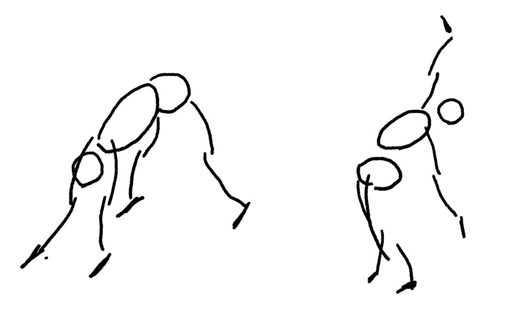

左はなんか腕が長くて変だな。右はまずまずか。

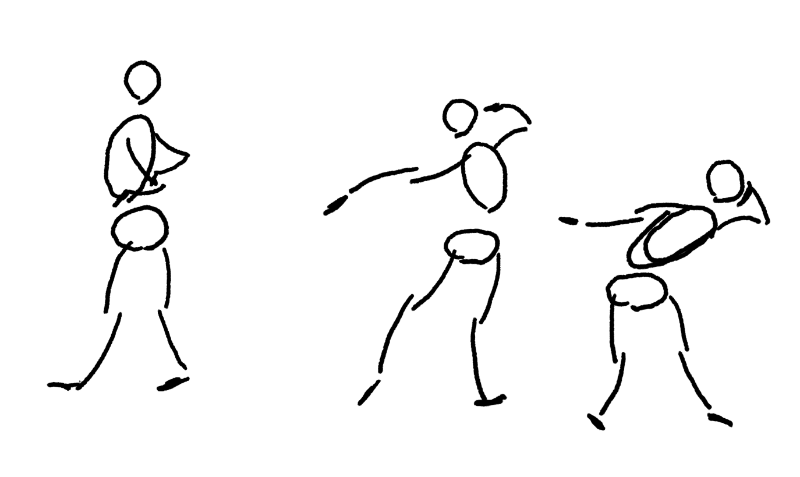

左はこの二日目の課題である動きが全然表現出来てないなぁ。
他はまぁまぁか？

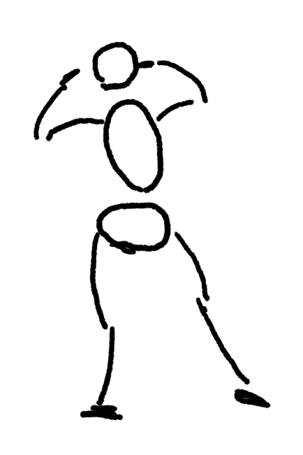

なんか足の緊張感がうまく描けてないなぁ。直線のぐって感じの足をこの描き方で描く方法が良く分かってないんだよな。

作例を見て書き直したい奴だけ描き直し。

左は良くなった気がするな。右も反りの緊張が強くなって良くなった気はする。

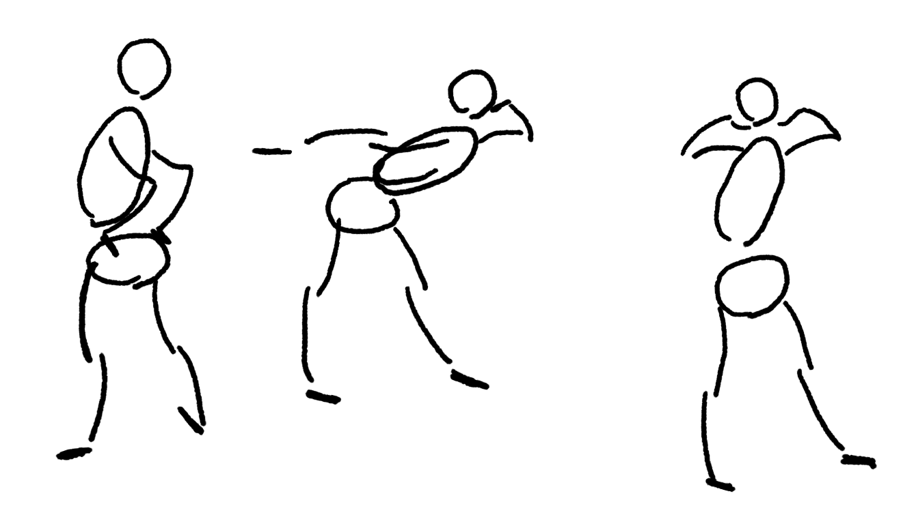

左は割と動きが出て良くなった気がする。真ん中は、足の緊張はふくらはぎの曲線で出す意識で描けば良さそうと思って試したもの。
良くなった気はする。

一番右は難しいな。実際、作例もそんなにうまくとらえられてない気がする。

### 二日目を終えての感想

動きを意識する、というのが、この解説でどうやるのかは良く分からない気もした。
ただ[[【書籍】魔法の人物ドローイング]]の経験が生きたおかげで、
アクションラインを意識しながら描く事で割と動きはとらえられている気もする。

1分は1分だと短いな、という気もするけれど、作例見る前のもそれなりには表現は出来ていて良さもある気はする。
全体的にはまぁまぁ出来ているんじゃないか。

1分スケッチで6枚やる、というのはいい気がする。集中しやすいし、数も描くので経験値もためやすい。
1分は思ったより短いので、その分迷ってないで思い切り良く描く練習になる気もする。

このまま続けていきたい。

## 三日目、脱線して円を描く 2025-09-09 (火)

デジタルでは薄い線を重ねて円を描くのは無理だと思っていたが、以下の動画を見かける。

[ラクガキ雑談#10：やってるつもりで、できてなかった！デジタルでのペンの扱い方、つかんだコツをご報告します - YouTube](https://www.youtube.com/watch?v=Zy0AJGMaFbg)

おぉ、上手ければやれるのか？という事で練習してみた。

一枚目

無理じゃね？と思いつつ続けてみた。

24枚目

ちょっとずつ良くなってるかも？続けていたら出来るようになるのかもしれない。

## 四日目、Dで動きの方向を示す 2025-09-15 (月)

ちょっと日にちがあいたが、そういえば円描いてたんだな。

しばらく円を描いて、適当なところで動画の第三回に取り掛かる。とりあえずこの円の描き方で描いてみよう。

まずは動画を見つつ同じ感じで描いてみる。

うーむ、作例の方が大きく沿ってる感じの躍動感が出ているな。

ちょっと写真の方をしっかり見てイメージを捉えるように意識してみよう。

うーむ、やはり作例の方が躍動感を感じるなぁ。Dの反りが足りてないな。
大げさにしてみるか。

何枚か描いてちょっと改善。ついでにこの薄い線を重ねるのも少し慣れてきたかもしれない。
次行こう。

動画を見ながら描いた。どうも動きが無い。
次は実物の方を見て、その印象を捉えるように意識してみよう。

多少マシになったか。

お、これは一発目でまぁまぁ。

これはなんか横向いている絵に見えちゃうな。うーん。

作例はそうは見えないな。Dの上の辺が肩の線みたいになってるのがポイントか？

何枚か描いたらこれはいい感じに描けた。

### 1分スケッチ

上に描きすぎて手が入らなかった。左は顔の位置と左手の肩の位置が良く無いな。
右の絵は左上への動きみたいなのがうまくとらえられてないな。

ちょっと下に描きすぎて足が描けなかった。

これも下に描きすぎたが、動きは結構出てる気もする。

### 作例を参考にリベンジ

作例を見つつ気になったところを時間を気にせず描いてみる。

どういうポーズなのかはわかりやすくなった気もする。

ちなみに大きかったり小さかったりするのは描いた時の拡大率が違うだけでだいたい同じ大きさに描いている。

これは悪くない気がする。

なんか骨盤の位置が不連続でずれてる感じがするんだが、このD字とどう合わせるべきかが良く分かってない気はするな。

### 1分スケッチの感想

1分スケッチは時間が短いので、描いている間は全然ダメな気がしているが、出来上がったものを眺めていると別にこれはこれでアリな気はするな。
その課で課題になっている事が意識出来ない事も多いが、
時間が決められている方が集中はしやすい気もするし、
1分で描いていまいちなところをみてもう一回描き直す、を繰り返す方が経験値の溜まりもいい気がする。

力を入れずに薄く描く、というのは良い方向性な気がしている。
思った通りの線を引ける確率がだんだんと上がっている気がするので、
このまま続けていけばそのうちいい感じになるかもしれない。

このyoutube動画は説明が少ないので、これだけだと上手く出来なかったとは思うが、
この前に[[【書籍】魔法の人物ドローイング]]をやっていたのはうまく機能している気がする。
本でやった事も思い出しつつ、イメージをすくい上げるのを意識して取り組むと成果が出ている気がする。

[[【書籍】魔法の人物ドローイング]]を定着させるのに良いと思っているので、これはやっていきたい。本も買ってもいいかもなぁ。

## 第四回、ちょっと立体感をつける 2025-09-16 (火)

五日目。ラッピングラインみたいなのを描いたりこれまで省いていた線を直線でつなげたりして立体っぽくする、
という話らしい。

とりあえず説明を聞きながら真似してみたもの。

ふーむ、なんかいまいちな気もするが、とりあえずやってみるか。

スケッチ例を見つつ真似たもの。腕とか足はつなげないのね。正中線も描いてないな。

これだけだと前回までとほとんど変わらないな。頭の大きさとかいまいちだが、それは前回までもたまにあったもの、という感じがする。

これは腕とかもつないでいた。なんか顔とか胸のDの幅が毎回小さくなりがちだな。もう少し幅の大きなDを描くように心がけた方が良さそうか。

足が細すぎたりとか細々といまいちな部分もあるけれど、立体的なメモとしては機能している気もする。

### 1分スケッチ

これまでは基本的には1分を厳守していたが、今回は全然間に合わない！ポーズが複雑過ぎて今回の課題のラッピングラインまでたどり着かないので、
最後に少し止めて作業していた。

ポーズが難しすぎる。

こんなの絶対無理やろ〜と思って作例見たらめちゃうまいしちゃんと1分で描いている。凄すぎ。

ちょっと今回のはいまいちな奴を描き直す気力が沸かないので今回はここまで。

ただ掛けた時間を思えばまぁまぁのものが描けている気はする。