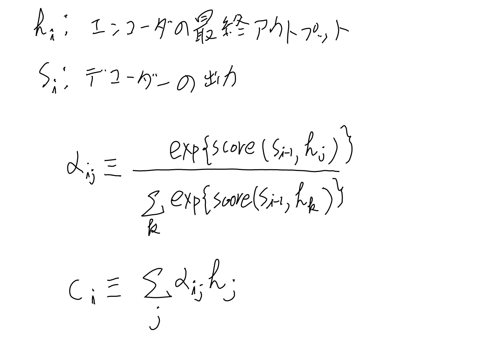
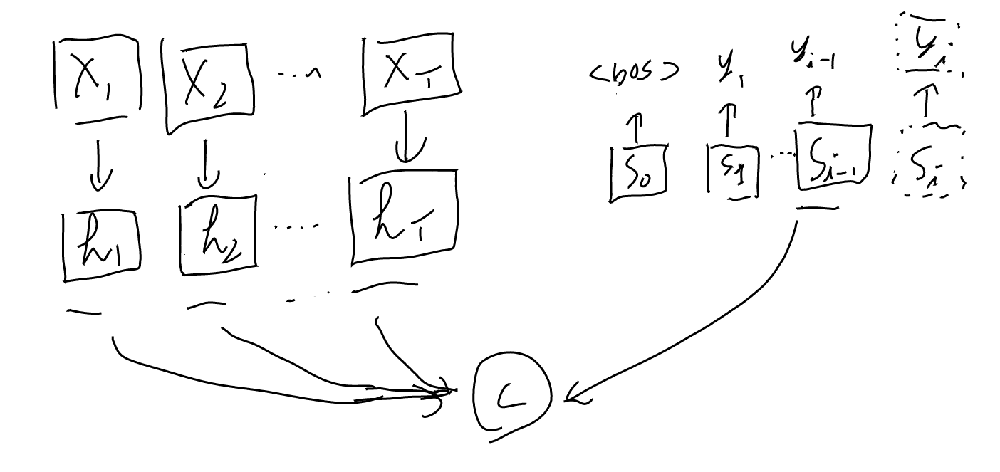
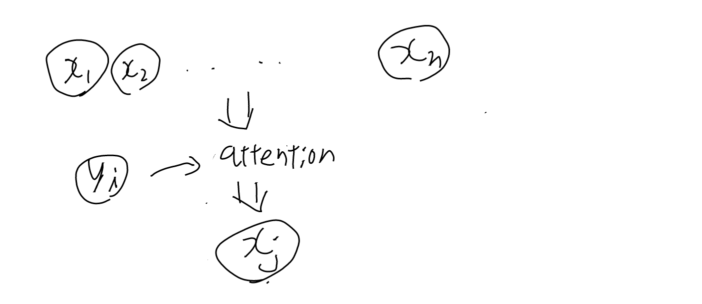

[[機械翻訳]]

[[論文]]、[arxiv: 1409.0473 Neural Machine Translation by Jointly Learning to Align and Translate](https://arxiv.org/abs/1409.0473),で提唱されたNMTの機構。
[[Transformer]]でも（頻繁に）使われる。

いろいろと変形があるが、基本的にはEncoder-Decoderモデルで、Encoderの最後の状態と現在生成しているDecoderのトークンのどこが対応しているかを、何らかのスコア（内積とか）で定義して、一番近いエンコーダーのアウトプットを特に重く見る、という仕組み。

## 定義

hの系列と$s_{i-1}$のどこが対応しているかを調べて、その結果を入力に使う。
cの式はsoftmaxになっているので一番スコアの高いhが選ばれる。

scoreは元論文ではalignment modelと言われていて1層のNNが使われていたが、その後単なる内積が使われる事が多くなったと思う。
Encoder-Decoder以外でも広く使われるようになった現在では、単純にscoreと見ておくのが良いと思いそうした。

### パラメータの数

scoreにはiが入っていない。つまり全てのhとsに対して同じ関数が使われる。
score自体にWが入っている事はあるが、iごとに別々のWを用意する事はしない。
つまり入力位置ごとに別々のパラメータを使ったりはしない。

当然hを作る過程ではそうしたパラメータは入りうるし、まさにアテンションを通してそれらのパラメータを学習するのがやりたい事でもあるが、
それらはアテンションというメカニズムの外の話。

[[Transformer]]の方にもそうした違いの話がある。

## Encoder-Decoderのダイアグラム

現在 $s_i$を出そうとしている時に使うアテンション $c_i$ は以下。

## アテンションの直感的な説明

n個の候補と、現在のベクトルを入力として、n個の候補から一つを選ぶ仕組み。

n個の中から1つを選ぶ、というのが重要。なお、softmaxと平均なのでスコアが2位とか3位もちょっとだけ足し合わせたものになる。（ただし結果は一つのベクトルに要約される事には変わりない）

なおセルフアテンションはこのyの側もn個になるのでややこしいが、概念的にはやはりyが1つにつき１つを選ぶ、を念頭に、それがn個同時に動くと解釈するのが良いだろう。