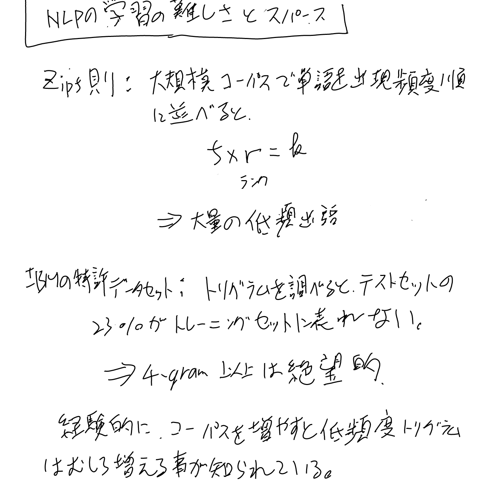
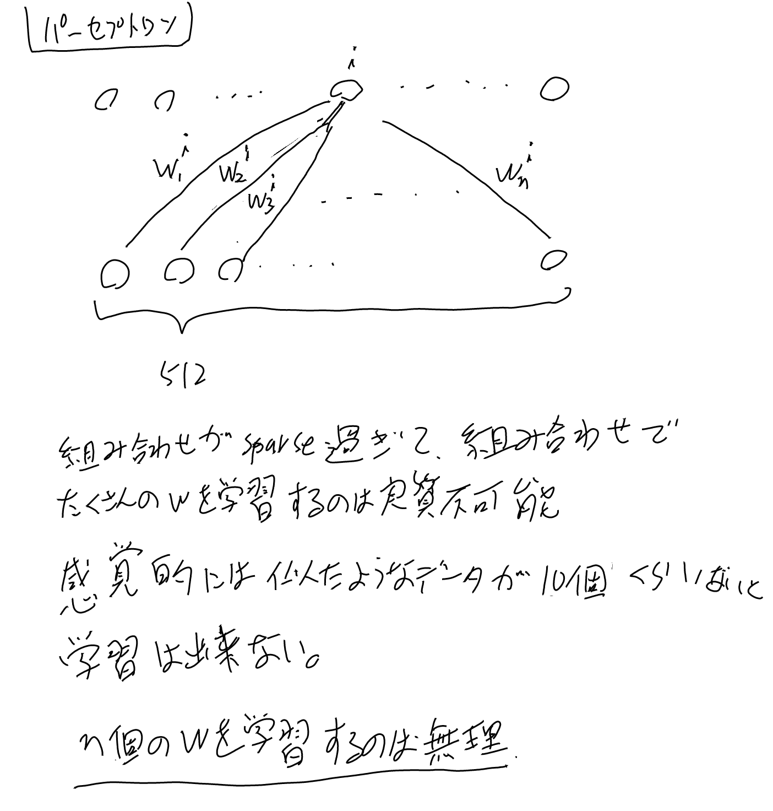
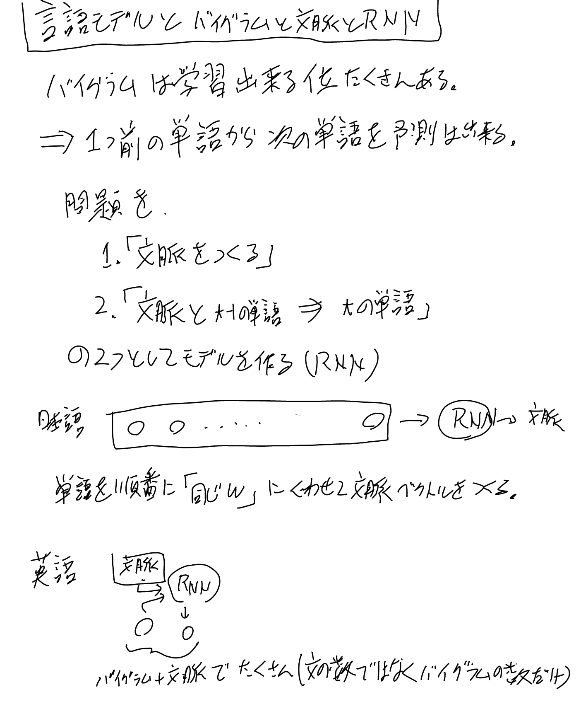
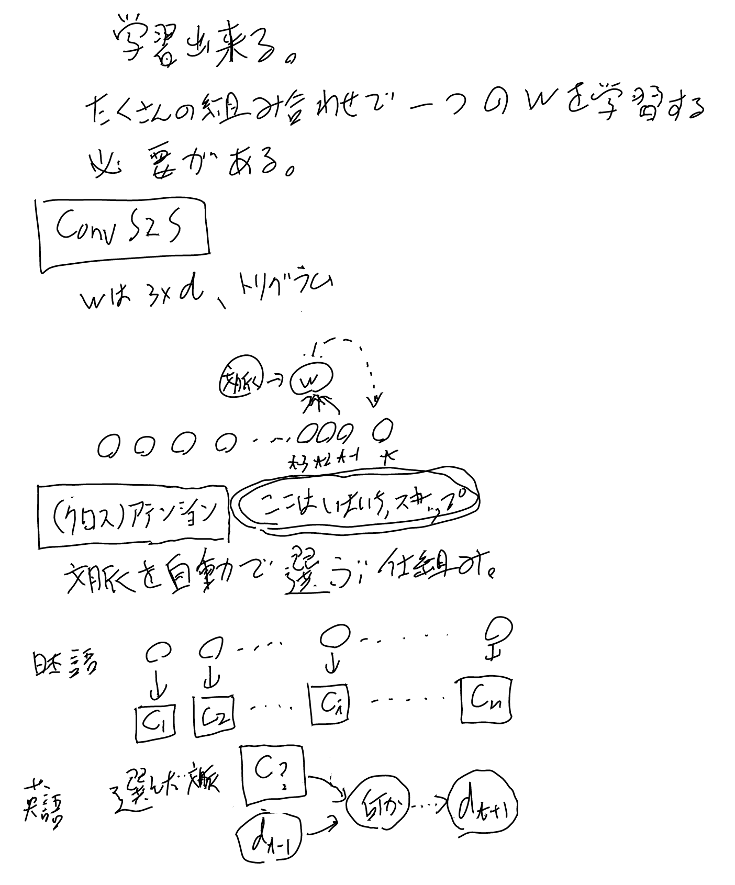
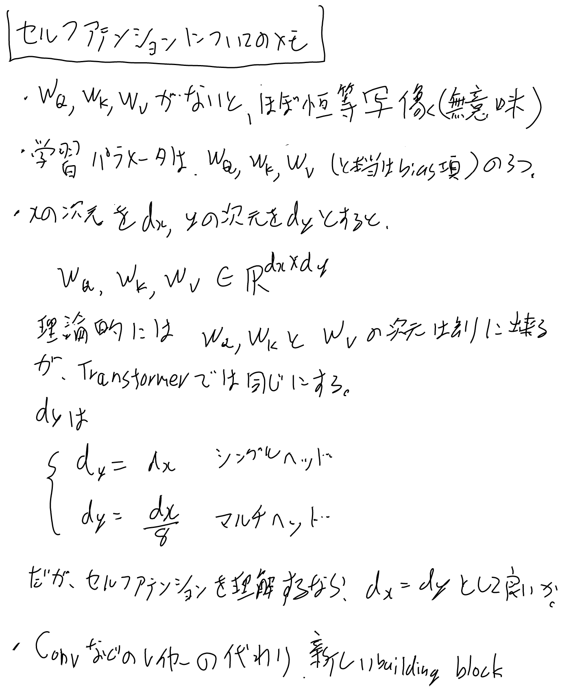
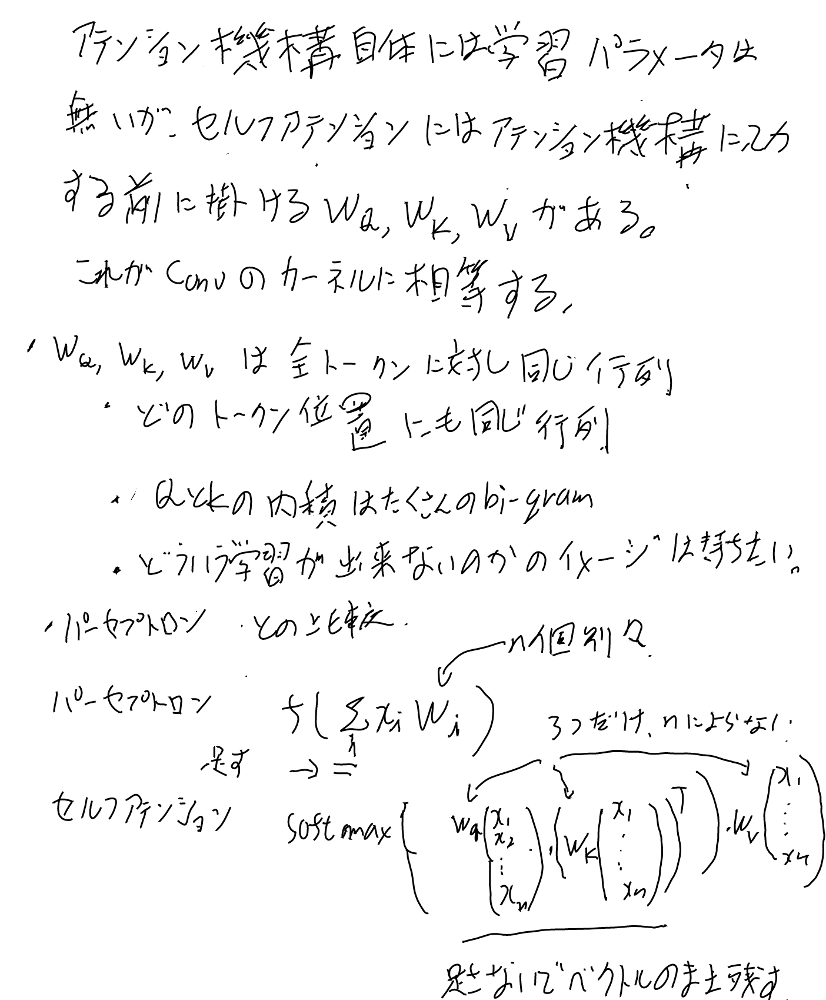

- [一人読書会ライブ: 原論文から解き明かす生成AI、3章の1、アテンションとセルフアテンション - YouTube](https://www.youtube.com/live/-ONYrKSyXA0)

2026-09-05 (土)にやった[[一人読書会ライブ]]のタイトル。
[[原論文から解き明かす生成AI]]の3章の1番目のライブだった。

[[セルフアテンション]]の話を中心に、アテンションについていろいろな角度から見ていく。

セルフアテンションのパーセプトロンとの数式の比較くらいまで。

## 次回にやりたい事

何を話したのかを忘れがちなのでメモしておく。

セルフアテンションはまぁ終わりでいいだろう。
次は以下の話をしたい。

- [[Transformerブロック]]の残りの要素
   - マルチヘッド
   - LayerNormとResidual Connection
   - FFN
- 計算量
- パラメータ数

## 喋る時に使った図の残り

[[アテンション]], [[セルフアテンション]], [[SoftMax]]などに適宜吸収した残りをここに貼っておく。

