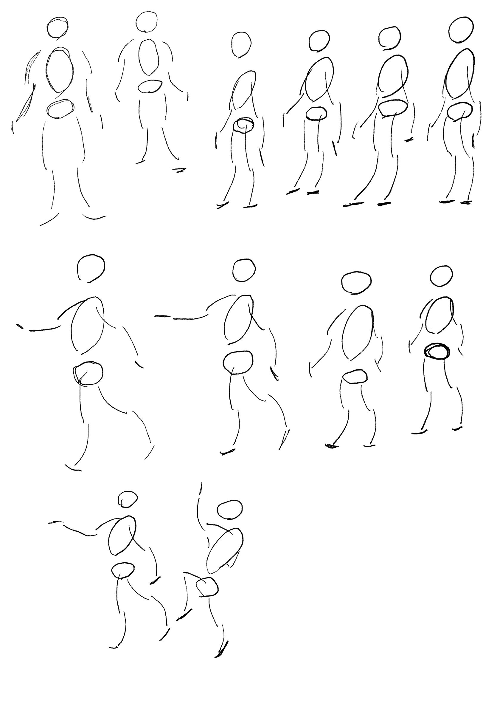
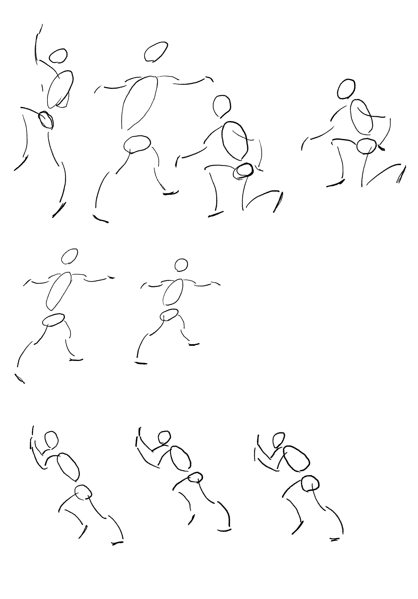
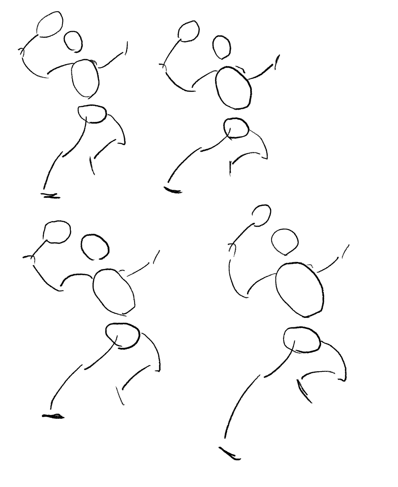
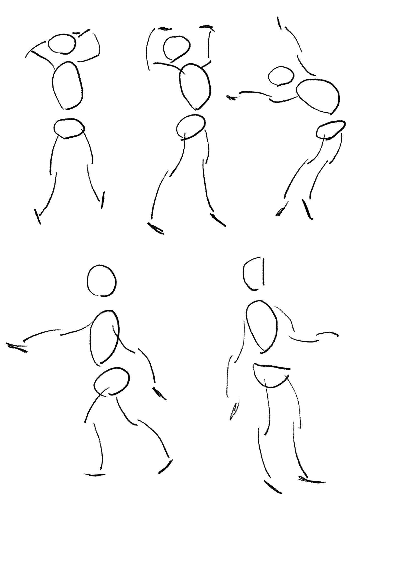
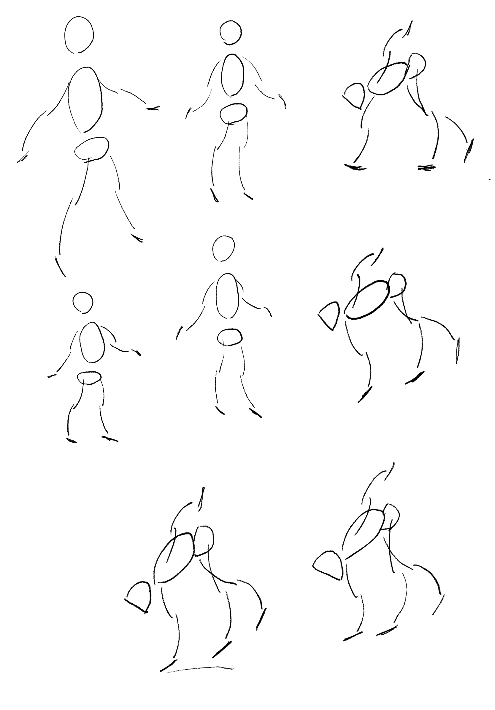

[[たてなか流クイックスケッチ]]を練習していく[[ライブ]]。

## テンプレ

```
書籍、たてなか流クイックスケッチの練習ライブ Chapter2〜 #karino2のお絵描きライブ
```

```
書籍、たてなか流クイックスケッチの練習ライブ Chapter2〜
たてなか流クイックスケッチ、という書籍を練習していくライブです。

web: https://tinyurl.com/22k3db7d
プレイリスト: https://www.youtube.com/playlist?list=PLK0kA_ju3STI
```

## あらすじ

以前途中までやった[[たてなか流クイックスケッチ]]を、ライブでもう一回やり直したい。途中で飽きてしまったので、ライブの力を使ってもっと進めたい。
本自体は結構気に入っているのだが、最終的な絵につなげる所まで行かなかったので、そこまでやりたいな。


## Chapter2〜顔と骨盤をDにするの途中まで

[書籍、たてなか流クイックスケッチの練習ライブ Chapter2〜 - YouTube](https://www.youtube.com/live/UBZWHoUyDhI)



なんか足が短くなるな〜とか言いながら描いていた。




動きが大きくなる方が見栄えはするよな、と思う。これは結構いいね。

以下は写真を描く。



やっぱり写真は上手く描けないなぁ、と思うが、このポーズが難しいという話もあるよな。



最後は骨盤と顔をDにする、という奴。なんか骨盤が上になりすぎるなぁ。