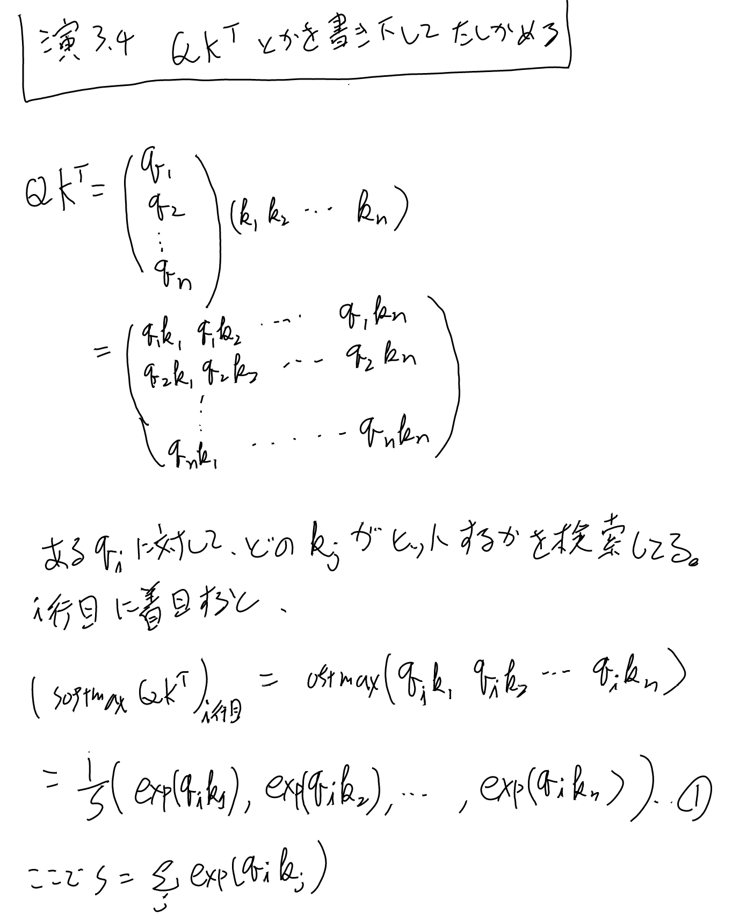
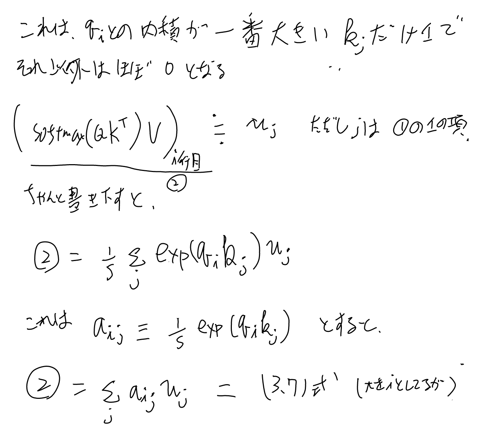

[[アテンション]]をConvの代わりに使おうというアイデア。[[Transformer]]の基本的な構成要素。[[Transformerブロック]]の主役。

## アテンションのQ, K, Vによる一般化（拡張）

[[原論文から解き明かす生成AI]]の3.3.2に詳しい。

アテンションはもともと

1. qと$\{\bm{x}_n\}$ の内積をとる
2. 1のsoftmaxをとる
3. 2の結果と$\{\bm{x}_n\}$の内積をとる

という演算。この1と3の$\{\bm{x}_n\}$をKとVという別のシンボルを当てて違うものを選べるようにし、
さらに1のqをn個集めたQに拡張する。

1. $QK^T$ を求める
2. 1をqの要素側（行方向）にsoftmaxする
3. 2とVを掛ける

となる。従来の[[アテンション]]ではKとVは同じだが、この定式化ではクエリと類似を判定する要素とその結果lookupする対象を分けて別々に指定出来る拡張となっている。

### 演習 3.4 QとかKを書き下してアテンションの式になるのを確認

セルフアテンションの前準備として、[[アテンション]]をQ, K, Vを使った式に拡張する。それが元と一致しているかを確認しておく。

[[原論文から解き明かす生成AI]]の演習3.4。Q, K, Vでの記述が便利なので、この定式化の計算を確かめておく。

## セルフアテンション

入力$\bf{x}$に対して、Q, K, Vをそれぞれ、 $W_Q \bf{x}$, $W_K \bf{x}$, $W_V \bf{x}$ を使うアテンション。

$W_Q$, $W_K$, $W_V$ が学習パラメータ。

QとKが同じだとほぼ恒等写像になって無意味だが、それぞれ別のWを掛ける事でセンテンスの中の単語同士の関係などを学習出来る。

## マルチヘッドアテンション

[[Transformerブロック]]では、[[セルフアテンション]]をマルチヘッド化している。

Q, K, Vを8個（H=8）に分離して、それぞれセルフアテンションを計算して、最後にそれをまとめて次へ送る。
次元がややこしいので以下にメモしておく。

入力の次元 $d_{model}=512$ で、Wのアウトプットの方はQ, K, V共通で全て 64。

ようするに512次元の入力を、64次元の出力にするWを8つ用意して、掛ける。図のLinearがこれ。

全ての位置の入力に対して同じWを掛ける。Q, K, Vそれぞれに別々のWを掛ける（論文の3.2.2に説明がある)。

### 次のレイヤーとのつなぎ

マルチヘッドのアテンションをconcatしてWを掛けたものをそのまま次の入力へと渡している。
アテンションを元になにかをする、というよりはアテンション自身の値をそのまま次にわたす（といっても$W_V$を掛けているのでそこで値用の変換をしている訳だが）。

### パラメータ数と計算量

[[Transformerブロック]]の方で計算している。実はマルチヘッド化してもシングルヘッドとほぼ同じ。