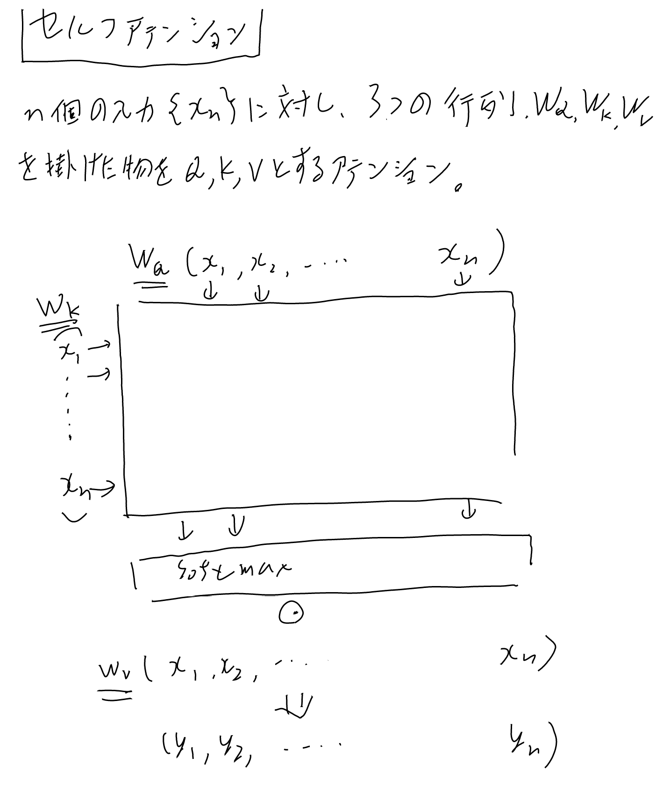

[[アテンション]]をConvの代わりに使おうというアイデア。[[Transformer]]の基本的な構成要素。[[Transformerブロック]]の主役。

## 定義

Q, K, Vに一般化した[[アテンション]]において。

入力$\bf{x}$に対して、$W_Q \bf{x}$, $W_K \bf{x}$, $W_V \bf{x}$ をそれぞれQ, K, Vとして使うアテンション。

$W_Q$, $W_K$, $W_V$ が学習パラメータ。

$W_Q$, $W_K$, $W_V$ が無いと、QとKが自身をlookupしてしまってほぼ恒等写像になって無意味だが、
それぞれ別のWを掛ける事でセンテンスの中の単語同士の関係などを学習出来る。

### パラメータ数と計算量

[[Transformerブロック]]の方で計算している。実はマルチヘッド化してもシングルヘッドとほぼ同じ。