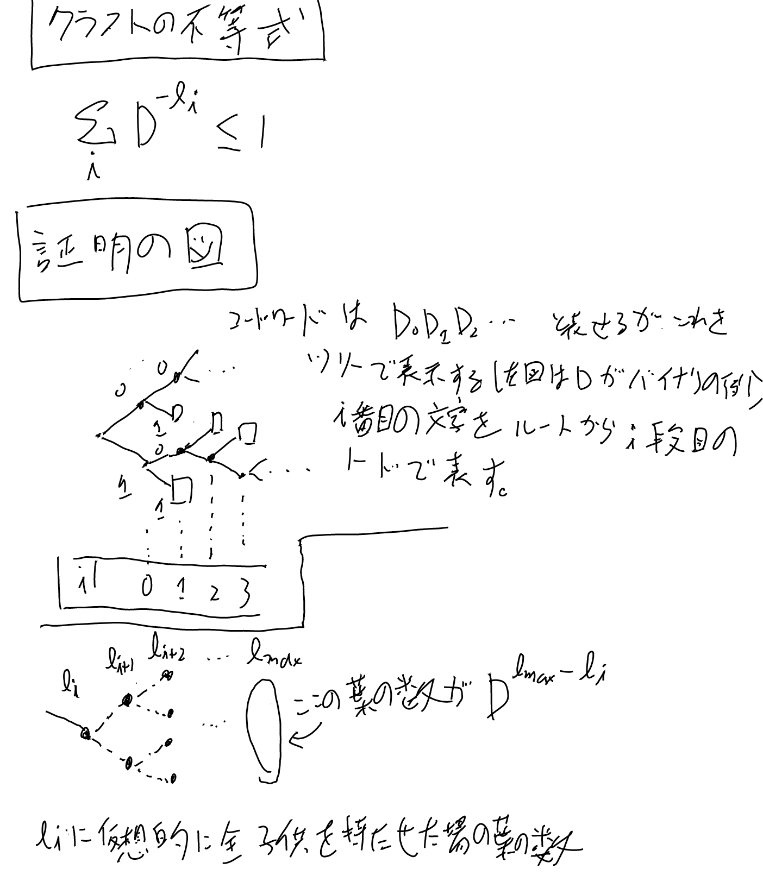
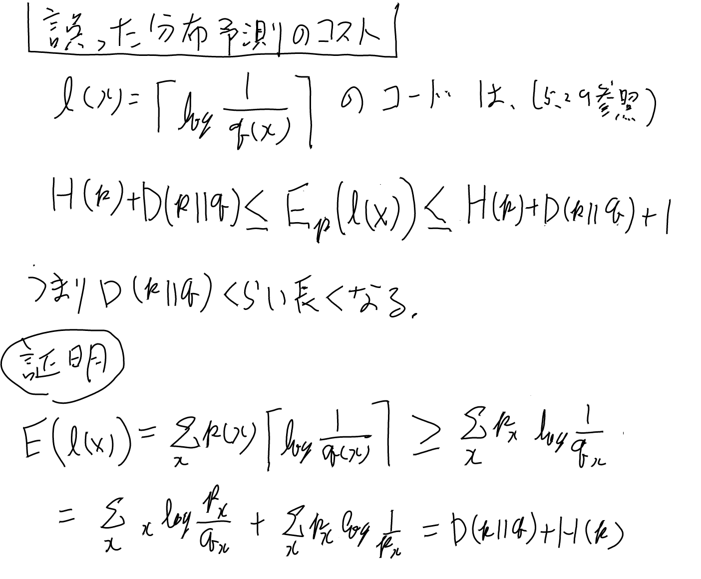

[[CoverAndThomas]]の5章を中心にまとめる。[[アルゴリズム]]

[Elements of Information Theoryの三章〜八章 - なーんだ、ただの水たまりじゃないか](https://karino2.github.io/2019/02/10/144121.html) の5章に詳しいメモがある。

## Source Code

あるRandom Variable Xに対し、D種類のアルファベットをつなげた有限の文字列D*を対応させる。この対応させた文字列をsource codeという。

あるXの値xに対して、C(x)で対応するコードの文字列（codeword）を表すとしこのC(x)の長さをl(x)で表す。

圧縮で議論されるのは、このlの期待値L(C)。

### Nonsingular

コードがnonsingularであるとは、Cが単射である事。（違うxが同じコードにならない）

### Uniquely Decodable

```
C(x1x2x3...) = C(x1)C(x2)...
```

と定義した時（これをextensionと言う）、これがnonsingularな事をuniquely decodableと呼ぶ。

### Prefix Code（instantaneous codeとも言う）

どのcodewordも他のcodewordのprefixになってないコードをPrefix Codeと言う。これは一致した瞬間にそれより後ろを見ずjにcodewordが決定するという事。

## Kraftの不等式(5.2)

任意のprefix codeは、以下の式を満たす。



### 証明のメモ

上のツリーを参照。prefix codeという条件は、あるコードが他のコードの親になってない、という事なので、何かのコードワードになっていたら、その子どもは全部無いものとして考えられる。

式5.7は、あるシンボルのコードの長さがliとして、その下にlmaxまでの仮想的な足を全部生やすといくつになるか、という風に考える。 これが5.7式のシグマの中。

子どもが全部居たとしてもそれはlmaxまでの木の部分木のはずなので、それらを全部足してもレベルlmaxまでの木の葉の数よりは小さくなる。
これが式5.7の意味。

## 最適コードの理論限界（5.3）

クラフトの不等式を制約条件に期待長を最小化する問題をラグランジュの未定乗数法で解く。
すると5.19で最小となり、期待長は5.20となる。

また逆に、長さがliの時の期待長LとHの差分を直接計算すると、定理5.3.1の証明の式が得られる。
なお、Relative Entropyというのは[[KLダイバージェンス]]の事。

これらは実数での最適値なのでbitなどで表すなら端数の分これより少し長くなる。

## 誤った分布の予測に基づくコードのコスト(定理5.4.3)



## ハフマンコード

分布が分かっている時の最適な符号化法。分かっていないケース＞[[LempelZiv]]

一番確率が低い二つのシンボルに下位0と1を割り当ててマージして新しいシンボルとし、その新しいシンボルを含めた確率が一番低い2つをまた次の下位2ビットを与えてマージし…を繰り返して得られるコード。

