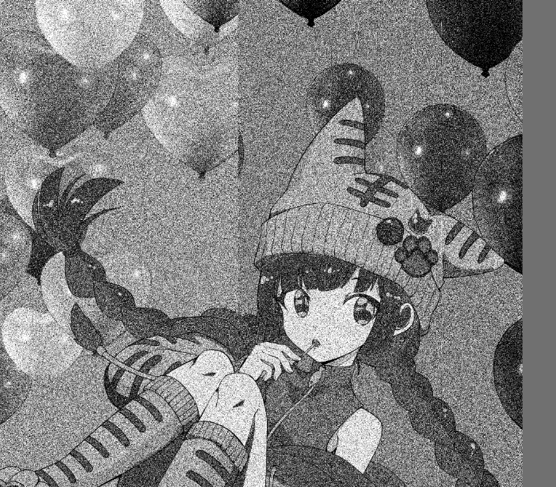

[[CG]]

[[Stippling]]を調べていて、ハーフトーンの方が[[MFG]]で作れそうだな、と思い、関連ページを作る。

[[MdImgr]]のテンプレート``

## リンク集

- [Halftone](https://www.shadertoy.com/view/XslGRM) shadertoyにあった実装
- [Bayer Dithering - Spencer Szabados](https://spencerszabados.github.io/blog/2022/bayer-dithering/) Bayer Ditherと

## MFGでの実装

MFGで実装してみる。

### 単にグレーの濃度を白黒の頻度で表すフィルタを作ってみる

Stipplingとは違うが、単に2値トーン化として雑にランダムにサンプルするコードを作ってみるとどうだろう？
ようするに単なるハーフトーンの雑な実装だが。

```
def result_u8 |x, y| {
   let gray = grayT(x, y)
   ifel(rand() < gray, u8[0xff, 0xff, 0xff, 0xff], u8[0, 0, 0, 0xff])
}
```



けっこういいけど、これ、なんかガンマ補正してない時の暗くなるのと同じ結果に見えるな。
アルファをガンマ補正するのはどうなんだ問題と同じでしないのが正しい気もするけれど、
あえてやってみるとどうなるだろう？

```
def result_u8 |x, y| {
   let lgray = grayT(x, y)
   let gray = linear2gamma(lgray)
   ifel(rand() < gray, u8[0xff, 0xff, 0xff, 0xff], u8[0, 0, 0, 0xff])
}
```


やはりこっちの方が正しい気はするな。

拡大するとランダムさがトーンとして汚いので、やはりbluenoiseの方が良さそうではある。


ちょっとハーフトーンは面白そうだな。論文を調べてみてあとでページを分けよう。

### shadertoyの実装を移植してみる

shadertoyでハーフトーンで眺めていて見つけた以下を移植してみる。

[Halftone](https://www.shadertoy.com/view/XslGRM)

最初は理解せずに書いたが、理解してみるとcosの周期パターンにすぎない事に気づく。sindとかcosdはいらなかったな。

```
@param_f32 threshold(SLIDER, label="閾値", init=0.6, min=0.0, max=1.0)

let PI = 3.1415926
let PI180 = PI / 180.0

fn sind |a:f32| { sin(a*PI180) }

fn cosd |a: f32| { cos(a*PI180) }

fn added |sh: f32v2, sa:f32, ca:f32, c:f32v2, d:f32 | {
  0.5 + 0.25 * cos((sh.x * sa + sh.y * ca + c.x) * d) + 0.25 * cos((sh.x * ca - sh.y * sa + c.y) * d)
}

def result_u8 |x, y| {
   let dstCoord = f32([x, y])/input_u8.extent(0)
   let rotationCenter = [0.5, 0.5]
   let shift = dstCoord - rotationCenter
   let dotSize = 3.0
   let angle = 45.0
   let rasterPattern = added(shift, sind(angle), cosd(angle), rotationCenter, PI / dotSize * 680.0)
   let srcPixel = input_u8(x, y)
        
   let avg = to_xyza(srcPixel).y
   let gray = (rasterPattern * threshold + avg - threshold) / (1.0 - threshold)

    # check raster pattern
    # let gray = rasterPattern
    [*vec3(gray), 1.0] |> lbgra_to_u8color(...)
}
```

結果は以下。


おお、結構いい感じだな。

### Bayerディザー

shadertoyのブレンディング式はどこから来ているのかなぁ、と調べていて、以下のブログに行き当たる。

[Bayer Dithering - Spencer Szabados](https://spencerszabados.github.io/blog/2022/bayer-dithering/)

ここからどうやって探したのか思い出せないが、以下と同じtxtファイルのinternet archiveを参照しているページがあって、そこからDHALF.txtを読んだ。

[DHALF.TXT](https://gist.github.com/robertlugg/f0b618587c2981b744716999573c5b65)

という事でこれを単純に実装してみる。

```
# bayer pattern
def pattern by 
[
    [ 0.0, 32.0,  8.0, 40.0,  2.0, 34.0, 10.0, 42.0], 
    [48.0, 16.0, 56.0, 24.0, 50.0, 18.0, 58.0, 26.0],  
    [12.0, 44.0,  4.0, 36.0, 14.0, 46.0,  6.0, 38.0],  
    [60.0, 28.0, 52.0, 20.0, 62.0, 30.0, 54.0, 22.0],
    [ 3.0, 35.0, 11.0, 43.0,  1.0, 33.0,  9.0, 41.0],
    [51.0, 19.0, 59.0, 27.0, 49.0, 17.0, 57.0, 25.0],
    [15.0, 47.0,  7.0, 39.0, 13.0, 45.0,  5.0, 37.0],
    [63.0, 31.0, 55.0, 23.0, 61.0, 29.0, 53.0, 21.0]  
]

let PATTERN_WIDTH = pattern.extent(0)
let PAT_MAX = f32(PATTERN_WIDTH^2-1)


def result_u8 |x, y| {
   let pxy = [x, y]%PATTERN_WIDTH
   let pval = pattern(*pxy)/PAT_MAX

   let level = input_u8(x, y) |> to_xyza(...).y
   let gray = ifel(level > pval, 1.0, 0.0)   

    [*vec3(gray), 1.0] |> lbgra_to_u8color(...)
}
```

超簡単。

適用した結果が以下。単なるグレースケールに見える。


でもアップにすると白黒2値だという事がわかる。


あまりにもグレースケールっぽくて面白さはなくなってしまうな。

カラー版もやってみよう。グローバル変数やパターンは白黒と一緒。

```
def result_u8 |x, y| {
   let pxy = [x, y]%PATTERN_WIDTH
   let pval = pattern(*pxy)/PAT_MAX

   let lbgra = input_u8(x, y) |> to_lbgra(...)
   let lbgr_q = ifel(lbgra.xyz > pval , vec3(1.0), vec3(0.0))

    [*lbgr_q, lbgra.w] |> lbgra_to_u8color(...)
}
```

これも簡単。
結果は以下。


なんか暗くなっちゃうな。このBayerパターンはガンマ補正の具合がいまいちなのではないか？

拡大すると以下。


昔のパソコンみたい。