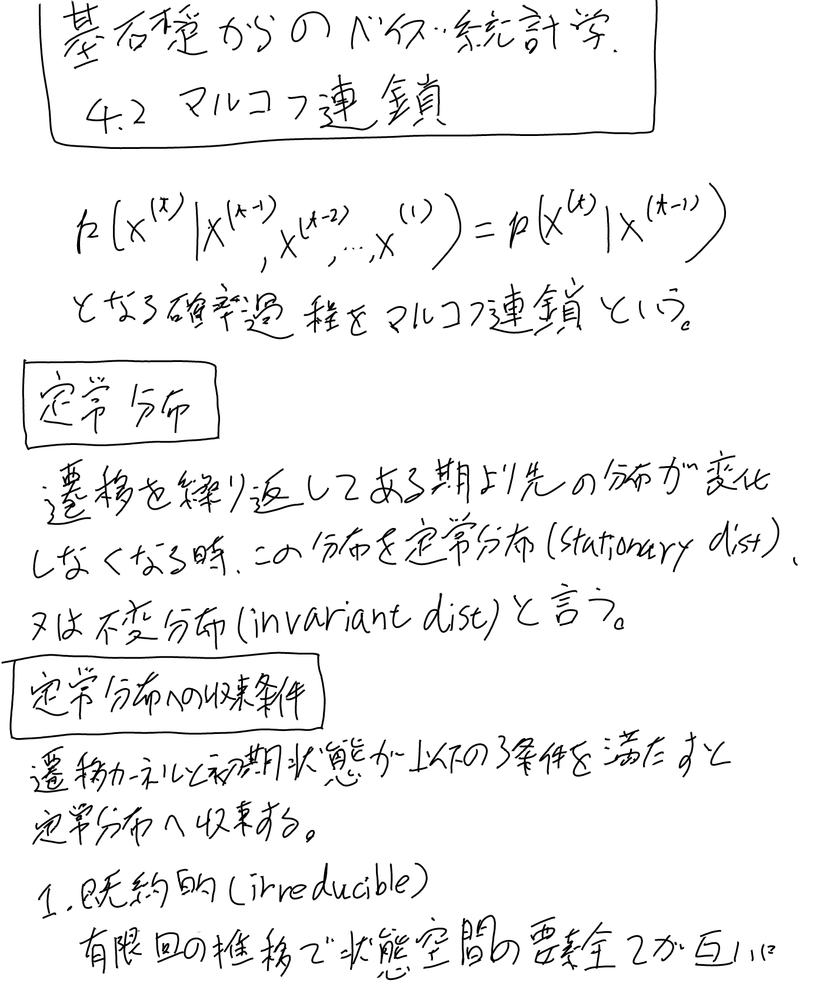
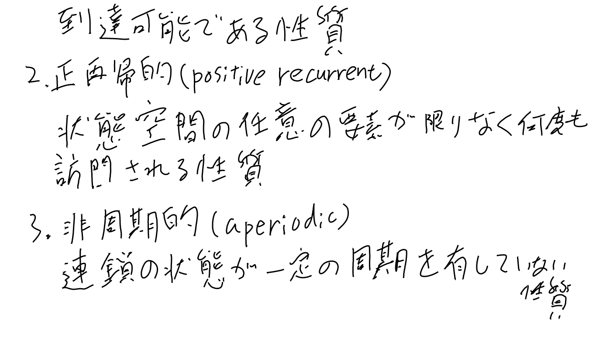
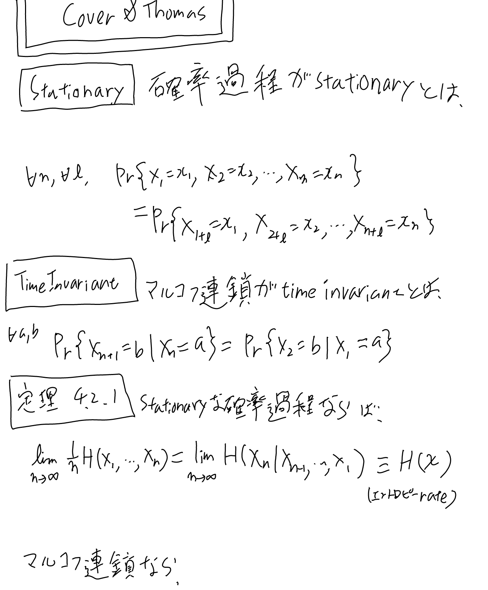
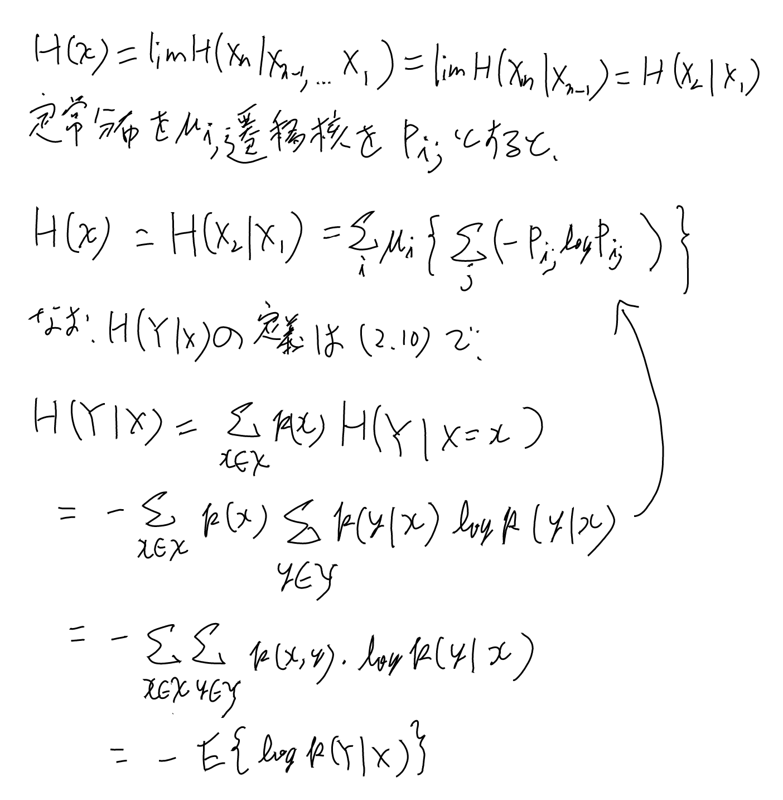

[[アルゴリズム]]

- [[TheNatureOfComputation]]の12章
- [[PRML]]の11.2がMCMC
- [[基礎からのベイズ統計学]]
- [[CoverAndThomas]]
- [[HMM]]もマルコフ連鎖と関係が深い。

## 定常分布とそこへの収束条件

[[基礎からのベイズ統計学]]

## Entropy Rates

[[CoverAndThomas]]より。

Stationaryは確率過程一般の話。Time Invariantはマルコフ連鎖の遷移核。
定常分布になっていない時は、Time Invariantなマルコフ連鎖でもまだStationaryでは無いが、定常分布まで行った後はStationaryとなる。

### 定理4.2.1の証明の概略

ちゃんとした証明は教科書を追うしか無いが、大雑把なメモを残しておく。

左辺の同時確率のエントロピーを使ったエントロピーレートの定義式（4.10）にchain ruleを適用して条件付き確率のエントロピーの和に直し、
stationaryな事から極値の存在を示せて（定理4.2.2）、極限が存在するなら和をnで割った算術平均が極限に収束するので（厳密には定理4.2.3だが感覚的には自然）、右辺となる。