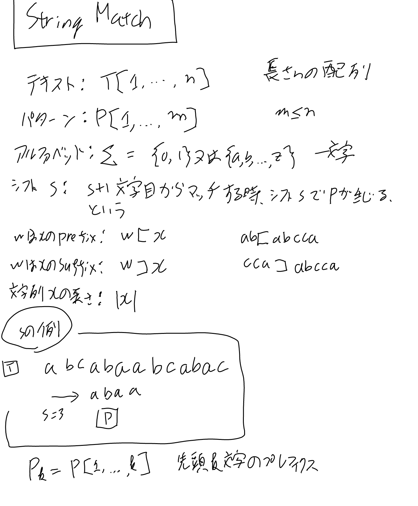
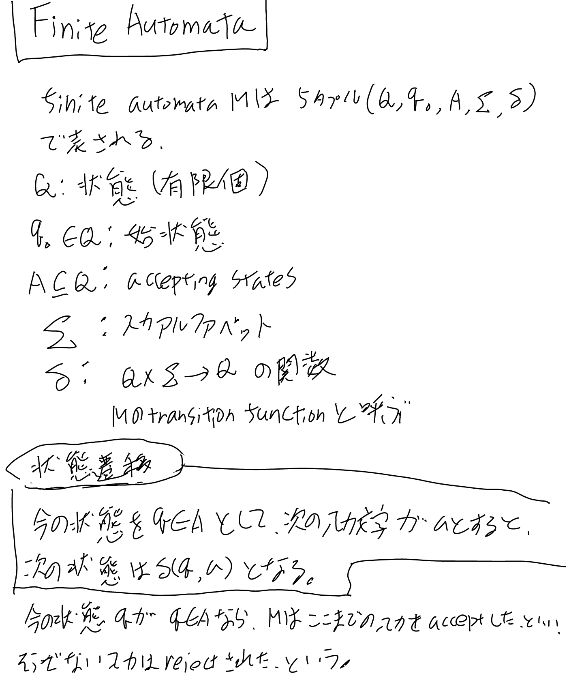
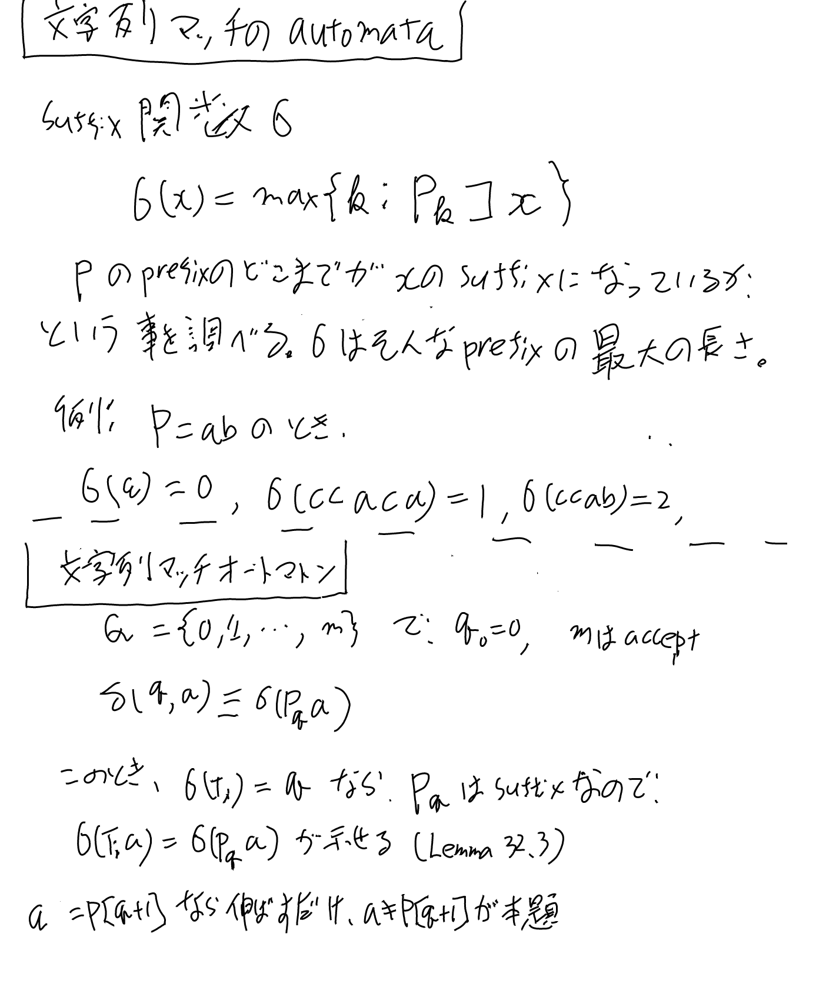
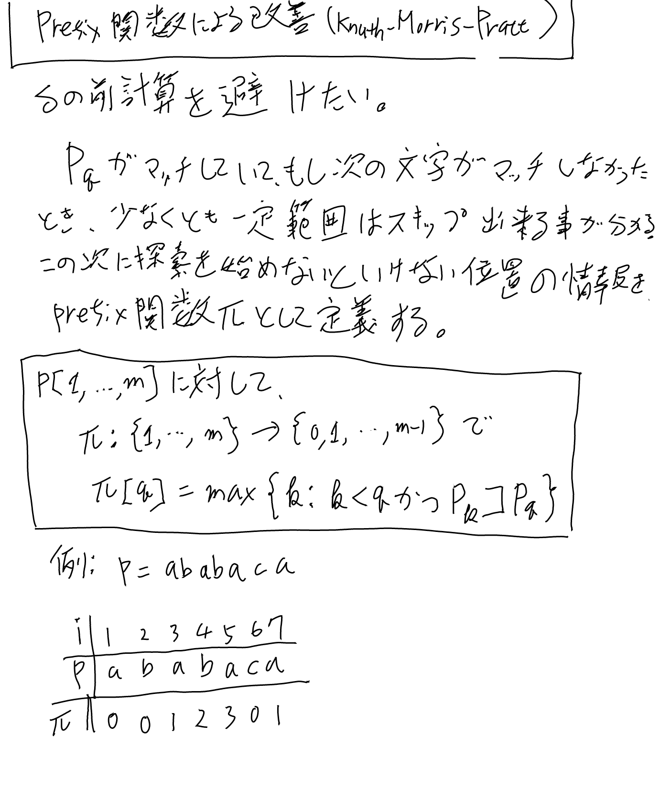

アルゴリズムの一分野である文字列マッチ。[[アルゴリズム]]

ここでは[[【書籍】IntroductionToAlgorithms]]の文字列マッチを読んでいったメモを中心に。32.3のあたり。

## ノーテーション

## 有限オートマトン

### ノーテーション

### 状態遷移

### acceptとreject

状態遷移を続けていって今の状態qがAのメンバならMはここまでの入力をacceptしたといい、そうでないなら入力はrejectされたという。

## Knuth-Morris-Prattアルゴリズムとprefix関数

オートマトンは遷移関数の事前計算の計算量が多い。
そこでその改善にprefix関数を使ってオンデマンドに計算する、というのがKMPアルゴリズムのアイデア。

### Prefix関数

Pqのsuffixになっているプレフィクスで最長なもの。プレフィクスなので長さだけで十分。
「Pqのsuffixになっている」というのが重要。

### Prefix関数の構築（COMPUTE-PREFIX-FUNCTION)

帰納法的な作りになっているので理解が少しむずかしい。

- 一つ前の時点でprefixになっている文字列が無い＞先頭1文字がprefixになっているかどうかだけの問題
- 一つ前の時点でsuffixになっているprefixが見つかっている（kにはその最後のprefixの値が入っている）＞そのprefixに1文字足してどうなるか見る
   - 1文字足して一致しなかったら同じsuffixのさらなるprefixになっているものを辿っていくと全てのsuffixになる候補を辿れるはず（ここが帰納的）

2文字以上のsuffixに一致するなら必ず一つ前のsuffixに一致しているはずである、というのがポイント。

### Prefix関数を使ったマッチのアルゴリズム

次の文字が一致しなかった時にパイを遡って次の文字と一致するprefixを探して続ける、というもの。
これがオーダーnになるのはなかなかきわどい分析が必要でちょっと難しいが、
アルゴリズムが正しい事とまぁまぁ早そうな事は容易に理解出来る。