[[元祖水玉本舗]], [[お絵描き]], [[ライブ]]

元祖水玉本舗を眺めつつ思い入れのあるゲームなどの回を模写とかしつつ語るお絵描きライブ。[[それっぽく描くコツ2周目]]の続き的なお絵描きライブ。

[水玉懐ゲー夜話(プレイリスト） - YouTube](https://www.youtube.com/playlist?list=PLLe3xJa7mDEk)

tinyurl: https://tinyurl.com/5e9rakrs

## 配信テンプレ

```
今回はワルキューレの伝説です #水玉懐ゲー夜話
```

```
水玉懐ゲー夜話：ワルキューレの伝説

元祖水玉本舗から思い入れのあるゲームの回を選んで模写しつつ、水玉本舗やゲームについて語るライブ配信です。

web: https://tinyurl.com/5e9rakrs
水玉懐ゲー夜話プレイリスト https://www.youtube.com/playlist?list=PLLe3xJa7mDEk
```

## ワルキューレの伝説

[水玉懐ゲー夜話：ワルキューレの伝説 - YouTube](https://www.youtube.com/live/kLj20YT7p-w)

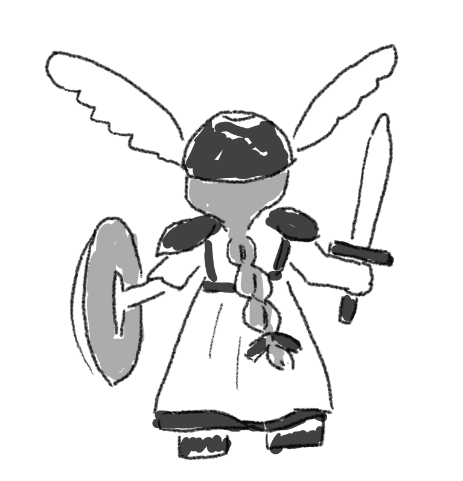
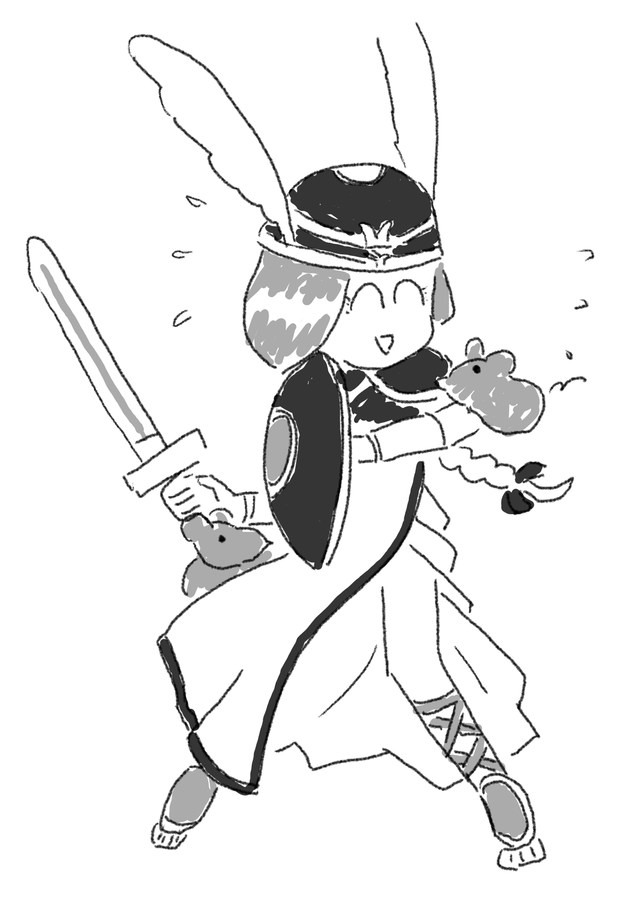

ドット絵が動く事で完成するという水玉先生の言う事がめちゃ分かる。ジャンプしているのがいいんだよな、ワルキューレ。音楽も好きだし。

## ワンダープロジェクトJ

[水玉懐ゲー夜話：ワンダープロジェクトJ - YouTube](https://www.youtube.com/live/iFabpsYUVzM)

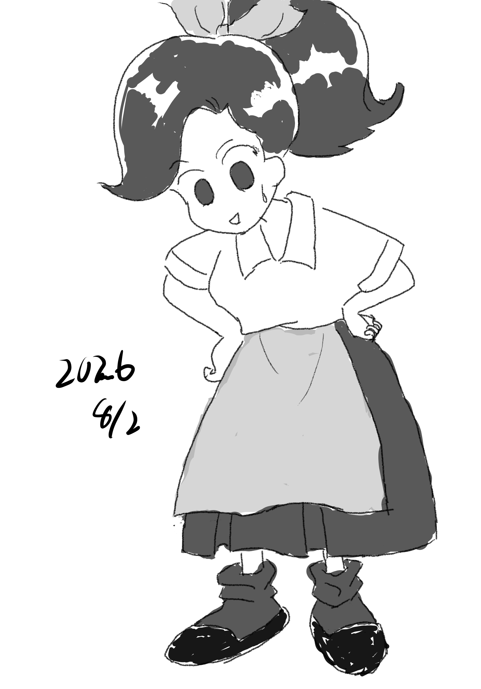

本番は見てるだけで手が出せない、というのがハラハラドキドキでいいゲームだったよなぁ。

ちょっとこの絵は未完成で時間切れだったので、気が済むまで描いてみた。

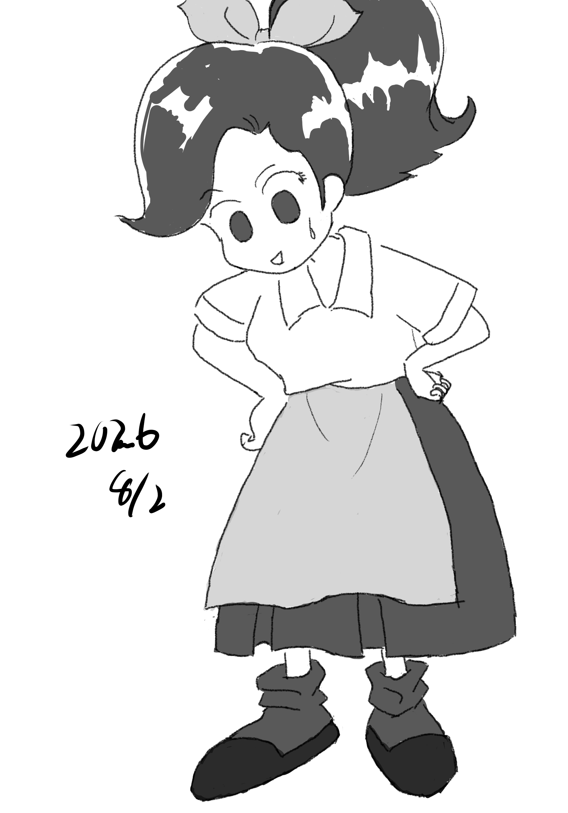

時間切れっぽい奴は、終わった後に完成までやった版も作ってもいいかな、という気はしている。
あんまり細部の修正を何度もやって全然終わらない、みたいなのは避けたいとも思っているが。

## ゼルダの伝説夢を見る島

[水玉懐ゲー夜話：ゼルダの伝説夢を見る島 - YouTube](https://www.youtube.com/live/HstMn_COBR0)

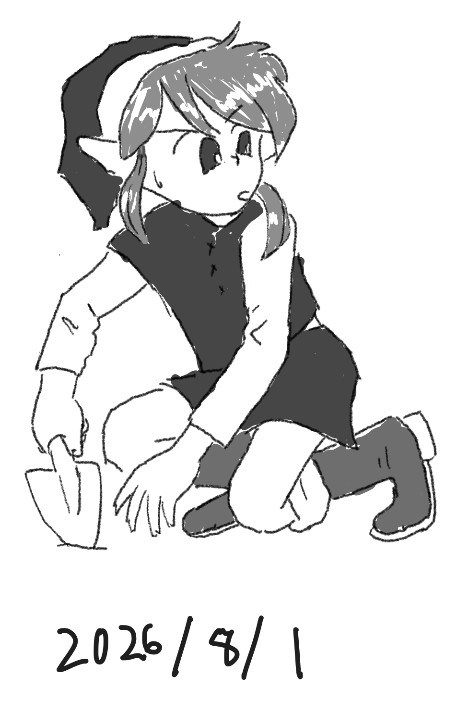

かぢばあたる先生の漫画の思い出が強いけど、ゲームも結構思い出深いなぁ、と配信していて思った。ゲームボーイ、我々の世代にはなんか象徴的なハードウェアだよなぁ。
夢を見る島は最高傑作なんじゃないか。

## ファイアーエムブレム、紋章の謎

[水玉懐ゲー夜話：ファイアーエムブレム紋章の謎 - YouTube](https://www.youtube.com/live/YolKGhO3UEo)

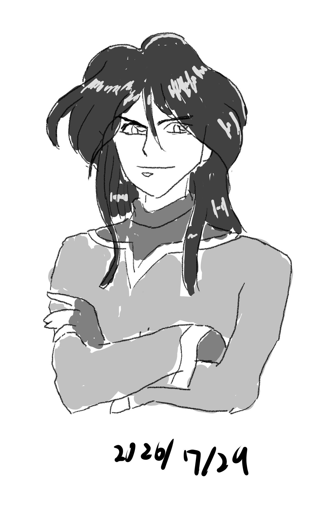

ちょっと最初にどこを描くか決めかねて間に合わんかった。まぁこういう事もあるよなぁ。
後で気が向いたら完成させるかもしれません。

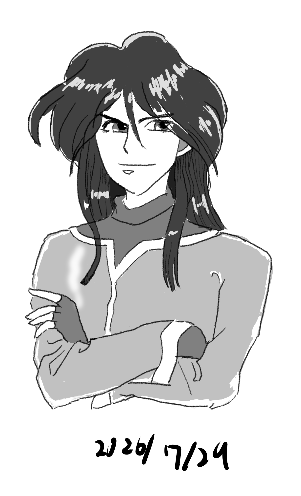

という事でもう少し気が済むまで手を入れた。

水玉先生のファイアーエムブレム回は凄くいいですよねぇ。
三姉妹も可愛いし、シーダとマルスも良いし。

ナバールとかの細い系のキャラの色気みたいなのに水玉先生の好みが良くでているなぁ、と思う。

## 聖剣伝説2

[水玉懐ゲー夜話：聖剣伝説2 - YouTube](https://www.youtube.com/live/6Pw_mwgPVQs)

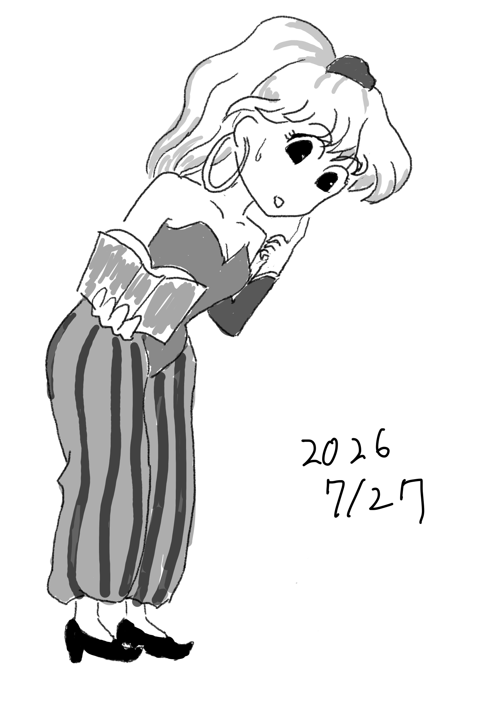

聖剣伝説2の回の元祖水玉本舗はいいよなぁ。
絵はもうちょっと練習したい感じもするが、喋ってこのくらいの絵を描く、というのをやっていきたい。

## ぷよぷよ（無印）

[水玉懐ゲー夜話：ぷよぷよ（無印） - YouTube](https://www.youtube.com/live/ECYeO5hQQ1I)

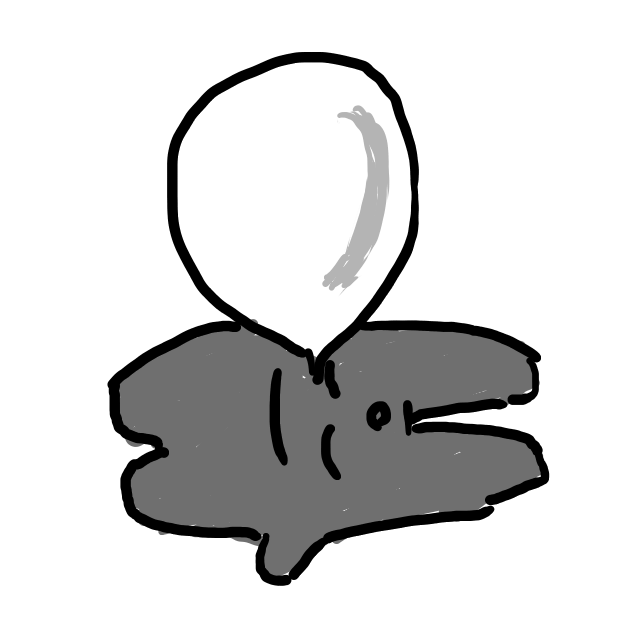

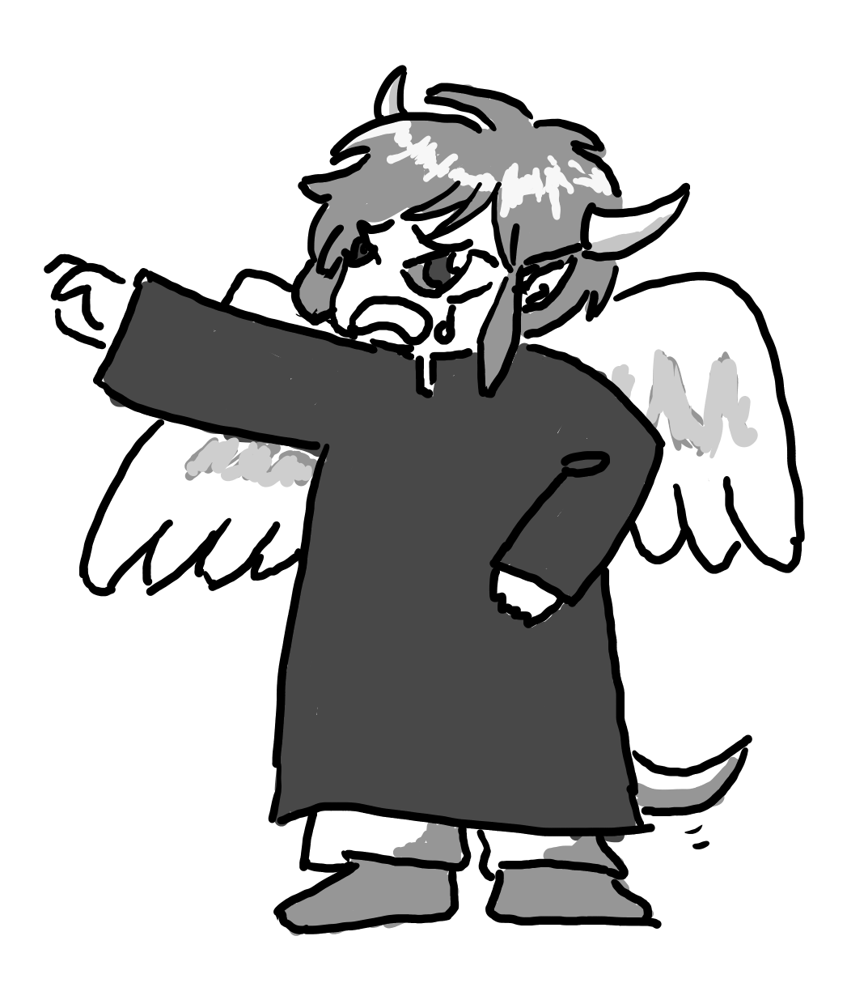

無印は今となっては対戦としては成立してないですが、そこに至るまでのそれぞれの思い出はありますやね。
キャラ的な思い出もぷよ1は多いし、ゲーム自体というよりもやっていた時の空間を思い出す。

## ランドストーカー

[水玉懐ゲー夜話：ランドストーカー - YouTube](https://www.youtube.com/live/LwIlGwXFulw)

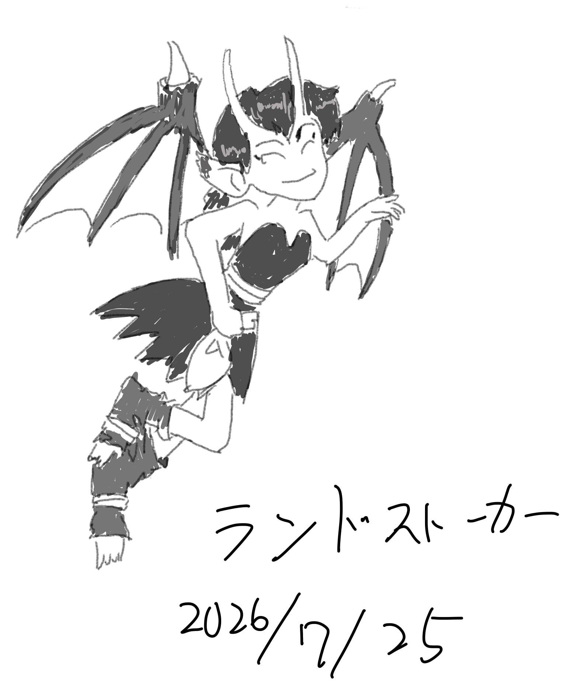

ちょっとライルを描く時間は無いなぁ。
練習していけばライルだけ描くくらいは出来るようになるかもしれないが。

本当はもっといろんなキャラを描いていきながら雑談したいのだが、まだサブキャラを一つで精一杯だな。

一方で結構楽しくやっていけそうな気はしているので、しばらく続けていきたい。