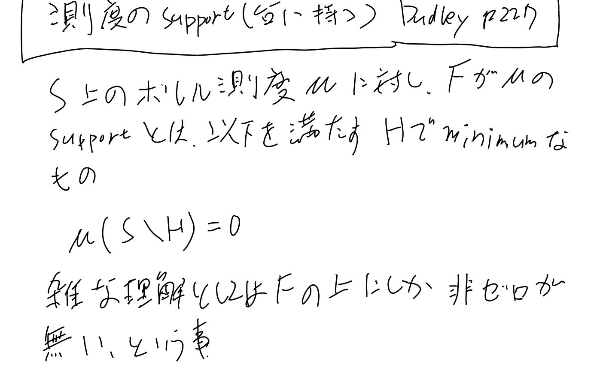

みんな大好き測度論。[[数学]]

- [「測度論無しで機械学習に必要な確率論の話をする」という動画シリーズを作りました - なーんだ、ただの水たまりじゃないか](https://karino2.github.io/2019/03/18/180857.html)
- [amazon: ルベーグ積分から確率論](https://www.amazon.co.jp/dp/4320015622?&linkCode=ll2&tag=karino203-22&linkId=57307f509f8c263c5e5ea751001e15bc&ref_=as_li_ss_tl) 自分が読んだ教科書。確率重視なので測度論は薄めだが、その分あとから参照しやすくて良い。
- [[実解析]] のDudleyも測度論を良く使う（実解析で確率論を議論する教科書）
- [セールで買った関数解析の入門書が、ルベーグ積分の入門にも素晴らしい！ - なーんだ、ただの水たまりじゃないか](https://karino2.github.io/2018/02/07/149.html)
- [Probabilistic Metric Spaces (Dover Books on Mathematics)を読むぞ！ - なーんだ、ただの水たまりじゃないか](https://karino2.github.io/2018/02/08/152.html)

## 台(Support)

ちなみにこのバックスラッシュみたいなのは差集合（文脈から分かるとは思うが）。